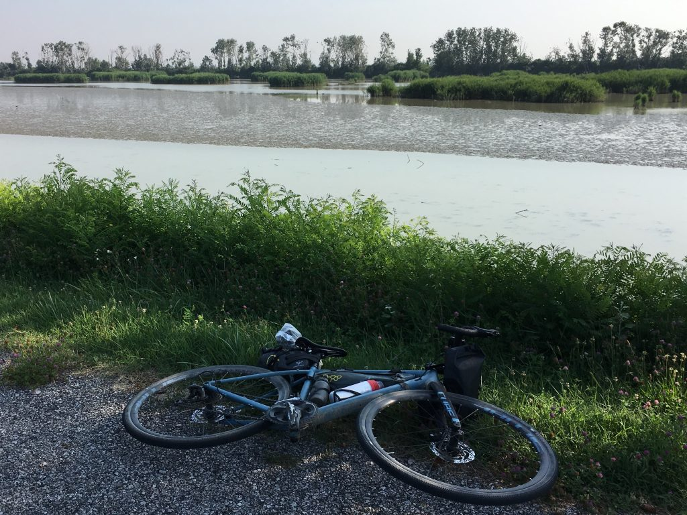
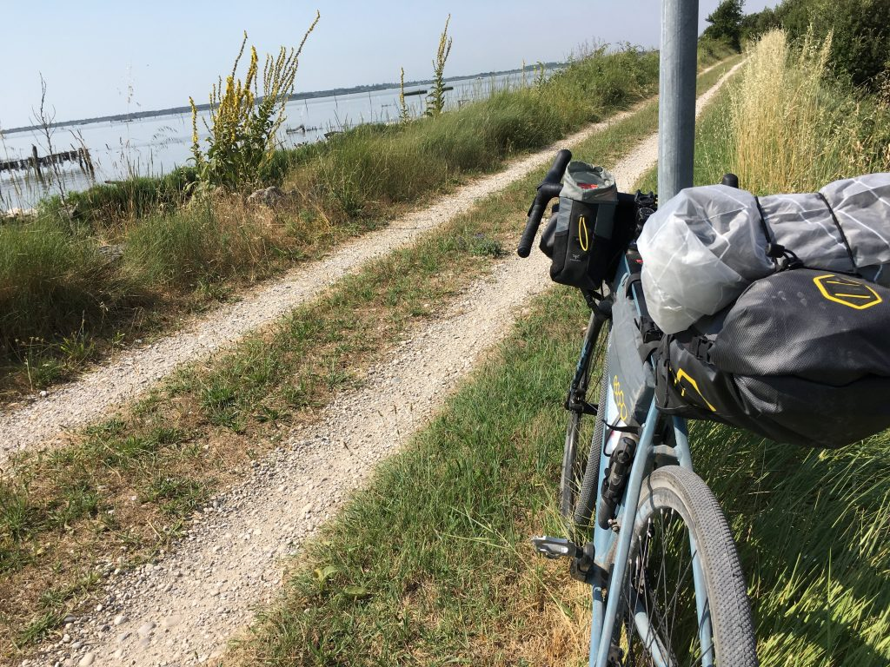
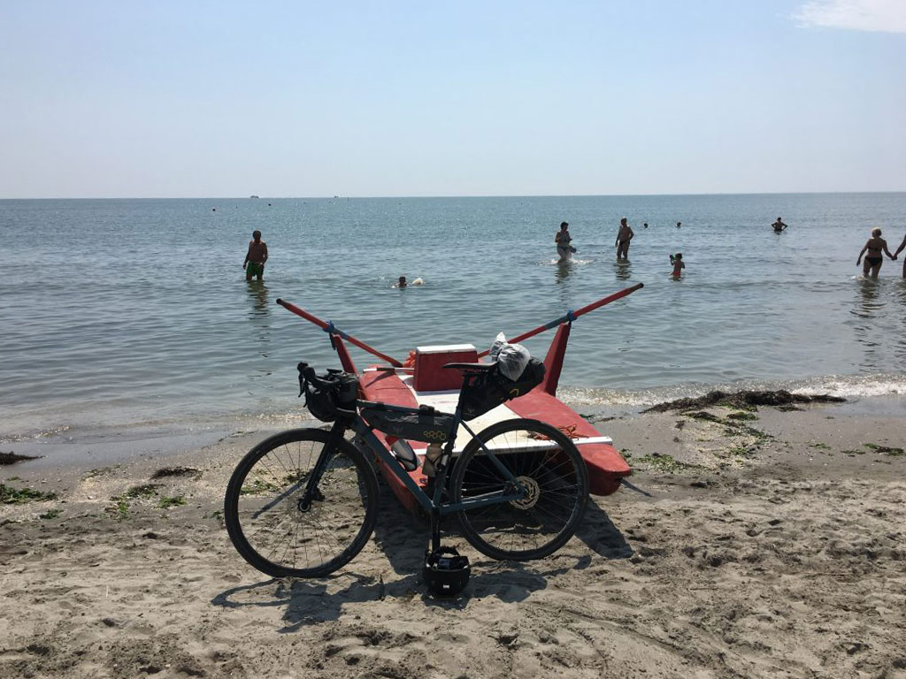
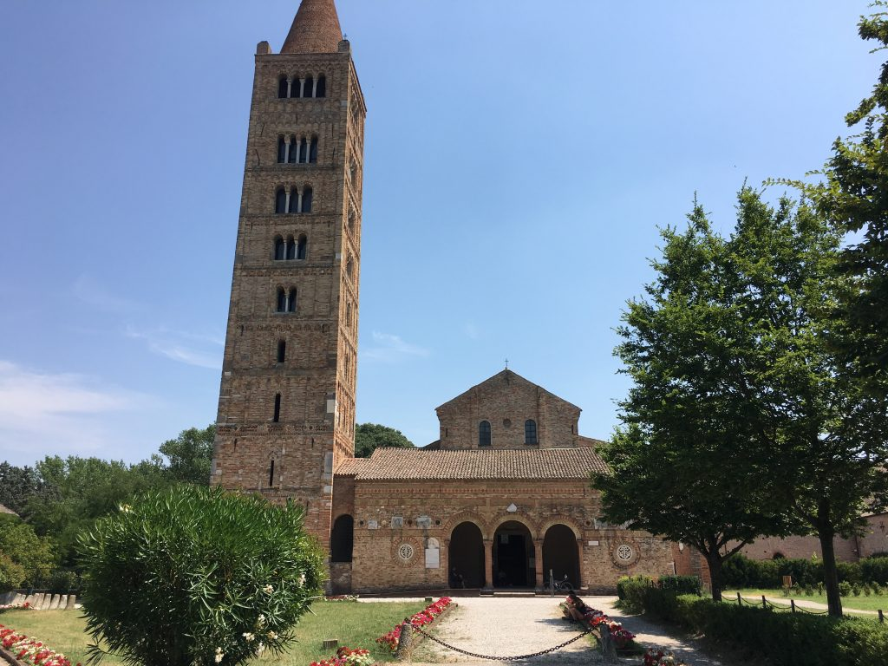

# Gardamare Tappa 5
---

_Da Mesola a Pomposa passando dal mare. Con mezz’ora di videogame dal vivo_

Questa volta sono partito senza tracce per il navigatore, perché volevo arrivare al mare chiedendo informazioni e orientandomi da solo. Vai a sapere che mi sarei trovato anche dentro un videogioco dal vivo.

Quante cose in questi ultimi 50km del mio viaggio. La terra del delta del Po è piena di meraviglie, naturali e costruite dall&#8217;uomo, e più di una volta sono rimasto a bocca aperta, estasiato da ciò che avevo davanti ai miei occhi. La prima volta è successo davanti a Torre Abate, a pochi metri dal rifugio dove ho passato la notte. Il manufatto è una splendida opera di ingegneria idraulica costruita nel 1569 durante la Bonifica Estense, con il compito di difesa dalle acque e controllo. È un posto magico, che ho avuto la fortuna di ammirare anche al tramonto la sera prima di partire.

Proseguendo lungo il cosiddetto Canale Bianco ho ripreso la ciclovia Destra Po lasciata il giorno prima a Mesola, ma da lì a poco lo scenario sarebbe cambiato drasticamente. In quel punto il Po si è già diviso nei due rami principali e io sto affiancando il ramo estense, chiamato Po di Goro, che in quell&#8217;area ha molti luoghi paludosi che brulicano di vita. Procedo lentamente e senza far rumore, soprattutto per godermi il silenzio e osservare gli uccelli pescare indisturbati.

Ormai si inizia a sentire l&#8217;odore del mare, ed è molto bello vedere lo scenario che cambia in modo così tangibile, così percepibile da tutti i sensi. Cambiano i colori, gli odori. Sono a Goro, ma voglio arrivare a Gorino proprio dove il Po si getta nel mare, e quando arrivo l&#8217;emozione è molto forte. Dal piccolo porto di Gorino il golfo chiamato Sacca di Goro è visibile a 360 gradi e sembra davvero enorme.

Sono arrivato al mare, partendo dal Lago di Garda e facendo quasi 300km in bici. Quasi non ci credo. Però, per me arrivare al mare significa letteralmente essere su una spiaggia e magari farmi anche un bagno. Inizio a informarmi nel borghetto di Gorino, raccolgo qualche indicazione un po&#8217; generica e mi avvio. E ancora non so in che rogna mi sto infilando.

Ripasso da Goro perché non si può fare diversamente, e da lì quasi per caso mi imbatto in uno sterrato con un cartello che indica i lidi. Fantastico, finalmente un pezzo di gravel vero dove la mia bici dà il meglio di se, e alla fine mi butterò in acqua. Mi lancio a buona velocità sullo sterrato e me lo godo come un bambino in bicicletta le prime volte. Non so dove sto andando e cosa troverò, ma è tutto dritto e ho il mare accanto. È fantastico. Ma arrivato alla fine dello sterrato una prima sorpresa: il sentiero finisce e non si sa bene cosa si debba fare. Tornare indietro no, dai. Eppure c&#8217;è ancora un cartello. Finalmente capisco: c&#8217;è un doppio cancello da cui passare per entrare dentro la pineta (capirò poi perche doppio). Un piccolo avviso segnala che è possibile accedere al secondo cancello solo dopo aver chiuso bene il primo. Ecco, penso, guarda se non resto bloccato dentro con 75 gradi all&#8217;ombra. Invece passo, e inizio ad andare. C&#8217;è un&#8217;afa pazzesca e sento intorno parecchi insetti, meglio sbrigarsi. Ma all&#8217;improvviso, sabbia. Mi impunto, cado. Pazienza, è sabbia. Mi rialzo e un istante dopo sono attorniato da migliaia di insetti che iniziano a pungermi ovunque. Ma avevo messo l&#8217;Autan! Totalmente irrilevante. Altro non posso fare, inizio a spingere la bici nella sabbia.

Ora provate a immaginare la situazione: un caldo allucinante, il sudore misto a Autan e crema solare mi cola negli occhi che mi bruciano molto. Questi nugoli di insetti continuano ad attaccarmi in tutti i modi e io spingo la bici che improvvisamente è diventata pesantissima. Oltre al danno la beffa: a un certo punto dalla direzione opposta spunta una MTB con gomme da sabbia che corre come una dannata. Il tipo ride. Simpatico. Scoprirò solo dopo che mi trovo su una traccia nota ai ciclisti MTB chiamata I due cancelli (messi lì per evitare che i daini escano dalla pineta dove vivono) e dove i mountain bikers si sfidano a colpi di cronometro. E io spingo. Arrivo infatti al secondo cancello, e ancora ignaro penso ok, è un gioco di ruolo, avete vinto voi.

Imbocco la passerella del Lido di Volano esausto, ma felice di vedere gli ombrelloni. Così come sto (più o meno come un matto), chiedo ai bagnini il permesso di poggiare la bici sul pattino e fotografare il mio arrivo al mare. E dopo un minuto sono in acqua a godermi il mio obiettivo raggiunto.

 

Adesso resta solo da arrivare all&#8217;Abbazia di Pomposa, che so essere bellissima e che sarà la fine del mio lungo viaggio. Dopo un pezzo di statale faticoso, trovo uno sterrato splendido che porta dritto dritto al giardino dell&#8217;Abbazia. Un momento di estasi vera.

Sono arrivato alla fine. Ora i km sono 305, ma quel che più conta è la strada che ha fatto la mia anima, che non si misura in chilometri.

Grazie amore mio per avermi accompagnato fin qui. Ce la posso fare, ce la sto facendo. Ce la faccio.