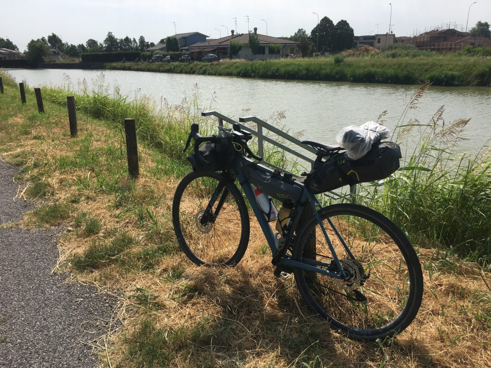

_Da Mantova a Ostiglia, dove all’inizio sembra la tangenziale controvento poi dopo è solo controvento_

Sono partito da Mantova tardi, perché all&#8217;agriturismo non potevo fare colazione prima delle 8, e quando ho cominciato a incartarmi per trovare la strada tra statali e semafori viaggiando contro una ventazza tosta, ho capito subito che oggi sarebbe stata una questione di disciplina e testa dura.

L&#8217;obiettivo era percorrere almeno 60km per poter dividere bene in due la strada per Ferrara, sperando di poter procedere con maggior dolcezza appena fuori la città. E infatti, arrivato non senza qualche difficoltà a Bagnolo San Vito, la situazione cambia.

Lì è l&#8217;inizio della vasta zona dove il Mincio si intreccia col Po, dando vita ad uno scenario di canali, canaletti, chiuse, tutto nato durante le grandi bonifiche dei primi del 900, i cui impianti erano spesso costruiti in edifici raffinati, di quando ancora in Italia c&#8217;era la cultura del bello anche per case popolari e impianti industriali.

Intanto vado, a fatica ma vado, con la speranza di trovare tante cose belle che mi diano la giusta carica per arrivare fino in fondo.

E in effetti l&#8217;incontro col Po non mi lascia indifferente. È maestoso, enorme, e in quel momento mi assale una bellissima sensazione di libertà assoluta, come se potessi lasciarmi andare con grande fiducia all&#8217;abbraccio di quel fiume gigantesco.

Incontro un ragazzo di vent&#8217;anni, fermo su un ponte a guardare i traghetti dei turisti sul Po. Mi spiega il funzionamento delle chiuse per far passare le navi, e mi racconta che questo che per me è un viaggio epico, per lui è la quotidianità: va avanti e indietro fra Mantova e Ferrara come io vado a fare la spesa al supermercato sotto casa. E grazie, c&#8217;ha vent&#8217;anni! Mi fa una foto sul ponte e poi riparto.

Da lì in poi la faccenda si fa complicata. Parte una di quelle belle vie di argine viste in decine di film ambientati in posti come questo, anche se il fiume è lontano e non si vede. È tutto molto bello in realtà, ma il vento soffia contro, fa comunque un caldo folle perché si sta facendo tardi, e io sono veramente stanco. Peraltro ieri mi ha morso un tafano, e come spesso mi succede (tutte le estati) lo sfogo arriva il giorno dopo, ho un polpaccio enorme e dolorante. E ho anche alle spalle 45km in cui ho speso parecchio. Mi fermo a Governolo, paesino molto carino al centro dell&#8217;incrocio fra Mincio e Po, c&#8217;è poca gente in giro, faccio scorta d&#8217;acqua e riparto subito.

Non c&#8217;è nulla, sono sotto al sole battente, penso più di una volta di mollare, ma anche volendo non saprei nemmeno dove fermarmi visto che i paesini non sembrano nemmeno particolarmente accoglienti. E poi devo continuare, è il senso di tutta questa storia, non posso mollare adesso. Guardo il contachilometri, siamo a 48km, se non a 60 devo arrivare almeno a 55/56 sperando di trovare un posto dove mi possa fermare. Avevo dimenticato il nome del paese che avevo individuato come metà strada tra Mantova e Ferrara, e in quel momento non ero nemmeno ben sicuro di dove fossi.

All&#8217;improvviso, veramente con le ultime forze rimaste, mi trovo davanti il cartello di Ostiglia. Ecco! Era qui che dovevo fermarmi! Alla fine il conto è di 55,59km, avrei voluto arrivare a 60 ma qui bisogna davvero che mi fermi per recuperare un po&#8217;.

Essere arrivato fin qui è importante, mi rendo conto che ho poca preparazione fisica, il caldo è opprimente, e viaggiare fisso controvento mi ha distrutto. Ma oggi era tutta una questione di forza di volontà. Sto accettando e sto reagendo, e oggi me ne accorgo un po&#8217; di più.