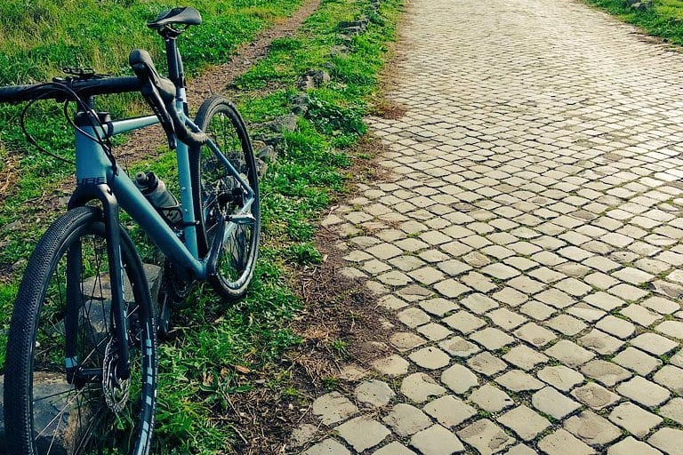

**Da ragazzo mi piaceva andare in bici**, ma non sono mai stato appassionato del mezzo in sé, e odiavo i ciclisti con le loro orrende divise multicolorate e piene di brutti loghi. Ma la vita è fatta in modo molto strano, e quando ho capito che per le mie ginocchiette andare a fare jogging non era l’ideale e mi è stato suggerito di provare con la bici, ho comprato un cancello da 100 euro e ho provato, spronato anche da mia moglie Milena. Dopo aver fatto da Assisi a Spoleto, per la prima volta 60km, ho pensato “ah, però”. Poi una domenica sempre col medesimo cancello (per la cronaca una Atala ibrida del 2010), ho fatto 93Km da Roma a Ostia e ritorno: arrivato a casa avevo la febbre alta e dolori ovunque, e mentre mi ficcavo a letto con un paracetamolo da 1000 sapevo di avere una nuova, irresistibile passione. Era il 2018, e ancora non sapevo che stava per iniziare il periodo più brutto e difficile di tutta la mia vita.

**A giugno del 2018 ho deciso di fare un salto di qualità**, e grazie ai consigli di un biomeccanico ho acquistato una Cube Nuroad Race taglia 53, una rapida bici da gravel con attitudini sportive, molto adatta per le mie caratteristiche fisiche. Avrei però dovuto aspettarla fino a novembre, archiviando rapidamente le ipotesi di sfruttarla durante l’estate. Ma a fine settembre è arrivata una mazzata inaspettata e terribile: il ritorno feroce e aggressivo della malattia che mia moglie aveva già affrontato e combattuto con splendidi risultati 4 anni prima. La situazione si è fatta quasi subito molto difficile, e in questo casino a novembre ho ricevuto la telefonata che la mia bici era arrivata. Sono andato a ritirarla senza gioia e anzi, convinto anche di aver fatto una cazzata, vista la situazione. Ma approfittando di qualche momento ritagliato per me, ho provato a lasciarmi andare, e in quelle pochissime occasioni in cui ho avuto la possibilità di usare la bici ho capito che mi faceva bene: riuscivo a lasciar vivere il dolore e la fatica che accumulavo in quei terribili giorni ma senza affondare sotto il loro peso. Riuscivo ad alleggerirmi senza nascondermi e senza resistere alla sofferenza. Ma era solo l’inizio.

**Il 23 Aprile del 2019 Milena se n’è andata**, lasciandomi da solo con i miei 50 anni compiuti da dieci giorni e con ciò che rimane della mia vita. Il 1 maggio ho ripreso la bici dopo tantissimo tempo, e percorrendo la ciclovia del Tevere fino a Fiumicino, in lunghi tratti di solitudine assoluta ho parlato da solo ad alta voce, ho urlato, ho pianto, ho dato sfogo a tanto del dolore che avevo dentro mentre sfrecciavo stentando fra i sassi e le canne non sfalciate. Quel giorno, in quei momenti, ho capito che questo stupido mezzo a due ruote con i pedali sarebbe stato lo strumento migliore – oltre all’amore di famiglia e amici – per affrontare il vuoto spaventoso e incolmabile che aveva lasciato la mia meravigliosa moglie.

**Dedico quindi a Milena questo blog**, e i piccoli o grandi viaggi che proverò a fare con la mia bici e che qui racconterò, in un percorso che ha poco a che fare con la geografia, e ha molto a che fare con l’anima. La mia, e la sua che mi accompagna.

