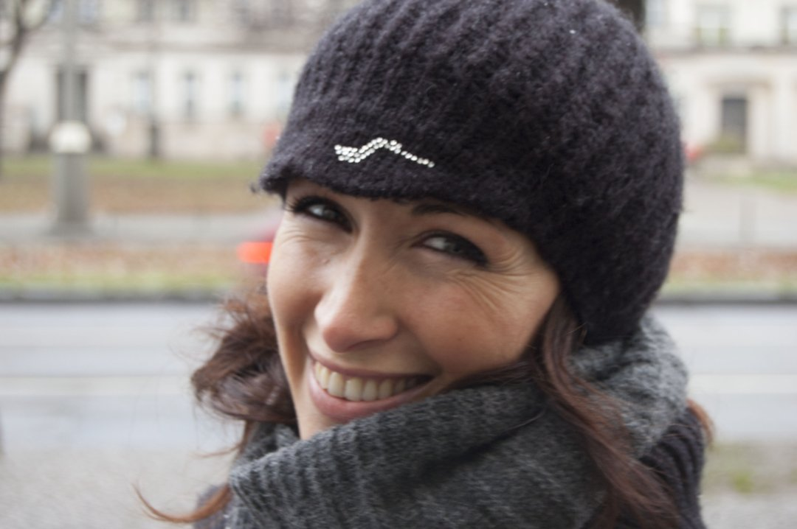

**Da ragazzo mi piaceva andare in bici**, ma non sono mai stato appassionato del mezzo in sé, e odiavo i ciclisti con le loro orrende divise multicolorate e piene di brutti loghi. Ma la vita è fatta in modo molto strano, e quando ho capito che per le mie ginocchiette andare a fare jogging non era l’ideale e mi è stato suggerito di provare con la bici, ho comprato un cancello da 100 euro e ho provato, spronato anche da mia moglie Milena. Dopo aver fatto da Assisi a Spoleto, per la prima volta 60km, ho pensato “ah, però”. Poi una domenica sempre col medesimo cancello (per la cronaca una Atala ibrida del 2010), ho fatto 93Km da Roma a Ostia e ritorno: arrivato a casa avevo la febbre alta e dolori ovunque, e mentre mi ficcavo a letto con un paracetamolo da 1000 sapevo di avere una nuova, irresistibile passione. Era il 2018, e ancora non sapevo che stava per iniziare il periodo più brutto e difficile di tutta la mia vita.

**A giugno del 2018 ho deciso di fare un salto di qualità**, e grazie ai consigli di un biomeccanico ho acquistato una Cube Nuroad Race taglia 53, una rapida bici da gravel con attitudini sportive, molto adatta per le mie caratteristiche fisiche. Avrei però dovuto aspettarla fino a novembre, archiviando rapidamente le ipotesi di sfruttarla durante l’estate. Ma a fine settembre è arrivata una mazzata inaspettata e terribile: il ritorno feroce e aggressivo della malattia che mia moglie aveva già affrontato e combattuto con splendidi risultati 4 anni prima. La situazione si è fatta quasi subito molto difficile, e in questo casino a novembre ho ricevuto la telefonata che la mia bici era arrivata. Sono andato a ritirarla senza gioia e anzi, convinto anche di aver fatto una cazzata, vista la situazione. Ma approfittando di qualche momento ritagliato per me, ho provato a lasciarmi andare, e in quelle pochissime occasioni in cui ho avuto la possibilità di usare la bici ho capito che mi faceva bene: riuscivo a lasciar vivere il dolore e la fatica che accumulavo in quei terribili giorni ma senza affondare sotto il loro peso. Riuscivo ad alleggerirmi senza nascondermi e senza resistere alla sofferenza. Ma era solo l’inizio.

**Il 23 Aprile del 2019 Milena se n’è andata**, lasciandomi da solo con i miei 50 anni compiuti da dieci giorni e con ciò che rimane della mia vita. Il 1 maggio ho ripreso la bici dopo tantissimo tempo, e percorrendo la ciclovia del Tevere fino a Fiumicino, in lunghi tratti di solitudine assoluta ho parlato da solo ad alta voce, ho urlato, ho pianto, ho dato sfogo a tanto del dolore che avevo dentro mentre sfrecciavo stentando fra i sassi e le canne non sfalciate. Quel giorno, in quei momenti, ho capito che questo stupido mezzo a due ruote con i pedali sarebbe stato lo strumento migliore – oltre all’amore di famiglia e amici – per affrontare il vuoto spaventoso e incolmabile che aveva lasciato la mia meravigliosa moglie.

**Dedico quindi a Milena questo blog**, e i piccoli o grandi viaggi che proverò a fare con la mia bici e che qui racconterò, in un percorso che ha poco a che fare con la geografia, e ha molto a che fare con l’anima. La mia, e la sua che mi accompagna.

## Commenti

**pm10**  
_Giugno 26, 2019 alle 10:37 am_

caro Biccio,
ti leggerò come ci si leggeva quando qui era solo blogosfera. per tenerti vicino, e farti sapere che ti penso e che tifo per te.
sempre.

---

**antonio**  
*Giugno 26, 2019 alle 2:45 pm*

Un garnd e abbraccio ed un “buon proseguimento nel viaggio della VITA” Antonio

---

**Roberta**   
*Giugno 26, 2019 alle 7:16 pm*

Ti leggerò con molta curiosità… Ritrovando un po’ ” di Milena ” nelle tue parole…

---

**Agnese**   
*Giugno 26, 2019 alle 10:48 am*

Sarà una splendida lettura.
Sarà leggere di amore, disperazione, speranza e forza.
Ti seguo e faccio anche io il tifo per voi, per te.

---

**benty**   
*Giugno 26, 2019 alle 10:50 am*

noi siamo qui a bordo strada a fare il tifo per te quando passi. Daje Biccio, un abbraccio grande e buone pedalate

---

**Marta**  
*Giugno 26, 2019 alle 11:21 am*

Che belle cose pensi e fai, ti seguirò con enorme piacere. Un abbraccio e buon viaggio!

---

**Antonio**  
*Giugno 26, 2019 alle 11:52 am*

Mi ha colpito molto questo tuo racconto, non amo la bicicletta, ma amo molto i viaggi dell’anima…
Buon Viaggio

---

**Lorelai_23**   
*Giugno 26, 2019 alle 11:29 am*

Mi hai emozionato, un abbraccio 🎈

---

**Eleonora**   
*Giugno 26, 2019 alle 11:31 am*

Sarà bellissimo leggerti, in bocca al lupo e buon viaggio!

---

**Alessandra Bosco**   
*Giugno 26, 2019 alle 11:42 am*

Hai avuto una bellissima idea, costruttiva e catartica. Sei un combattente! Vincerai ❤

---

**Federico**  
*Giugno 26, 2019 alle 11:47 am*

Pedala fino alla fine del mondo e indietro: da qui avrai sempre spinta e sostegno. Daje!

---

**Giulia Ciampo**  
*Giugno 26, 2019 alle 11:51 am*

Che nella iniziativa sono certa che lei è fiera di te anche quando ci sono momenti no., Vedrai che sarà una bellissima esperienza, un grande saggio una volta mi disse bisogna imparare a guardare con occhi diversi, loro sono solo in un altra dimensione e ci guidano

---

**Barbara**  
*Giugno 26, 2019 alle 11:53 am*

Buon viaggio Fabrizio… con la tua Cube per pedalare e con Milena nel cuore ❤

---

**Stefano Cagelli**  
*Giugno 26, 2019 alle 11:54 am*

Sarà un viaggio bellissimo.

---

**Bolso**  
*Giugno 26, 2019 alle 12:08 pm*

Ci sono anch’io. Un grande abbraccio (e chissà che non mi fai venire voglia).

---

**Ale**  
*Giugno 26, 2019 alle 12:15 pm*

Pedala, viaggia e VIVI!!!!!!
Anch’io leggerò…. così contribuirai a rendere più leggeri e piacevoli questi miei momenti sedentari e noiosi.

---

**Luciana**  
*Giugno 26, 2019 alle 12:17 pm*

Ti seguirò con immenso piacere, ogni pedalata , con Milena nel ❤.

---

**Luciana Bernasconi**  
*Giugno 26, 2019 alle 12:18 pm*

Ti seguirò con immenso piacere, ogni pedalata con Milena nel ❤.

---

**Alessio Jacona**  
*Giugno 26, 2019 alle 12:49 pm*

Dai Buccio. Dai che vai bene.

---

**Alessio Jacona**   
*Giugno 26, 2019 alle 12:50 pm*

(Era Biccio :D)

---

**Fabio**  
*Giugno 26, 2019 alle 12:58 pm*

Mi piace questo blog e lo spirito che ti muove. Ti seguo molto volentieri.

---

**Federica Darida**  
*Giugno 26, 2019 alle 2:10 pm*

Sembra solo un pezzo di ferro, a volte è anche arrugginito e le ruote sono sgonfie ma sotto c’è tanto, c’è tutto.
Non vedo l’ora di far parte della tua squadra. Sto li.

---

**Marco**  
*Giugno 26, 2019 alle 3:32 pm*

Ciao Biccio, io faccio fatica ad andare in bici quando non sono felice, ti leggerò con curiosità – e ovviamente molto affetto. marmaz

---

**Angelo**  
*Giugno 26, 2019 alle 4:07 pm*

Io i km, per schiarirmi la mente, sono abituato a farli in moto, ma ti capisco
Per stare su due ruote bisogna stare in equilibrio, e per trovare il proprio equilibrio non c’è nulla di meglio che stare su due ruote
Un abbraccio

---

**Alessia**  
*Giugno 26, 2019 alle 4:10 pm*

<3

---

**Antonella**  
*Giugno 26, 2019 alle 5:51 pm*

Naturalmente ho pianto di commozione e non posso che augurarti buon viaggio!!

---

**Stefania**   
*Giugno 26, 2019 alle 6:54 pm*

L’amore che descrivi mi lascia senza parole. Non vi ho conosciuto personalmente ma penso tutti i giorni a questa tristissima storia. Pedalare fa bene all’anima anche perché i pedali sono sempre due, inseparabili. Buon viaggio

---

**Vincenzo**  
*Giugno 26, 2019 alle 8:43 pm*

La vita è fatta di incontri che ci cambiano la vita, persone, situazioni, cose e per ognuna di loro vale la pena quell’incontro.
Ti leggerò con piacere e affetto in questa nuova avventura. ❤️

---

**Vanina**  
*Giugno 26, 2019 alle 10:28 pm*

Buon viaggio! Seguirti sarà come fare un viaggio insieme anche con Mile, leggere delle tue emozioni e delle tue esperienze sarà una splendida occasione di sentirvi vicini entrambi. Grazie Fabrì!

---

**Pietro**  
*Giugno 27, 2019 alle 5:32 am*

Ecco come piangere di commozione ma anche di orgoglio per te di prima mattina… Ti seguirà da lontano o è ovviamente faccio il tifo per te!!

---

**Giuska**  
*Giugno 27, 2019 alle 6:52 am*

Quando il morale è basso, quando il giorno sembra buio, quando il lavoro diventa monotono, quando ti sembra che non ci sia più speranza, monta sulla bicicletta e pedala senza pensare a nient’altro che alla strada che percorri.
(Sir Arthur Conan Doyle).

Buona pedalata amico del mio cuore.

---

**Chiara**   
*Giugno 27, 2019 alle 8:22 am*

Con gli occhi gonfi di lacrime che non so nemmeno se sto scrivendo giusto, ti dico che hai fatto bene. La scrittura come la bici sarà una terapia, un modo per gestire, osservare, sentire. Ti abbraccio forte forte <3

---

**Oriella Innamorato**   
*Giugno 27, 2019 alle 8:31 am*

Buon vento!

---

**Floss**   
*Luglio 2, 2019 alle 10:06 am*

Caro Biccio , capisco quello che stai provando, anch’io ho trascorso un periodo molto triste della mia vita : improvvisamente perdita in pochi mesi di sorella ,madre e separazione coniugale
La bici mi ha dato forza , energia , maggiore sicurezza in me , introspezione , ausilio a capire i problemi che mi si sono abbattuti sul capo e cercare di risolverli .
Viaggia Biccio con la tua gravel appena puoi, appena hai tempo e voglia e trova la compagnia giusta che abbia la tua stessa curiosità di conoscere luoghi ancora sconosciuti ai tuoi occhi !

---

**Strelnik**   
*Giugno 27, 2019 alle 9:32 am*

Forza ai tuoi pedali, Biccio.

---

**Claudia R. - aprimondo**  
*Giugno 27, 2019 alle 10:10 am*

Ce la farai, e non solo a pedalare. Un abbraccio.

---

**Massi**   
*Giugno 27, 2019 alle 1:24 pm*

Caro Biccio, leggerò con immenso piacere le tue parole scritte, portatrici mai di oscurità, volendoti anche tanto bene.

---

**Piero**   
*Giugno 28, 2019 alle 7:40 pm*

Ciao Fabrizio…pedala e vola con la mente…piangi se serve, grida fino a non avere più voce…ma poi torna a ridere ed a farti abbracciare dalla natura. Cerca di non sentire la stanchezza, pensa che non è comparabile con il dolore di chi non sta bene…respira a pieni polmoni ed ascolta il tuo respiro…chiudi gli occhi e sii felice.

---

**Cristian Conti**   
*Giugno 29, 2019 alle 8:38 am*

Ciao Biccio, la strada che sia percorsa camminando, correndo o pedalando è una grande forma di terapia e strumento di cambiamento interiore. Me ne sono accorto quando mi sono separato e non potevo andare a correre per un problema al ginocchio, di quanto ne avrei avuto bisogno.
Buona strada.

---

**Sara**   
*Luglio 2, 2019 alle 4:46 pm*

Bellissime parole… Possa questo percorso condurti ad una rinascita, continuando a portare con te solo i ricordi belli.
Milena sicuramente ti accompagnerà.
Buon viaggio!

---

**Mitì**   
*Luglio 5, 2019 alle 9:42 pm*

Siamo in viaggio con te. Un bacio :-*

---

**MarianOne**  
*Agosto 8, 2019 alle 9:17 am*

Sempre in viaggio, mai mollare, sempre con la forza di chi ti ama e ti ha amato nel cuore e neel gambe.
Daje

---

**Piero**   
*Novembre 8, 2019 alle 5:10 pm*

Un abbraccio da tutti i tuoi alunni di Information architecture (ELIS, master Media 2002-2004)