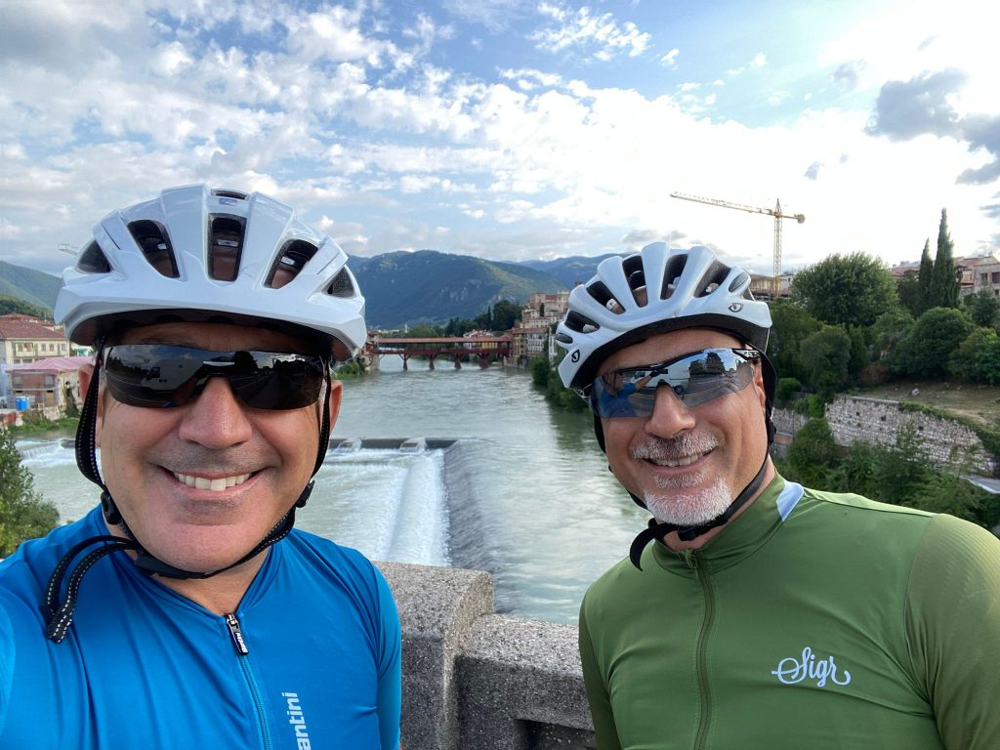
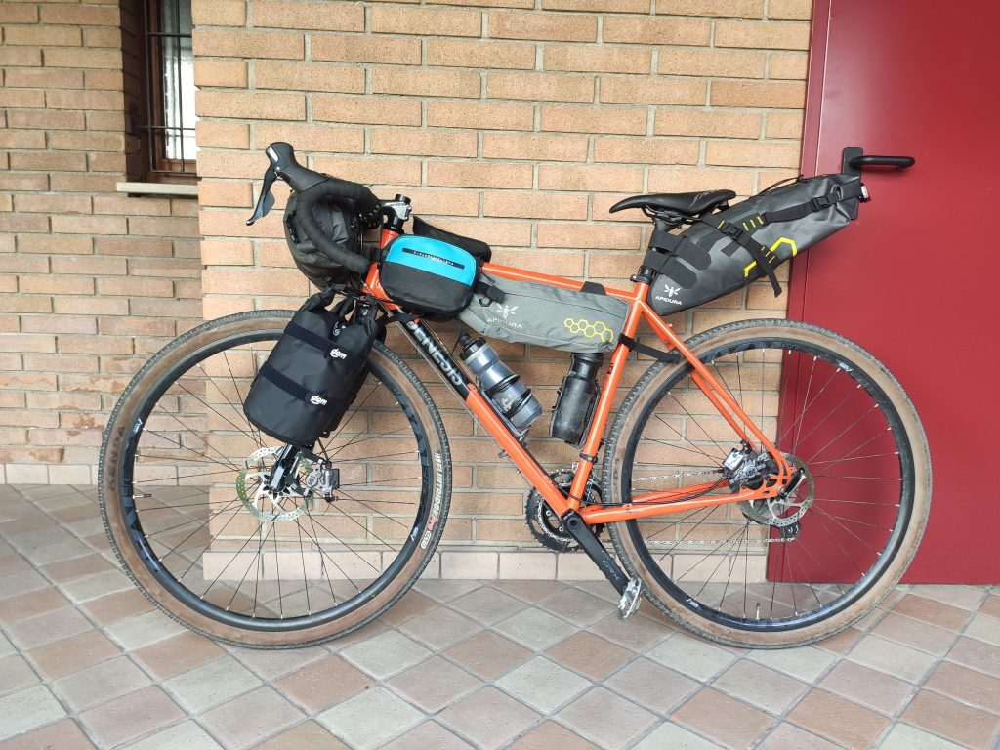
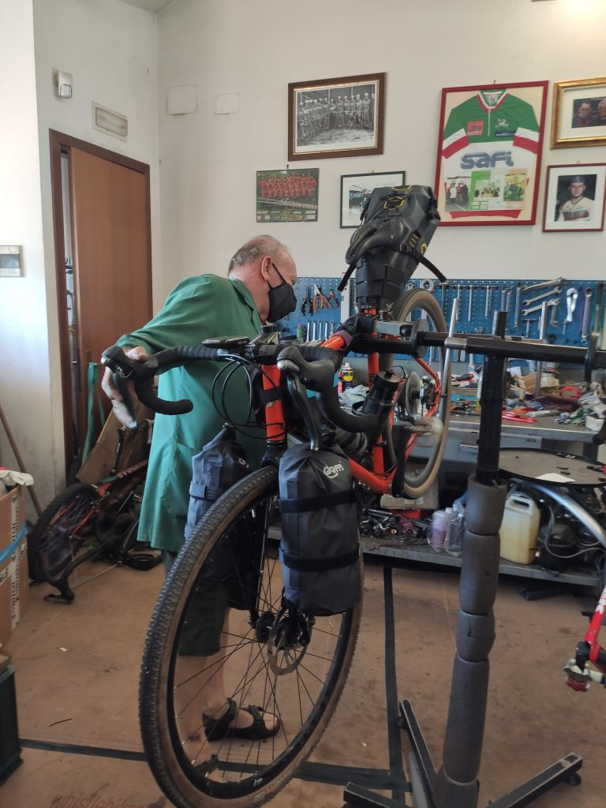
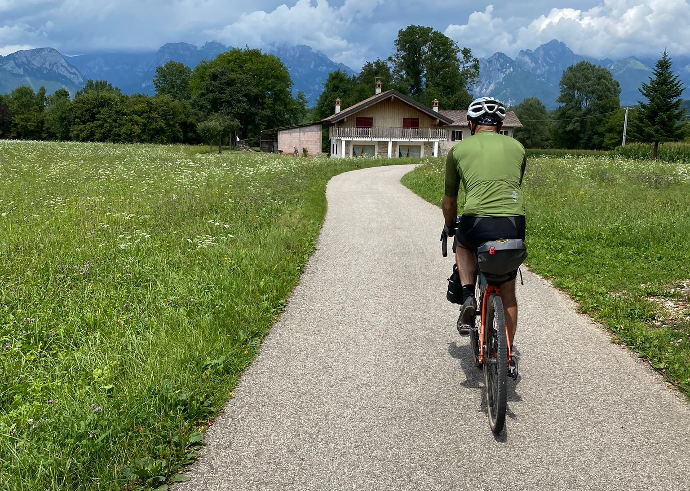

---

title: Tappa 1 - Da Bassano del Grappa a Belluno
weight: 1

---
Dopo un intero anno senza viaggi in bici causa Covid, finalmente torno a mettere le borse sulla mia Genesis per macinare un po' di km in qualche giorno. La scelta cade sulle Dolomiti, un giro non particolarmente impegnativo per chi è giovane ed allenato, probabilmente un po' difficoltoso per un ciclista della domenica come me. La novità stavolta è che non sono da solo, sono con il mio amico Vincenzo, e non mi dispiace lasciare un po' da parte i miei viaggi in solitaria, senza mai dimenticare lo spirito con cui tutto questo è iniziato.

## La partenza

Ed eccoci qui, alla partenza da Bassano del Grappa questa mattina, dopo essere arrivati in serata lui da Roma e io da Cervia.

La mia bici è attrezzata con le solite borse Apidura a cui ho voluto aggiungere due Gorilla Cage alla forcella, leggere e capienti. Dormiremo in agriturismi e B&B quindi niente tenda o sacco a pelo.

La partenza da Bassano non è rapidissima perché non riusciamo a individuare la strada dalla traccia, ma poi si parte di buona lena seguendo strade secondarie molto piacevoli. Qualcosa però non va, il cambio non scende come dovrebbe, ed è strano perché ho fatto revisionare la bici prima di partire. Però è presto, e trovo solo un negozio di bici chiuso. 

## Cose che succedono ai vivi

Arrivati però a Pederobba passo davanti ad un ciclista che mi ispira fiducia, e decido di tentare. Il personaggio è fantastico, piuttosto anziano, e con una sorprendente manualità che mi colpisce subito. Gli spiego il problema, e la prima cosa che mi dice guardando la bici è "ma quanto state via? Due mesi?" Ok, effettivamente troppa roba 😁

Inizia a studiare il problema, e non capisce come mai qualcosa blocca il filo del cambio. Poi un illuminazione, la staffa dove ho montato il ciclocomputer! Per errore l'ho stretta sul cavo! "Cose che succedono ai vivi" mi fa lui.

In pochi minuti mi sfila il filo del cambio, lo sostituisce, lo prova, tutto con una maestria e una velocità sorprendente nonostante un occhio offeso.

Nel frattempo mi racconta che sarebbe già in pensione ma non trova nessuno che vada a lavorare lì. Mi racconta che ha provato a fare lavorare un ragazzo, ma "non mi ha fatto neanche una domanda. Non mi fido di chi non fa domande".

Alla fine mi saluta con un "buon viaggio" e nonostante le insistenze non accetta denaro. Uscendo un tale che era nel negozio mi dice "è il miglior meccanico della Pedemontana". E io realizzo che non gli ho neanche chiesto il nome.

## Verso Belluno, faticando

Il viaggio prosegue purtroppo su statali, lo scenario è molto bello ma le auto e i tir non ci mettono tranquillità. Di tanto in tanto ci fermiamo nei vari paesini che sono calmi e silenziosi. In particolare in uno di questi, Lentiai, mi fermo volentieri perché sono piuttosto stanco dopo un tratto di una decina di km in lieve ma continua pendenza e con il vento contro. Peraltro sconto forse anche il fatto di non aver stupidamente mangiato abbastanza né a cena né a colazione.

La strada verso Belluno è noiosissima, solo verso il finale la traccia ci conduce su una ciclabile che passa nella campagna, e ci rinfranchiamo un bel po'.

Siamo comunque piuttosto stanchi e Belluno non si vede, ma a forza di pedalare riusciamo ad arrivare. Comica finale: ci carichiamo le bici in spalla per le scale che portano in centro perché la scala mobile è ovviamente proibita. A quel punto tanto valeva arrivarci per la strada ma obiettivamente temo che saremmo crollati prima di arrivare!

Domani comincia la parte più difficile ma più bella, io sono con il ghiaccio sul ginocchio. Speriamo che tenga, ma se avrò momenti difficili penserò alla grande forza d'animo e umanità del meccanico di Pederobba.
