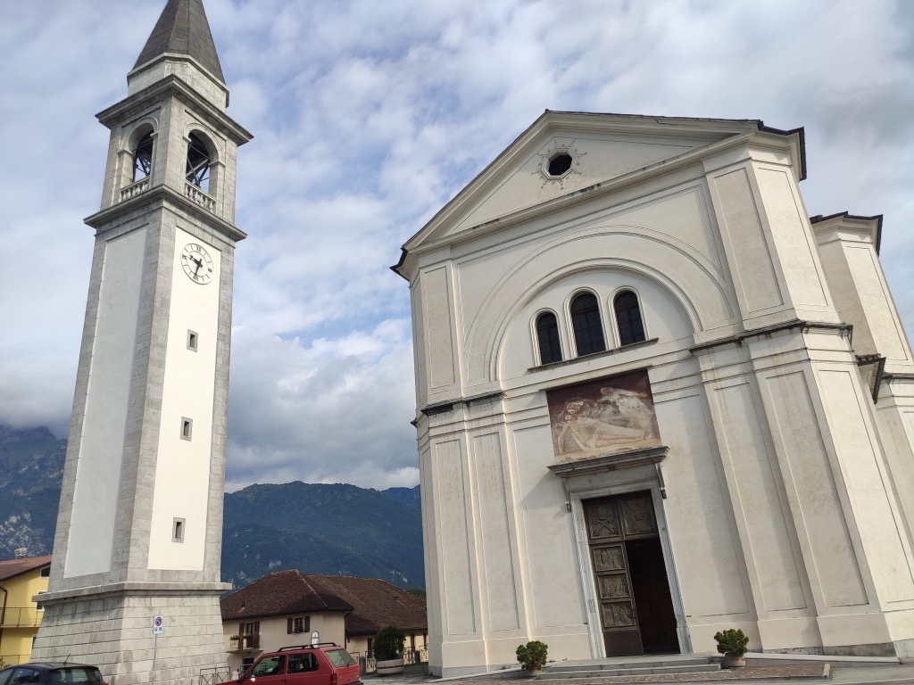
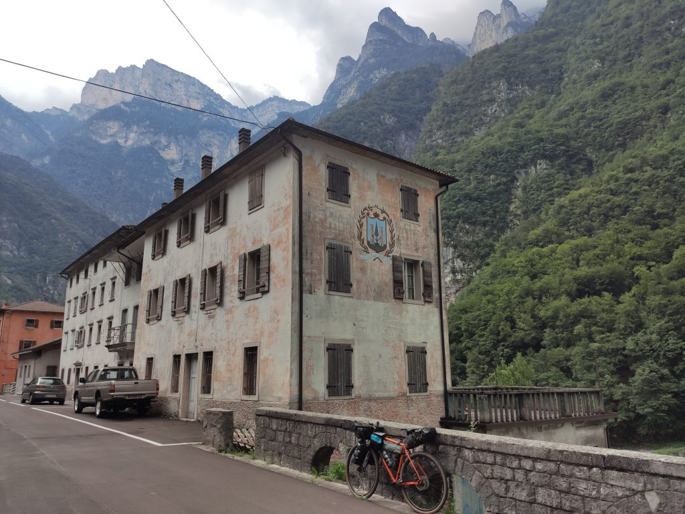

***4 Agosto 2021***

Dopo la lunga tappa di ieri, con Vincenzo abbiamo deciso di fare una tappa di "trasferimento" senza spingere troppo, 45km con un dislivello totale di 848mt con destinazione Pieve di Cadore. La giornata è buona ma sappiamo che troveremo tempaccio salendo verso nord. Mi fa un po' male il ginocchio ma confido nel fatto che pedalare normalmente non peggiora la situazione.

## La Partenza

La partenza è su strada statale, un po' trafficata, ci mettiamo a filo della corsia di emergenza e pedaliamo con pazienza. Non c'è molto da vedere, ma quando capita qualche paesino sulla strada ci fermiamo volentieri per dare un'occhiata e fare qualche foto, come nel caso di Canevoi, dove fotografiamo uno dei tanti grandi campanili bianchi che si trovano in queste zone.

## Pedalando, la bellezza arriva

Poco dopo, finalmente un'occasione per lasciare la strada: la ciclabile Pontalpina. Ma dopo pochissimi chilometri con delusione finiamo dritti dentro la classica zona commerciale di fondo valle, dimenticando prestissimo il piacere di pedalare in mezzo alla natura. Ma alla fine della ciclabile troviamo una grande bici rosa, molto probabilmente dedicata al giro d'Italia.

Proseguiamo a pedalare per questo tratto molto commerciale, e dopo qualche km di strada provinciale lo scenario cambia completamente. Appena passato il Piave (in un bellissimo punto in cui il fiume si allarga quasi a creare un lago anche se molto asciutto), all'altezza di Soverzene inizia una bella ciclabile che ci conduce via dalle auto, al termine della quale inizia un percorso molto rispettoso dei ciclisti. Iniziamo ad entrare in luoghi dove la bicicletta è considerata davvero.

Da lì in poi la strada si fa davvero bella. C'è pochissima gente in giro e pochissime auto e al termine della ciclabile ci troviamo su un altro bel ponte sul Piave, dove appoggiando la bici sulla balaustra per fare una foto, vedo prima staccarsi e poi volare nel fiume la mia luce posteriore!

## Ancora traffico, ma dai, ci siamo
Arrivati a Codissago, dove avremmo dovuto prendere una bella ciclabile che costeggia il fiume Piave, veniamo informati che l'alluvione ha fatto un disastro rendendola impraticabile. Ci facciamo coraggio e affrontiamo la Statale 51, stretta e ipertrafficata anche per via dei lavori. Un po' storditi arriviamo in un punto dove è disponibile la vecchia statale, ormai in disuso perché sostituita dalla nuova, ma perfettamente praticabile con la bici. Ancora un cambiamento di scenario: siamo letteralmente soli, su questa bella strada che costeggia il Piave da un lato, e alcuni bei paesini apparentemente abbandonati dall'altro lato. 

La strada è tranquilla, il clima è ottimo anche se il cielo è coperto. Solo gli ultimi dieci km verso Pieve iniziano ad essere pesanti: sapevamo che il dislivello oggi si faceva tutto qui, e infatti nel giro di 8km saliamo da 400 a 900mt! Nonostante la fatica della salita il ginocchio sembra reggere, vado piano senza forzare mai e questo probabilmente aiuta.

Arrivati a Pieve di Cadore piuttosto stanchi, la cosa migliore da fare è abbattersi su cibo in abbondanza, nell'ottima Locanda dei Dogi dove torneremo anche stasera!

## La traccia

→ [Giro_delle_Dolomiti_Day_2_da_Belluno_a_Pieve_di_Cadore.gpx](../Giro_delle_Dolomiti_Day_2_da_Belluno_a_Pieve_di_Cadore.gpx)

## Commenti

**Margherita**    
*Agosto 4, 2021 alle 3:57 pm*

Grandissimi! Vi invidio soprattutto la tappa alla locanda 😊 (non è vero, anche il Piave).
Buona continuazione!