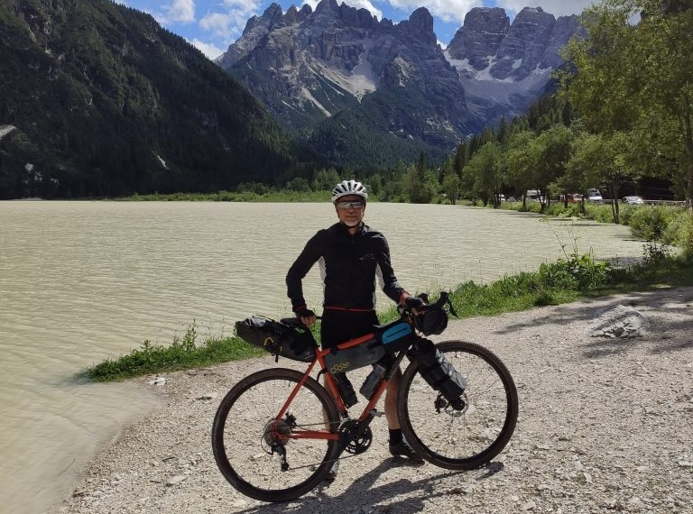

***5 Agosto 2021***

Io e Vincenzo sapevamo bene che questa sarebbe stata la tappa più lunga, la più difficile e la più bella del giro, ma quanto saremmo rimasti meravigliati e stupiti era inimmaginabile.

## La partenza
Già dalla partenza da Pieve di Cadore si è capito che il percorso avrebbe preso una piega diversa rispetto ai giorni precedenti. Il percorso verso Cortina, tutto in salita, si snoda lungo una ciclabile tranquilla e bellissima. Il tempo incredibilmente è splendido, e questo è un regalo meraviglioso considerando la tanta pioggia del giorno prima. 

Arrivati a San Vito di Cadore finalmente tocchiamo i 1000mt di altezza.

## Nel cuore delle Dolomiti
La ciclabile continua a salire, oggi l'obiettivo è raggiungere i 1.200 metri di Cortina per poi arrivare fino ai 1.530 del passo di Cimebanche. La strada è lunga, il dislivello anche, pedaliamo con tranquillità per dosare le forze e non arrivare stremati al vero impegno della giornata: raggiungere il lago di Braies.

Non devo raccontare nulla di Cortina che non si sappia già: paesino molto carino e perfettamente curato, centro pieno di negozi di brand &#8220;alti&#8221;, insomma tutto quello che sai di Cortina è sostanzialmente vero. Ci fermiamo giusto il tempo di fare scorta di cibo (paninetti con affettati e formaggi che consumeremo lungo tutta la giornata senza mai fare un vero pranzo per non appesantirci) e un caffè, e poi via.

E qui comincia il bello: andando in direzione Dobbiaco la ciclabile è in realtà una bellissima vecchia ferrovia dismessa, con fondo ghiaioso, che si snoda nei boschi attraversando anche delle gallerie, alcune delle quali scavate nella roccia.

È tutto bellissimo. Siamo felici di essere su ghiaia e di lasciare per un po' l'asfalto, (anche se le ciclabili sono splendide ovviamente), ma qui su questo terreno le nostre bici gravel decisamente esprimono il loro meglio. E la natura è incredibile. Si sale, e si fatica, ma il percorso è animato da ruscelli, laghetti, un grande silenzio e un'aria fresca e frizzante.

L'idea di mangiare i nostri mini panini si è rivelata ottima: abbiamo sempre carburante ed evitiamo lunghe pause. Ma la salita si sente tutta, insieme ai chilometri già accumulati nei giorni precedenti. Fino al passo di Cimebanche dobbiamo salire per 45 km totali fino a raggiungere i 1.530 metri a partire dagli 800 di Pieve di Cadore toccati ieri. 

E spingendo spingendo ci arriviamo.

## Verso Braies
Ci fermiamo al ristoro del passo per un caffè e per rifornimento acqua, e ci apprestiamo a ripartire per goderci i 20km di discesa verso Dobbiaco 😁

Carichi come non mai, ci lanciamo nella discesa per riempirci gli occhi di tutta la bellezza di questo sentiero ghiaioso che continua ininterrotto da Cortina. Ci sentiamo bene entrambi, qui c'è tutto il senso del viaggio di scoperta, di emozione, di spensieratezza, e di ricarica personale.

Scendendo succedono due cose buffe: la prima è che improvvisamente in un ghiaione mi si blocca la pinza del freno posteriore, problema che per fortuna risolviamo abbastanza rapidamente riuscendo a sganciare la pinza rientrata senza forzare. La seconda è che per via delle forti piogge dei giorni scorsi ci troviamo un ruscello da guadare 😁

Continuando a pedalare incontriamo altre due meraviglie: il Lago di Landro, da dove si vedono le Tre Cime di Lavaredo e il Lago di Dobbiaco, enorme e bellissimo.

Siamo ormai a Dobbiaco, la discesa è finita, a questo punto non resta che affrontare la vera sfida di oggi: tornare a quota 1500 metri per raggiungere il Lago di Braies, la vera sfida di tutto questo lungo percorso. Raccogliamo quindi le forze residue, e raggiunta Villabassa iniziamo a salire lungo la ciclabile che porta verso Braies. L'inizio non è micidiale, pedaliamo lentamente ma le pendenze non sono impossibili. Alla fine della ciclabile però una sorpresina sgradevole: salvo errori, l'unico modo per arrivare su è tramite la strada trafficata. Alternative non ce ne sono, e quindi ci mettiamo in marcia. A questo punto ci rendiamo conto che stiamo affrontando una salita di circa 3km con pendenza inesorabile che oscilla fra 10% e 11%.

Più tardi, io e Vincenzo ci confessiamo che più di una volta abbiamo pensato di mollare. Abbiamo nelle gambe i tanti chilometri fatti quel giorno e nei giorni precedenti, e davvero stiamo faticando tantissimo. Ma tutto il viaggio girava intorno all'arrivare lì, e la testa ci dice di spingere e spingere. Quando vediamo il parcheggio delle auto, capiamo che è fatta. Che gioia incredibile!

Nel frattempo ci raggiunge anche il nostro amico Cesare in auto, che in questi giorni condividerà con noi le serate e alcuni momenti diurni aspettando il nostro arrivo in bici. 

È fatta, Braies è conquistata, la giornata si chiude a Valdaora di Sotto dove fermiamo il GPS a 100km tondi, per abbatterci su cibo e vino, che fame!