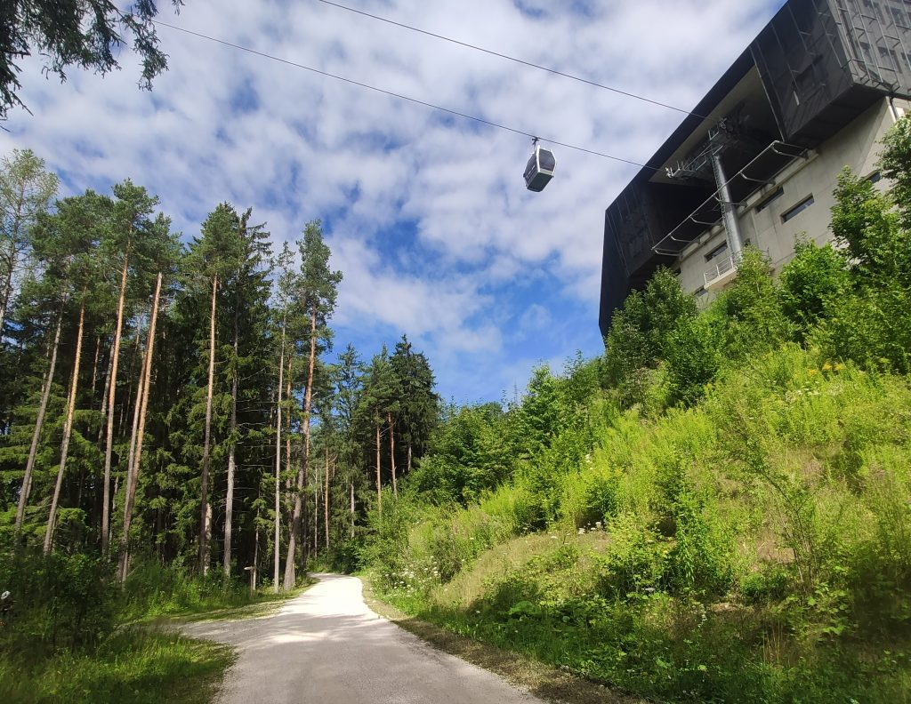
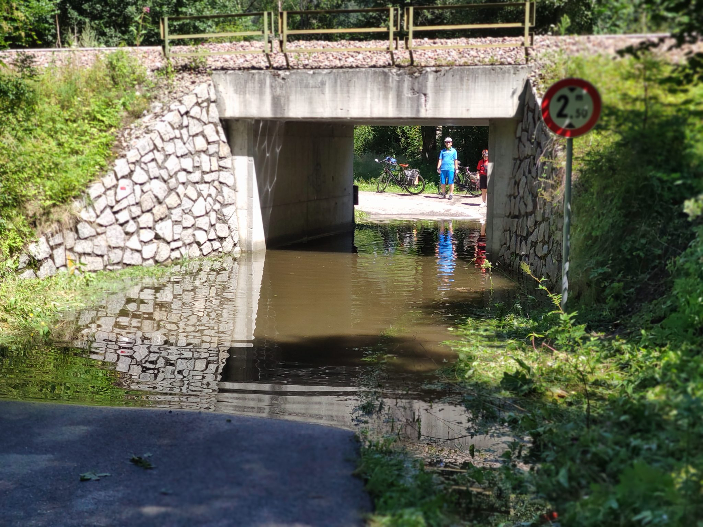
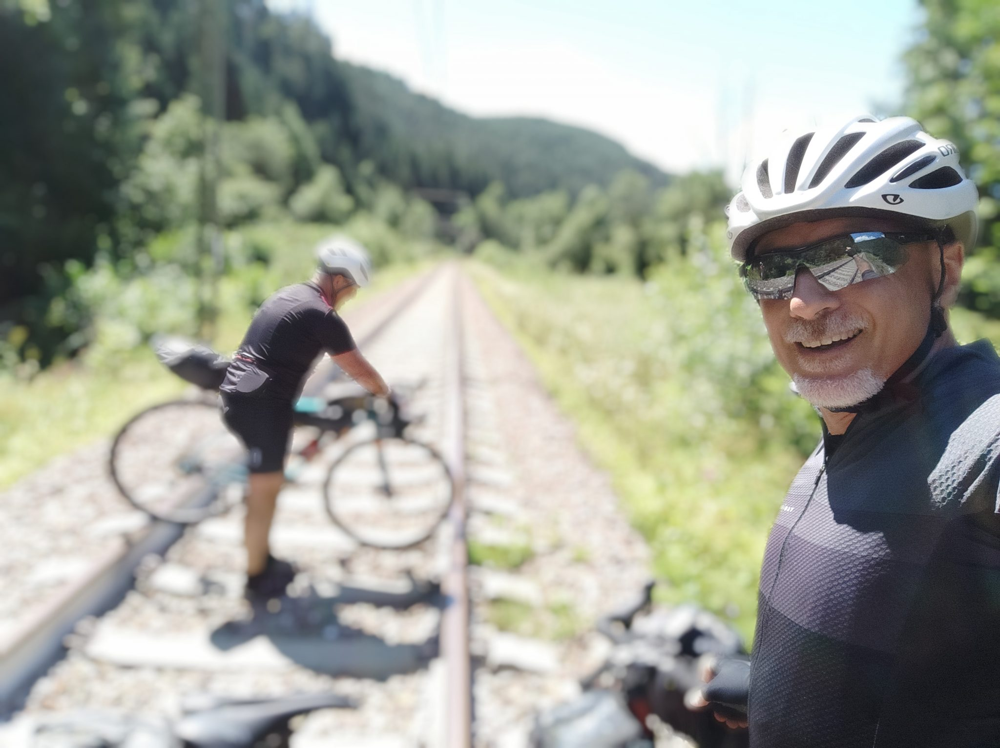
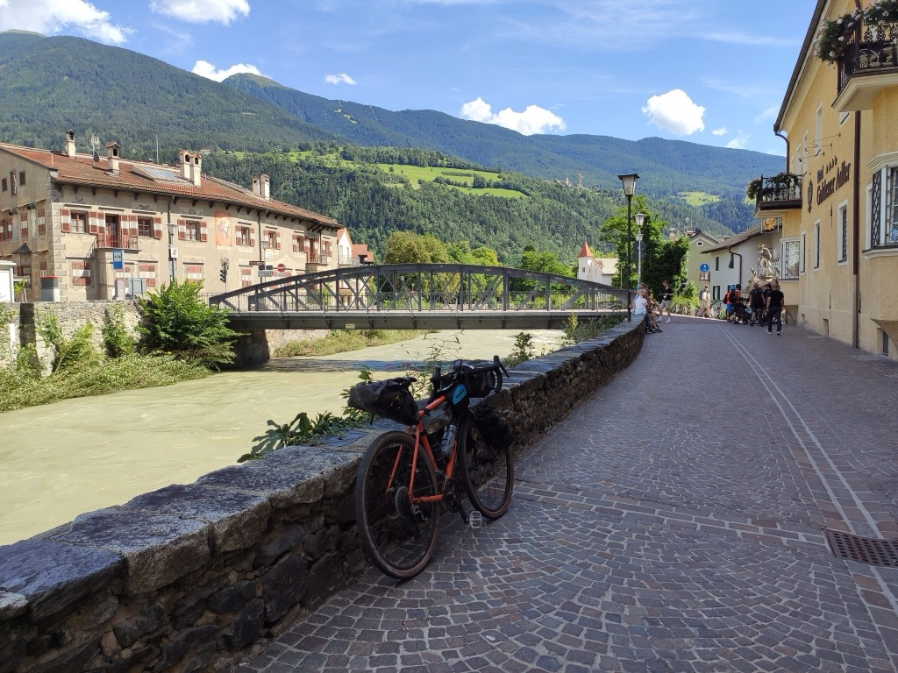
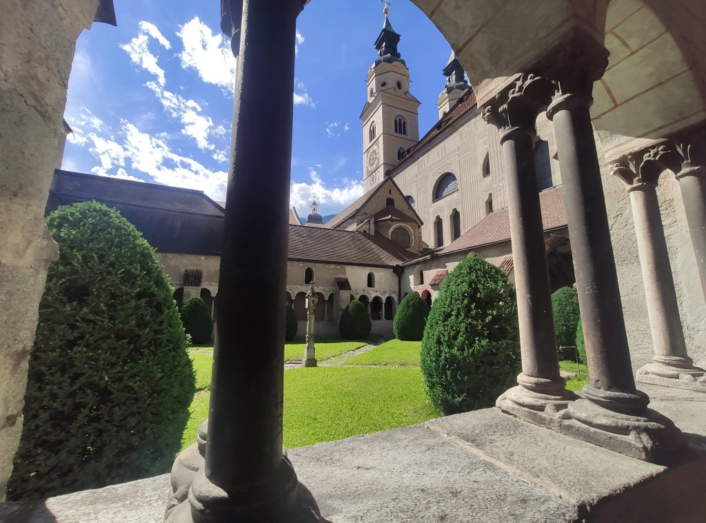

***6 Agosto 2021***

Dopo Braies, che nella nostra mente rappresentava la sfida principale, sapevamo che il resto del viaggio sarebbe stato più "in discesa". E infatti questa tappa, più breve e nettamente meno faticosa, non ci ha dato grandissime emozioni. 
## La partenza
La bellezza qui è davvero ovunque, e non va mai sottovalutata: ad esempio, appena partiti troviamo la ciclabile da Valdaora a Brunico, uno splendido percorso nel bosco, e questo tratto con passaggio della funivia è particolarmente suggestivo.

Arrivati a Brunico pedalando, ci fermiamo per un caffè. Siamo un po' rallentati, ma ci può stare dopo la lunga tappa di ieri. Ripartiamo da Brunico in direzione Bressanone sempre seguendo la ciclabile che costeggia l'impetuoso fiume Rienz. L'acqua è una costante in questi giorni, e le grandi piogge hanno pericolosamente innalzato i livelli di fiumi e torrenti, al punto di rappresentare un pericolo in diversi passaggi. Infatti proprio fra Brunico e Bressanone ci troviamo in un sottopasso allagato, con acqua evidentemente profonda una sessantina di centimetri.

Decidiamo che non vale la pena inzupparsi, e che può essere una buona idea scavalcare la ferrovia 😱 e così facciamo, prendendoci anche il tempo di fare un paio di foto.

## Piccole scoperte emozionanti
Dopo una breve pausa a Rio Pusteria per mangiare qualcosa, entriamo in Bressanone sul delizioso lungofiume "urbano" del Rienz, e pedalando raggiungiamo il Duomo, e il suo splendido chiostro. Sarà per la bellezza degli affreschi, per la musica diffusa nel chiostro, per il silenzio, forse anche per le difese un po' abbassate, ma mi vivo un breve momento di emozione molto profonda che mi porterò poi dentro per tutta la giornata. 

 

Tutto intorno a noi è incredibilmente ordinato e civile. Assuefatti al caos e alla sporcizia di Roma, trovare luoghi curati con così tanta attenzione fa veramente effetto. Viene da chiedersi se il circolo virtuoso della bellezza sia un meccanismo che può ancora essere innescato anche là dove ormai tutto sembra abbastanza perduto. 

Ripartiamo da Bressanone in direzione Chiusa, pedalando in grande tranquillità. Il tempo è bello, stiamo scendendo di pendenza, e 60km alla fine vengono via quasi senza accorgercene. Arriviamo a Chiusa nel pomeriggio, pronti per goderci una serata di relax e buon cibo (costine alla birra, veramente notevoli!)

## La traccia

→ [Giro_delle_Dolomiti_Day_4_Da_Valdaora_a_Chiusa.gpx](../Giro_delle_Dolomiti_Day_4_Da_Valdaora_a_Chiusa.gpx)