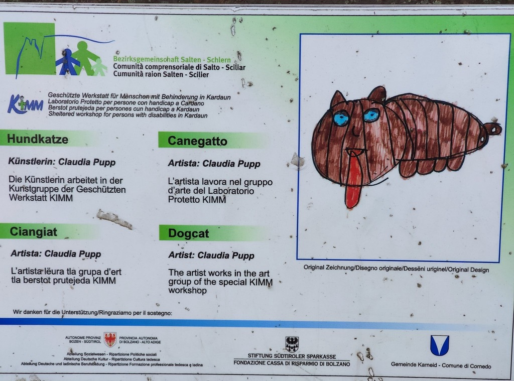
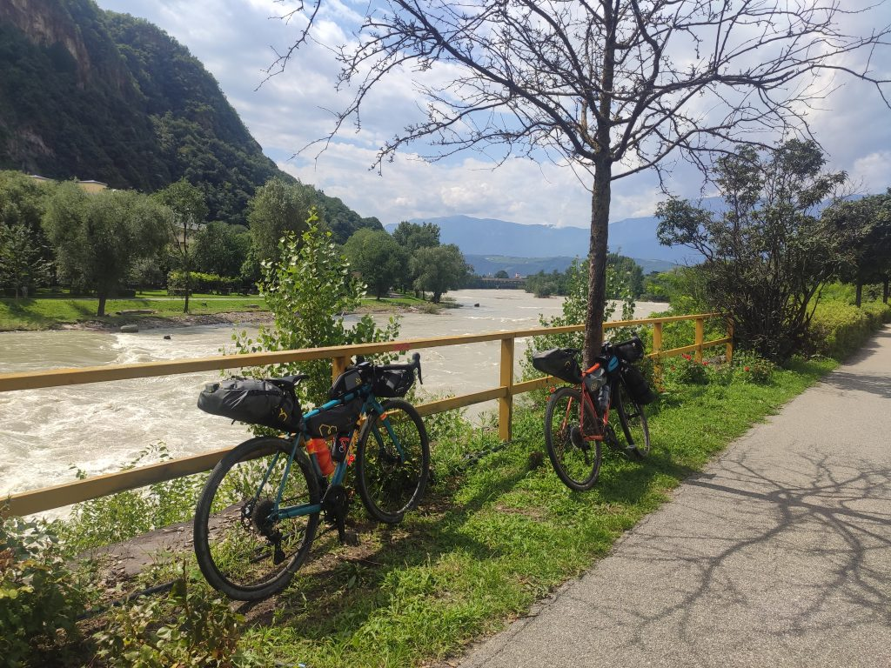
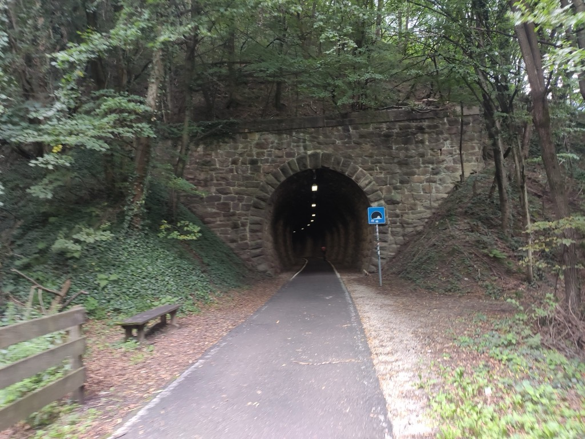

Proprio quando ti sembra di aver iniziato la discesa, e inizi a mollare, ecco che arriva la giornata più pesante che ti prende in contropiede tanto è inaspettata. 

## La partenza 
Partiamo sapendo di dover fare una novantina di chilometri sostanzialmente in discesa, e sembra tutto abbastanza facile. La ciclabile da Chiusa a Bolzano non è particolarmente bella, ma il fiume Isarco che l&#8217;accompagna rende il percorso molto piacevole.

Prima di arrivare a Bolzano ci imbattiamo in una iniziativa molto bella: lungo la ciclabile c&#8217;è un esposizione permanente di opere create da un laboratorio artistico per persone con disabilità (Laboratorio Protetto per persone con handicap a Cardano) in collaborazione con la Provincia Autonoma di Bolzano

Arrivati a Bolzano sembra davvero di essere in Scandinavia. Le ciclabili sono una rete interconnessa con indicazioni stradali, e la bicicletta è un mezzo comunemente usato per girare in città. Tutto, dalla periferia, è estremamente curato, e fa molto più effetto vedere una città vera e propria che riesce a conservare la stessa cura che puoi trovare in un paesino. Bolzano è una bella città, vivibile e ben organizzata, e io e Vincenzo pensiamo: ma perché viviamo come viviamo a Roma, quando è possibile vivere così? Lo so, l&#8217;ho già detto, ma quando è una città vera a farti vedere la differenza, fa tutto un altro effetto.

Sulla ciclabile di Bolzano incontriamo una famiglia che passeggia. Lui è abituato a fare campionati di Mountain Bike e fa abitualmente viaggi in bici. Ci dice che, anche se non l&#8217;avevamo considerato (anzi si, ma no, e questa la capisco da solo), vale nettamente la pena di andare a fare un giro lungo la ciclabile che attraversa i vigneti della Strada del Vino (da Appiano Sulla Strada del Vino fino a Caldaro Sulla Strada del Vino). Decidiamo che si, dobbiamo farlo per forza, in fondo il viaggio è fatto anche di decisioni improvvise di questo tipo. Sappiamo che incontreremo un po&#8217; di dislivello ma niente di che. E in effetti il percorso merita la deviazione, soprattutto per vedere Appiano e fermarci anche un po&#8217; nella deliziosa piazzetta principale.

Ripartiamo da Appiano e proseguiamo sulla Strada del Vino. Saliamo ancora, e fa caldo, c&#8217;è tanta afa e inizia ad alzarsi un vento un po&#8217; fastidioso. Un po&#8217; affaticati e in piena salita, iniziano i problemi che ci avrebbero accompagnato lungo la strada da quel momento in poi. 

Primo problema: mi si sgancia la catena e mi si incastra fra il pignone più grande e il disco di plastica di protezione del pacco pignoni. E niente, non esce. Ci mettiamo in due con calma e pazienza ma fa caldo, siamo sudatissimi e iniziamo ad attirare gli insetti a frotte. Uno di questi, un maledetto tafano (a cui sono particolarmente reattivo) mi becca mentre sono nel pieno dell&#8217;impegno del scastrare la catena. Finalmente stanchi sudati e pizzicati riusciamo a sistemare la catena e ripartiamo.

Le vigne della Strada del Vino sono bellissime e si perdono a vista d&#8217;occhio. Il punto più bello è la cima di Caldaro da dove, fra le vigne, si intravede il lago di Caldaro

Tutto bellissimo, ma qualcosa non va: siamo in discesa ma fatichiamo a pedalare per via del vento contro, che non ci toglieremo mai più di dosso. Fino a fine giornata.

Scendiamo verso il lago, lo scenario è bellissimo ma fatichiamo. C&#8217;è un&#8217;afa insopportabile e un forte vento contrario, il peggio del peggio. A un certo punto ci perdiamo, siamo evidentemente stanchi e un po&#8217; confusi, e cerchiamo la strada per imboccare la ciclabile dell&#8217;Adige, ma senza gran fortuna. 

Finalmente a forza di girare a vuoto troviamo la strada, ma io mi accorgo che sto sbandando. Mi fermo con l&#8217;intenzione di gonfiare la ruota posteriore, ma non avevo mai usato questa pompa appena comprata, e ci sbatto un bel po&#8217; la testa prima di riuscire. Si, mi sto innervosendo.

Siamo arrivati alla ciclabile dell&#8217;Adige, che speravamo di goderci un po&#8217; di più, ma avendo ancora più di 30km da fare ed essendo già pomeriggio, non c&#8217;è molto da godere. Partiamo e subito ci rendiamo conto del vero problema: siamo inesorabilmente controvento e lo saremmo stati per i successivi 30km. 

Per quanto spingiamo non si riesce ad andare oltre i 15/16km all&#8217;ora. Io fatico, davvero tanto, sento tutto il peso dei chilometri di questi giorni, la stanchezza di oggi, e penso a questa tappa che avrebbe dovuto essere un passeggiatone senza pretese, e invece si sta rivelando una faticata enorme e senza gran valore. Vincenzo riesce a spingere di più, ma anche lui è stanco. Non parliamo, pedaliamo e basta. Tutto questo ci sembra una grande metafora di qualcosa, forse della vita in sé.

A un certo punto, arrivati al confine della provincia di Trento, decidiamo che è ora di farci un po&#8217; di gel energetico, volevamo evitarlo ma tant&#8217;è. E la botta arriva: per una mezz&#8217;oretta riusciamo a contrastare il vento e a spingere fino a 20km/h. Ma la strada e tanta e l&#8217;effetto bomba finisce in fretta. 

Siamo quasi a Trento, ma non manca una beffa finale: per proseguire sull&#8217;Adige bisogna per forza fare un giro davvero assurdo, e anche qui le metafore sulla vita si sprecano

Vabbè. Pedalando pedalando, praticamente sulle ginocchia, entriamo nel lungoAdige cittadino, e lì comica finale: il navigatore punta dritto a un muro. C&#8217;è un sottopasso! Per arrivare al nostro appartamento avremmo dovuto caricarci la bici e passare sotto la stazione. Grandi risate nervose e liberatorie, ci incolliamo la bici in spalla e via, è fatta. 111km. La vita arriva proprio lì, quando la sottovaluti ti presenta il conto.