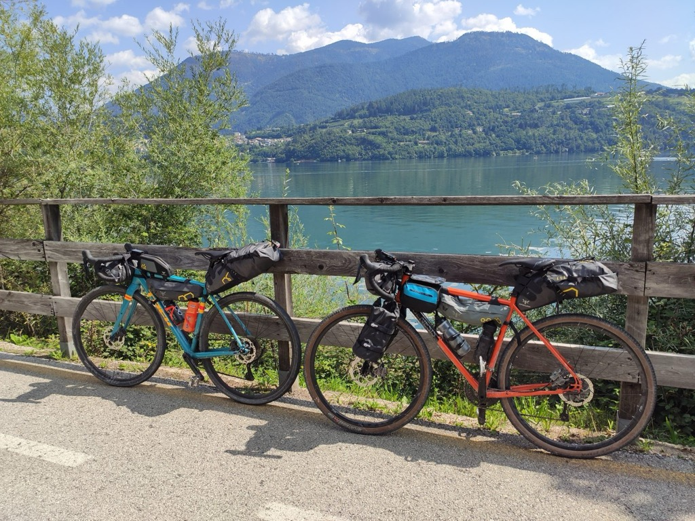
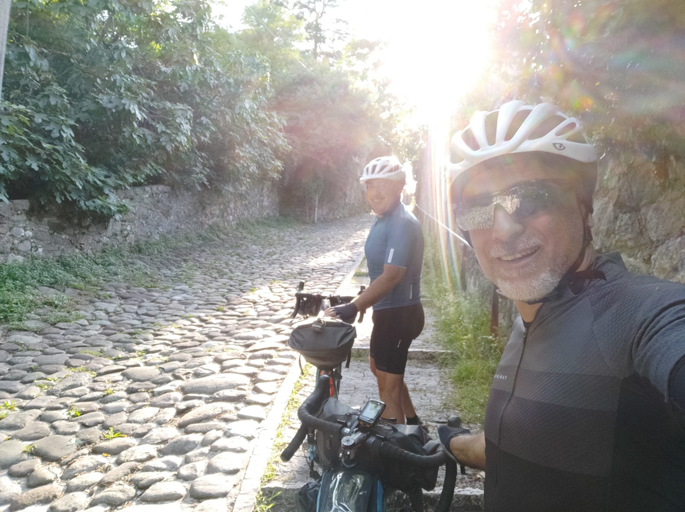
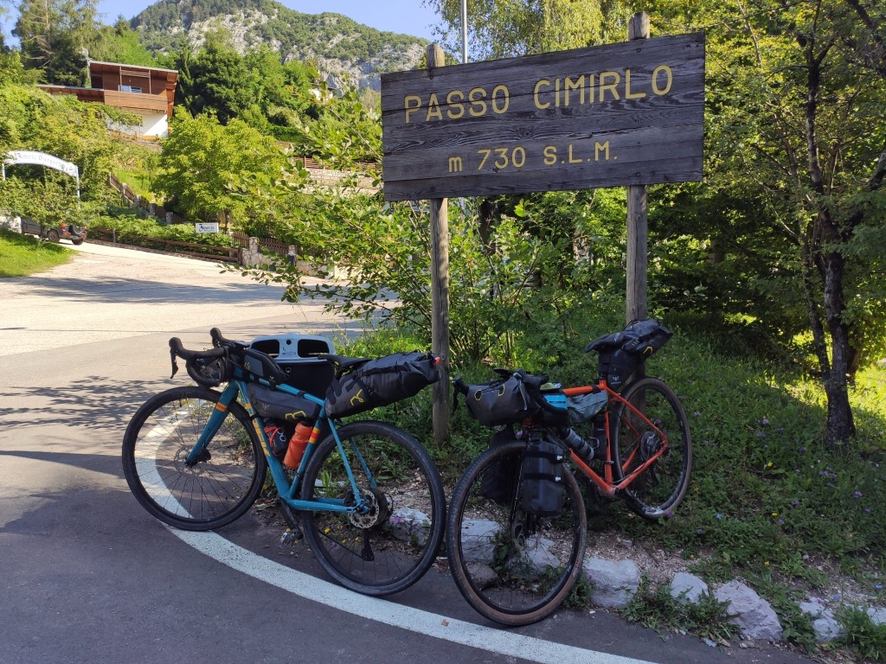
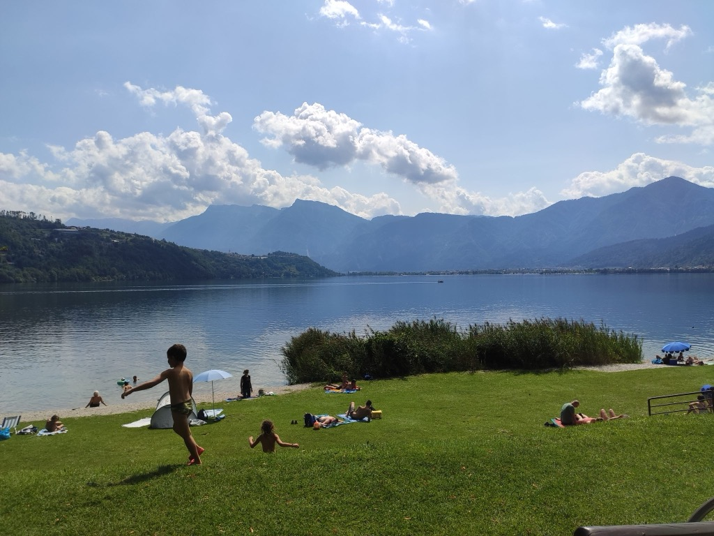
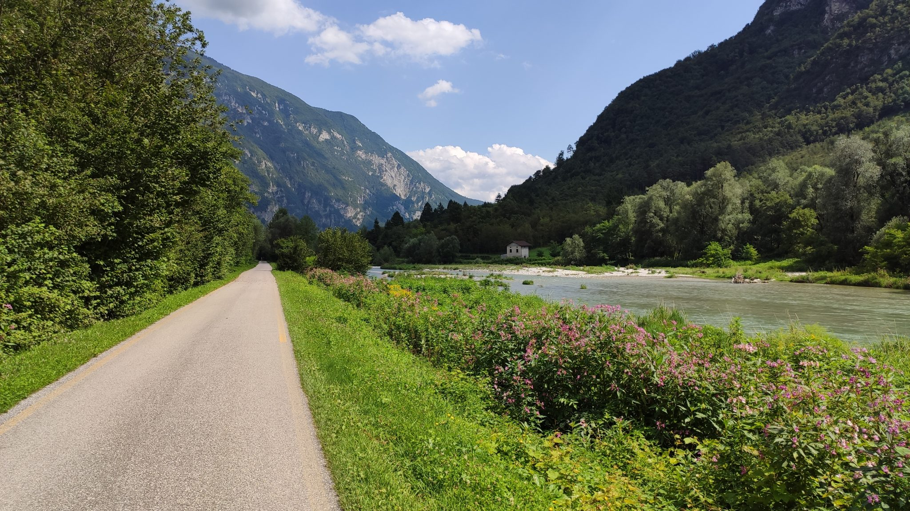
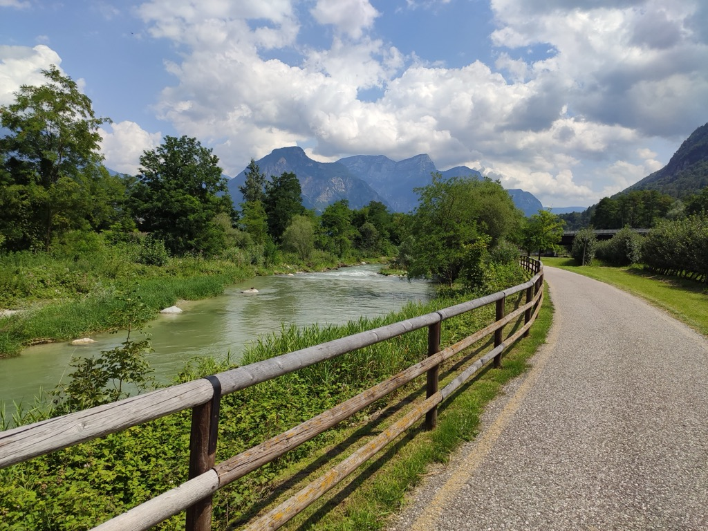
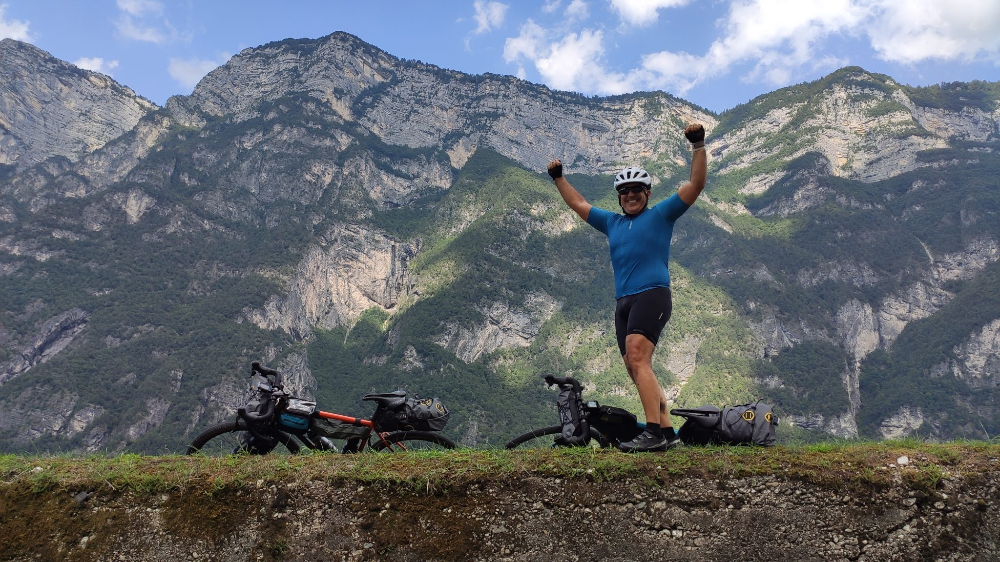

Dopo una giornata di riposo a Trento per riprendere le energie, ci accingiamo a chiudere il giro percorrendo la ciclabile che nel 2020&nbsp;si è aggiudicata il&nbsp;premio&nbsp;della stampa&nbsp;dell &#8220;Italian green roads award&#8221;, l&#8217;oscar italiano del cicloturismo: la ciclabile della Valsugana. Siamo molto curiosi, e l&#8217;idea di chiudere l&#8217;anello con un percorso molto bello ci intriga parecchio. C&#8217;è solo un piccolo problema: che per accedere alla Valsugana da Trento occorre scollinare un passo a 730mt slm partendo dai 190mt di Trento, in 7km circa. 

La mattina ci svegliamo un po&#8217; storditi: stiamo mangiando e bevendo un bel po&#8217; la sera e il sonno non ne giova. Fatta una veloce colazione, salutiamo e diamo appuntamento a Bassano al nostro amico Cesare, che sta condividendo il viaggio muovendosi in auto fra le varie tappe, e partiamo. Dopo qualche km in centro, arriviamo all&#8217;attacco della salita, ed è già tostissima: un 13% ciottolato, e siamo ancora in centro. Decidiamo di spingere la bici per non ammazzarci sui ciottoli a gambe ancora fredde. Dopo qualche centinaio di metri però torna l&#8217;asfalto, e non abbiamo più scuse: iniziamo a pedalare. E sono 7km davvero tosti, dove raramente si scende sotto il 7% di pendenza e si toccano invece il 18/20.

È proprio diretta, abbiamo 400km nelle gambe, le bici pesano e fa pure un gran caldo. Ma pedalata dopo pedalata, fra una risata e l&#8217;altra (che non sono mai mancate per fortuna), arriviamo fino su al passo. Siamo a 730mt di altezza raggiunti forse anche in meno di 7km!

Siamo a pezzi, ma la prospettiva di farci altrettanti km in discesa ci sollazza. Ci lanciamo quindi per la discesa asfaltata convinti di farci un percorso trionfale fino al lago di Caldonazzo senza spingere un pedale. E invece, dopo poche centinaia di metri, scopriamo la verità: quasi tutta la discesa è su carrarecce di ciottoli a pendenze impossibili, che ci costringono a scendere a piedi. Alla faccia della discesa trionfale!

Con non poca fatica però arriviamo fino in fondo, e il premio della bellezza del Lago di Caldonazzo merita la faticata.

Costeggiando il Lago di Caldonazzo sulla piacevolissima ciclabile, arriviamo all&#8217;inizio della famosa e tanto attesa Ciclabile della Valsugana. E lì scopriamo un mondo. La ciclabile segue il Brenta dal suo formarsi, e si snoda per 80km di bellezza incredibile. È tutto curato, tutto pulito, c&#8217;è tantissimo verde, alberi, fiori, e questo splendido fiume che in più punti è paragonabile a un ruscello di montagna con piccole cascatelle sulle rocce. Sembra di pedalare in un delizioso giardino giapponese.

Stiamo bene, e siamo contenti. Pedaliamo allegramente sopra i 20km/h e maciniamo strada rapidamente e godendoci lo scenario, in continuo cambiamento e con tantissime sorprese. Non facciamo molte tappe, giusto una sosta a Borgo Valsugana e poi in uno dei tanti bici grill lungo la ciclabile per farci un panino, ma per il resto ci godiamo il percorso incantato facendo gli scemi di tanto in tanto 😊.

Il finale è un crescendo. Alla fine della ciclabile inizia un percorso fra splendidi paesini lungo il Brenta, fra cui il bellissimo Valstagna.

Arriviamo a Bassano senza minimamente sentire i 100km percorsi, e siamo contenti. È stato un viaggio pazzesco, divertente e pieno di colori. Io e Vincenzo, che è stato per me un compagno di strada perfetto, sappiamo che è stato anche un viaggio dell&#8217;anima, perché la bici è così, ti fa scaricare le zavorre della mente e ti fa trovare quello che non cerchi quando meno te l&#8217;aspetti. L&#8217;importante è andare avanti, non importa la pendenza. 

_Grazie a Vincenzo per aver condiviso con me questo viaggio, non ce l&#8217;avrei mai fatta senza di te e comunque non sarebbe stato così divertente. Grazie a Cesare che non potendo pedalare con noi ci ha seguito in auto pur di condividere con noi un po&#8217; di preziosi momenti insieme._

