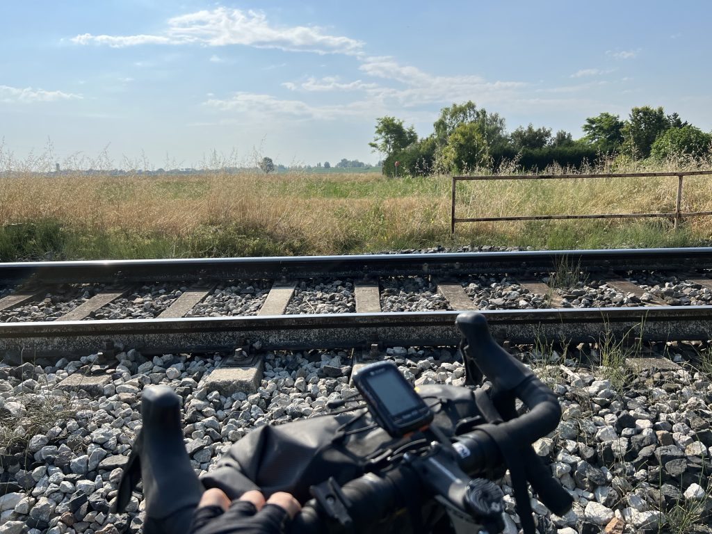
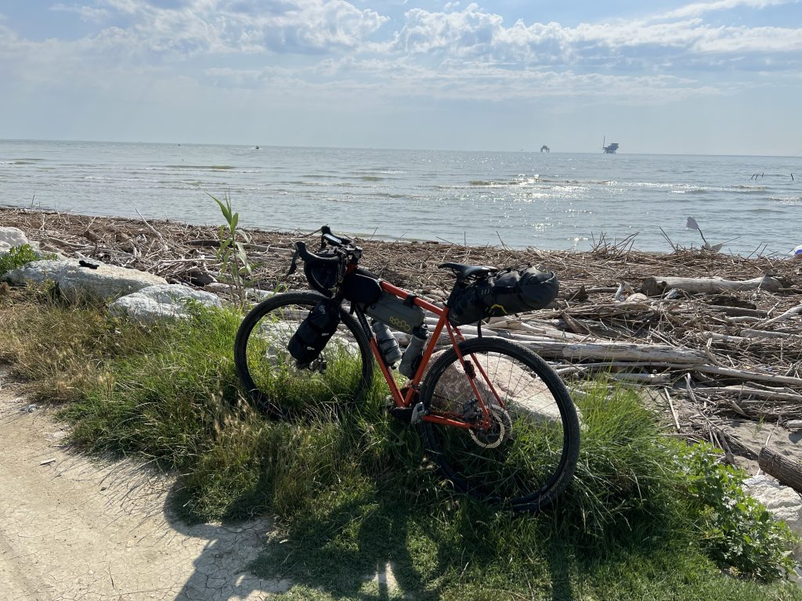
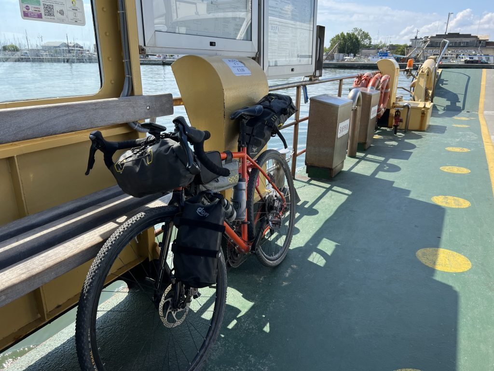
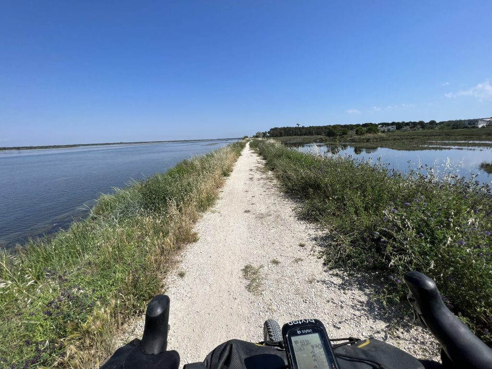
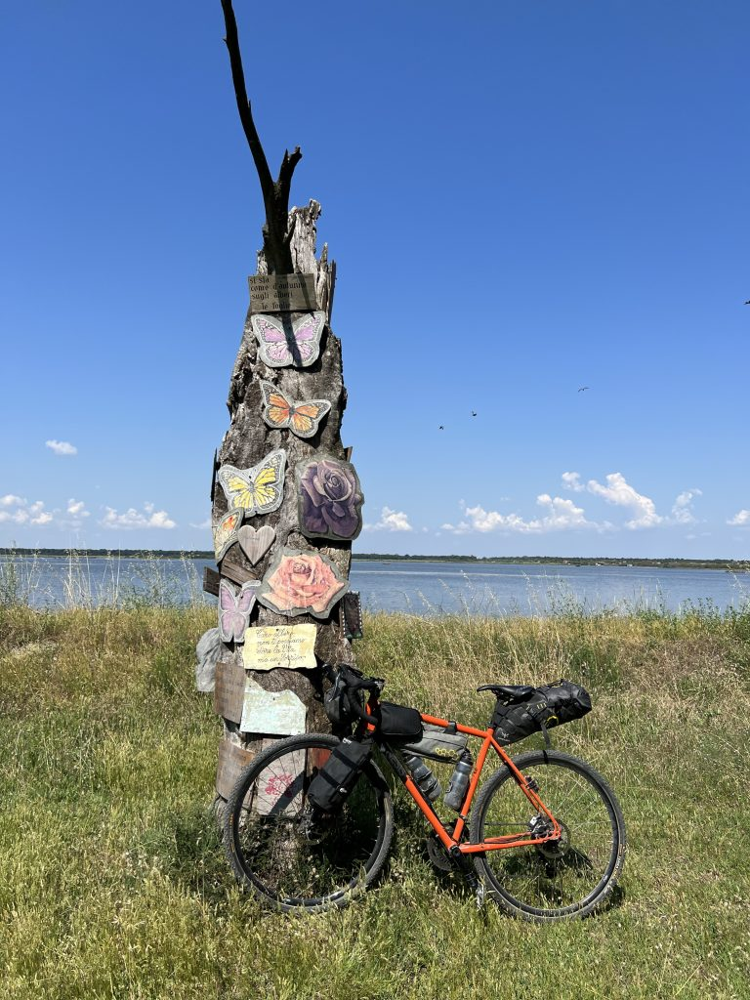
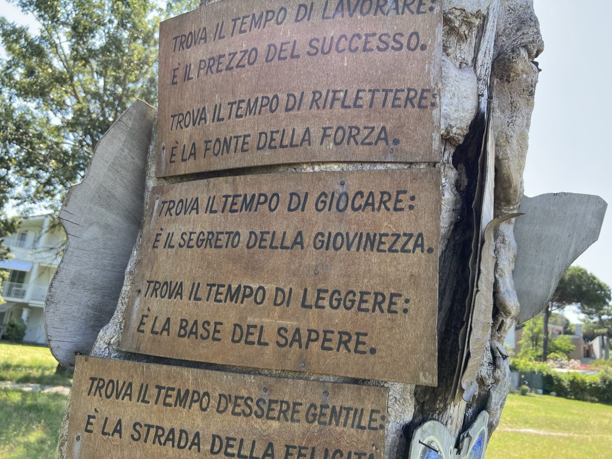
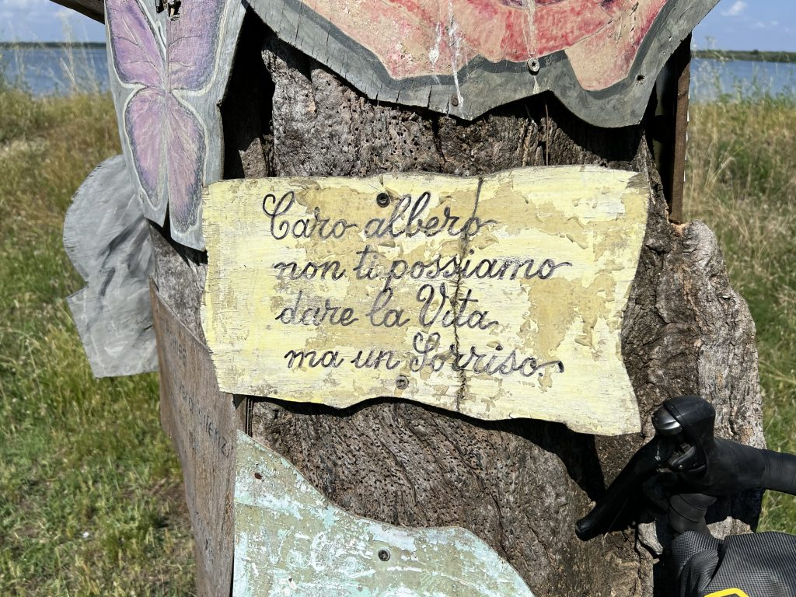
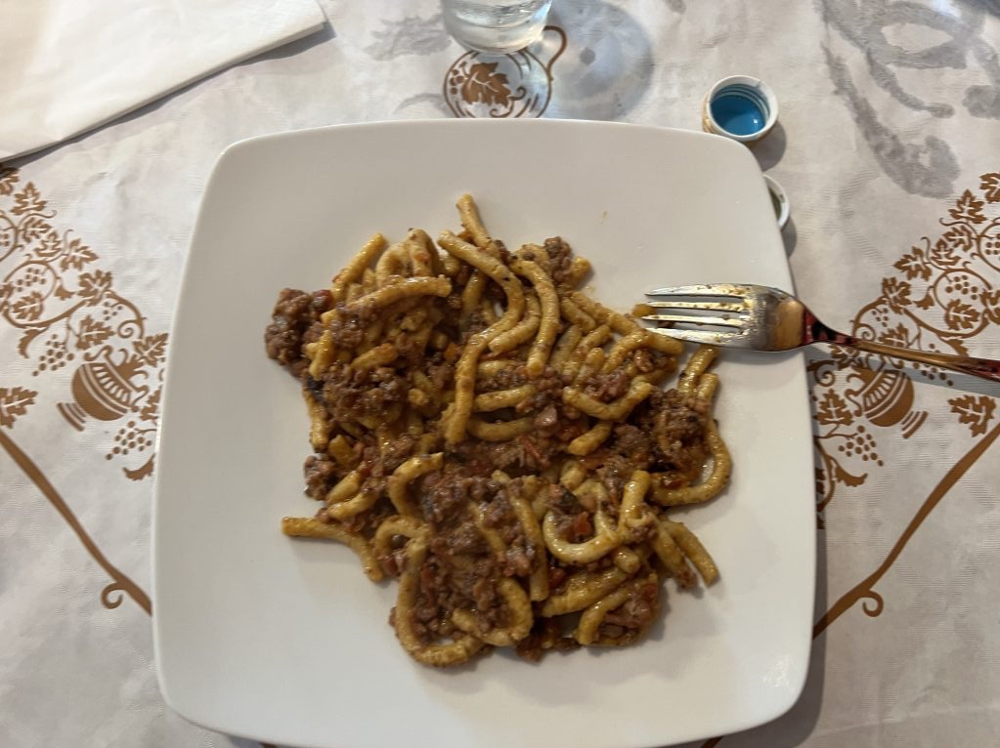
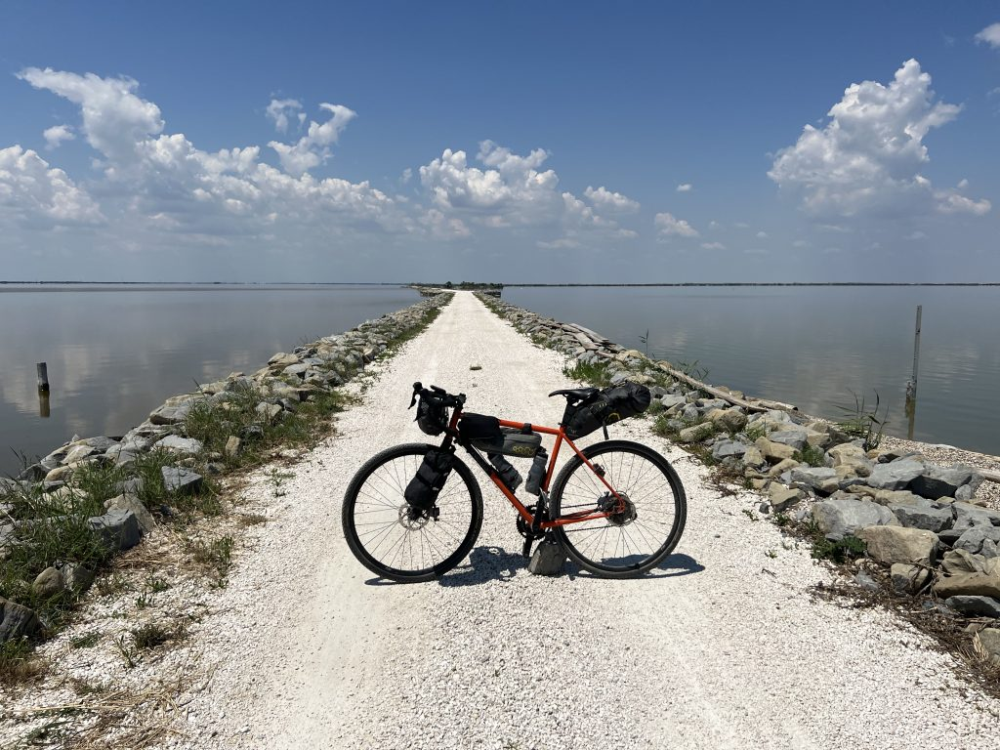
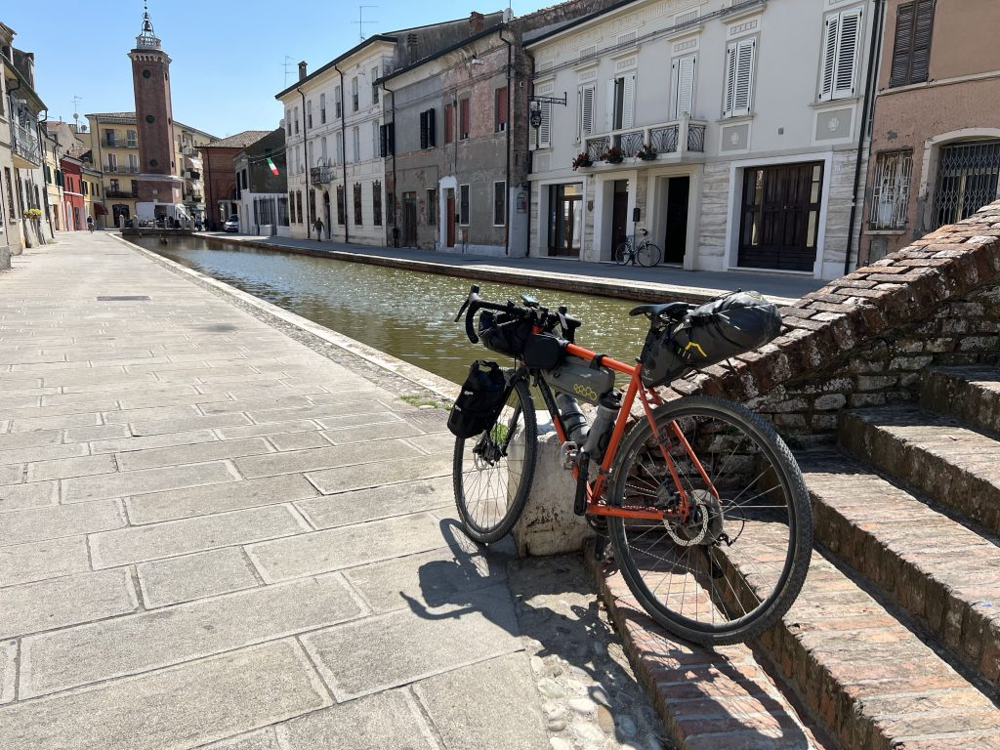

***16 Giugno 2023***

4 anni dopo il mio primo viaggio in bici in solitaria, ho deciso di tornare in quegli stessi luoghi, alla ricerca delle ragioni stesse che mi hanno spinto a tornare. E già ti gira la testa eh? Vedrai dopo.

## La partenza
Parto da Ravenna un po’ più tardi di quel che pensavo, ma ci sta, non ho voglia di correre e preferisco prendermela veramente comoda. Ma la prima ora di viaggio è un film, nella più classica delle mie tradizioni. Come prima cosa il navigatore non mi aggancia il GPS. E vabbè, si risolve facile con sette otto piroette su me stesso. Finalmente si prende il via, e dopo qualche km la mappa che ho creato con Komoot mi propone di girare per una sterrata. Mah, vediamo. Un bel viale sterrato molto gravel, che mi godo fino alla fine, quando, appunto, finisce. Davanti a me un montarozzo e sopra, i binari della ferrovia.  
“E quindi? Aspè… mi stai dicendo che… “  
“Eh gia”  
“Cioè tu dici che devo…”  
”Eh si”.

E va bene, attraversiamo pure i binari in curva con una bici stracarica sul collo, cosa potrà mai andare storto? Detto fatto, salto come un grillo sciancato e attraverso i binari praticamente volando. Da lì riparto, e inizia un dedalo incomprensibile di stradine di campagna, che finiscono contro un enorme Terranova, dietro cui si intravede un omino, che mi spiega gentilmente che se devo raggiungere l’argine, tanto vale che riparto da capo. Perfetto. Non mi resta che tornare su una normale strada urbana e chiedere a Maps di fingere che io sia un auto, e dopo una decina di minuti di traffico e casino, raggiungo l’argine. E via, verso il mare.

## Verso il mare 
Il percorso è molto bello, sterrato gradevole. A un certo punto si stringe molto e diventa single track, fattibile anche se circondata da erba molto alta. Trovo un signore con il figlio impantanati e preoccupati, li supero lentamente e li incoraggio a continuare, dato che poco dopo la strada si allarga e diventa molto bella. In realtà io non ne ho la più pallida idea, ma la determinazione funziona, e mi seguono convintamente. Guarda un po’ la strada si allarga e diventa molto bella. E si arriva al mare. Ma questo lo sapevo.

Sono a Lido di Adriano, che è il Casilino sul mare, per chi è pratico di Roma Est. Mi sento un po’ a casa ma preferisco tirar dritto verso Punta Marina, decisamente più gradevole, da dove arrivo a Porto Corsini, dove salirò sul traghetto che trasporta dall’altro lato del Canale Candiano, nel punto in cui sfocia nel mare.

Arrivato a Marina Romea, inizio il viaggio vero. Mi infilo nella Piallassa della Baiona che è la prima zona lagunare del Parco del Delta del Po. E l’orizzonte inizia ad aprirsi.

## Il silenzio
C’è un silenzio bellissimo, sottolineato solo dalle tante specie di uccelli che vivono qui. Pedalo lentamente, mi godo il paesaggio, il viaggio, e mi nutro di tutta la bellezza che ho intorno. Dopo qualche km mi imbatto in un albero secco, dove i cittadini o i villeggianti di Marina Romea, non so il perché, hanno lasciato dei messaggi molto belli che mi commuovono un po’.

Proseguo il viaggio tra pinete sabbiose e argini sterrati. Inizio ad avere fame, e sarà il caso di guardarsi intorno. Detto fatto, vedo da lontano la Trattoria Primaro e mi fiondo. Il proprietario, la cui gentilezza è certamente ben nascosta (ma non ne fa mistero) mi spiega che non fanno panini, figuriamoci piadine, ma mi siedo, un po’ di fresco riposo ci sta, e un piatto di pasta non mi ucciderà. Infatti prendo degli ottimi Passatelli al Ragù di Seppia che mi rimettono al mondo.

## La magia delle valli di Comacchio 
Riparto dopo aver mangiato, ed ecco la magia. Davanti a me, all’improvviso, si aprono le Valli di Comacchio, enorme e meravigliosa zona lagunare del Delta del Po. Acque immobili, silenzio assoluto, uccelli di ogni tipo, è uno spettacolo incredibile. Invece di fare il giro largo, trovo per caso la “passerella” che taglia tutta la laguna e decido di farla. Ed è bellissima.

Tutto intorno a me sa di pace e mi sento parte del tutto. Pedalo molto lentamente, nel rispetto supremo di me stesso e di tutto ciò che esiste. Ad ogni passaggio un gruppo di uccelli vola via nella laguna. Continuo a pedalare, e comincio a comprendere perché sono qui, perché da solo, e perché proprio adesso. Ha a che fare con l’incontrare il me stesso di allora, rassicurarlo, abbracciarlo, chiudere un cerchio importante i cui presupposti partono da lontanissimo. Ti gira ancora più la testa? Oh, t’avevo avvisato.

Non ho idea di dove porti questa strada, ho mollato mappe e sicurezze (la “sopravvivenza”, direbbe [Erica Poli][1], per lasciar spazio all’esistenza), alla fine, a Comacchio, in qualche modo ci arriverò. E infatti ci arrivo, attraverso un tranquillo dedalo di argini di canali che dalla laguna porta fino al centro del paese.

E ora aperitivo, cena, riposo, e poi domani si parte. Ah il ventro vagale dici? Recentemente mi sto appassionando alla [Teoria Polivagale][2] di Stephen Porges. No, non te la spiego qui, t’ho messo il link apposta 😄

## La traccia

→ [Il_Delta_del_Po_da_Ravenna_a_Venezia_Tappa_1.gpx](../Il_Delta_del_Po_da_Ravenna_a_Venezia_Tappa_1.gpx)
