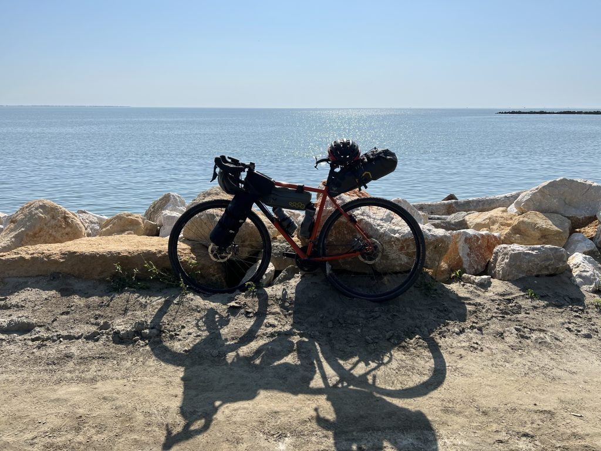
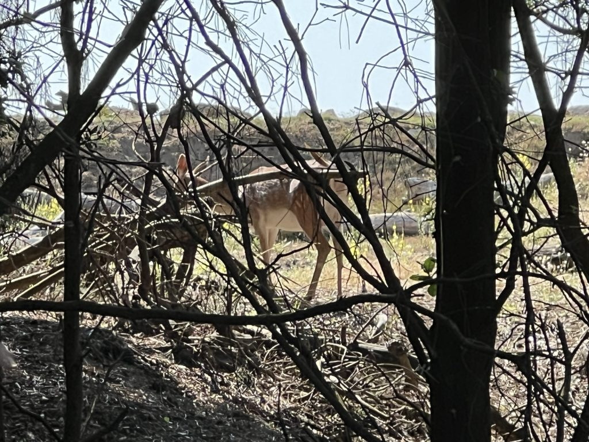
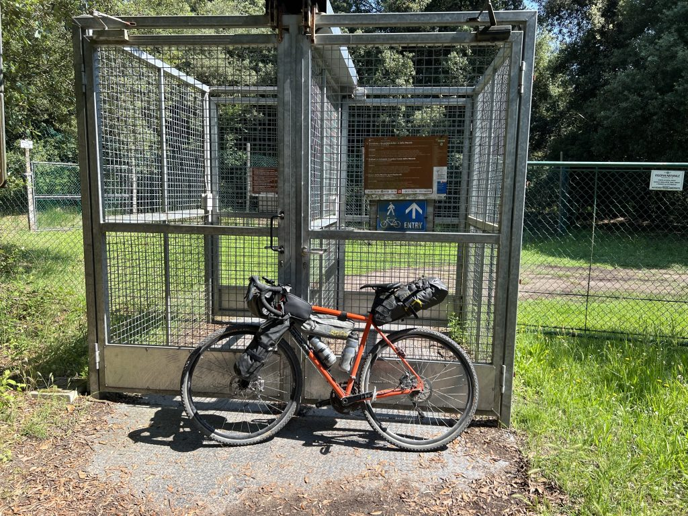
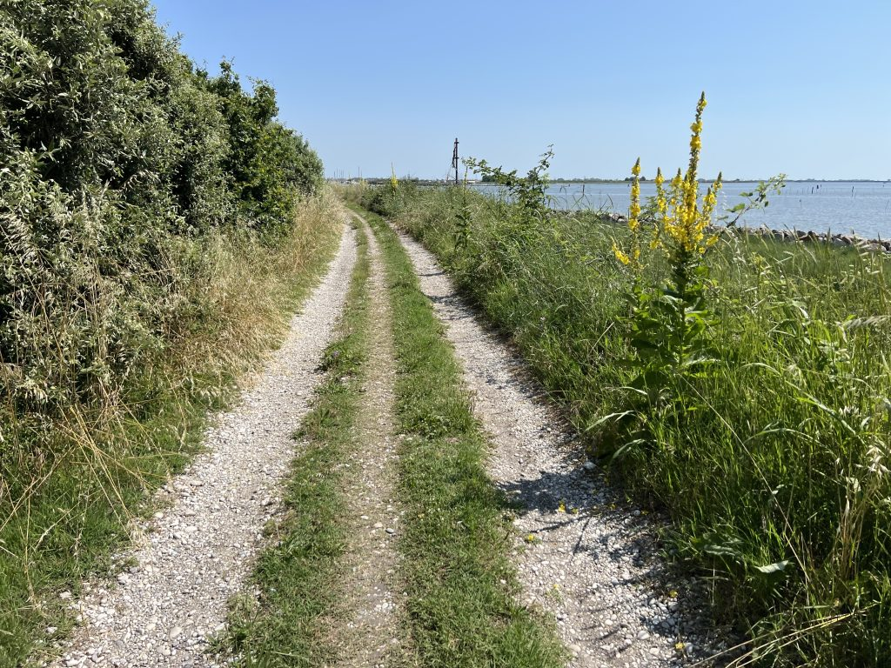
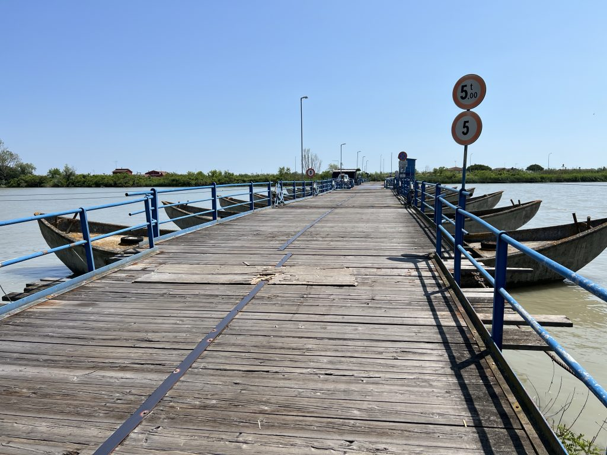

***17 Giugno 2023***

Dopo una serata a base di spritz, e a seguire, marinati locali e anguilla ai ferri (stai a Comacchio, e che mangi sennò?), la ripartenza mattutina è un po’ più lenta del dovuto, ma poco male, non c’è davvero fretta.
## La partenza
Da Comacchio mi dirigo verso Porto Garibaldi, dove mi infilo in un Carrefour per fare il pieno di cibarie, necessarie anche per la scarsa colazione offerta dal B&B dove ho passato la notte. Fatte le provviste riparto e mi batto tutti i lidi del ferrarese, non senza una quota di inevitabile noia. Ma tiro dritto. E le cose cambiano quando arrivo in zona Lido di Volano.

Il primo tratto segue il mare metro per metro, e il percorso è veramente bello. Dopo qualche centinaia di metri, si arriva in una bellissima pineta, dove si pedala tranquilli su una sterrata larga e comoda. E li mi imbatto in un daino intento a fare colazione. 

Ho tentato di avvicinarmi ma il povero daino se l’è data a gambe levate! Pazienza, riparto.  
Sto pedalando a bassissima intensità, e questo sarà il leitmotiv di tutti i 90km che farò oggi. Ho voglia di godermi ogni metro, senza fretta, senza ansia di correre per arrivare cosa, un’ora prima? E perché? E allora pedalo con lentezza, e mi fermo continuamente, sapendo che avrei fatto felice il mio amico Mik, che m’avrebbe ammazzato al terzodicesimo stop per guardare il mattone della casa cantoniera o il cormorano che fa cose. Ma né Mik né gli altri amici pedalatori romani sono lì con me, e quindi. 

## Ritorno al videogame
Finito il tratto di pineta di Lido di Volano, ecco che iniziano i salti nel passato. D’altronde ieri ho capito che ero qui per questo. Il primo fa molto ridere: ritrovo il percorso MTB delimitato dai cancelli, [avventura surreale del primo viaggio](../gardamare/tappa5/). Stavolta però è tutto diverso. 

Intanto ho il [Jungle](https://www.jungle-formula.it/) e non l’Autan, perché mi puoi fregà una volta, non due. Ma poi sono **veramente** più rilassato, e me la pedalo scanzonato, compresi i sabbioni che prevedibilmente mi inceppano, ma pazienza.

## L'incontro con me stesso
Finisco il videogame del Bosco della Mesola, e mi ritrovo lì, dove 4 anni fa raggiungevo il mare dopo tanti km di fatica, soprattutto di testa, come scopro ora. L’incontro con me stesso di 4 anni fa non è facile, ma a quello che c’è da dire ci pensa il cuore. È un momento importante, di grandi e inaspettate consapevolezze, che celebro continuando a pedalare con tranquillità, lasciando che accada ciò che deve accadere. 

Incontro il Po, e anche questo è un passaggio importante . E qui, proprio qui, si apre uno spiraglio enorme su pezzi del mio passato remoto che trovano un senso solo ora. No, non sto qui a dirti, troppo personale, però oh, bella botta capire solo ora perché sono così tanto attratto da questi luoghi, da questi canali, da questi bilancioni. 

## Un passo diverso
Continuo a pedalare, e nonostante le nuove consapevolezze, mi stupisce la serenità con cui procedo, a passo lento ma continuo. Tutt’altra storia rispetto a 4 anni fa, dove ansia e fretta dominavano tutto. Mi fermo spesso, chiacchiero volentieri con tutti, ed è un piacere condividere storie. Tra l’altro a Goro mi capita di spiegare a una bambina il motivo per cui mischio acqua gassata e naturale nelle borracce (noi romani siamo viziati e ci piace l’acqua “non troppo gassata” 😄).

Per il resto del viaggio non c’è davvero molto da raccontare. Pedalo metro dopo metro, intorno a me il paesaggio non muta mai, mi metto al passo con la lentezza dello scorrere dei rami del Po, che attraverso più volte, spesso su splendidi ponti di chiatte.

Diversi km dopo arrivo a destinazione, mi spingo fino alla spiaggia di Boccasette dove mi faccio un paio di spritz a 4 euro (mi dicono persino sia “al limite” rispetto ai bar di zona), per poi andarmene a cena all’ottima [Oasi di Val Pisana](https://www.tripadvisor.it/Restaurant_Review-g1184501-d17821084-Reviews-Oasi_Val_Pisani-Porto_Viro_Province_of_Rovigo_Veneto.html), dove mi intrattengo a chiacchierare con la proprietaria Katia. 

Domani si parte per Venezia.

## La traccia

→ [Il_Delta_del_Po_da_Ravenna_a_Venezia_Tappa_2.gpx](../Il_Delta_del_Po_da_Ravenna_a_Venezia_Tappa_2.gpx)
