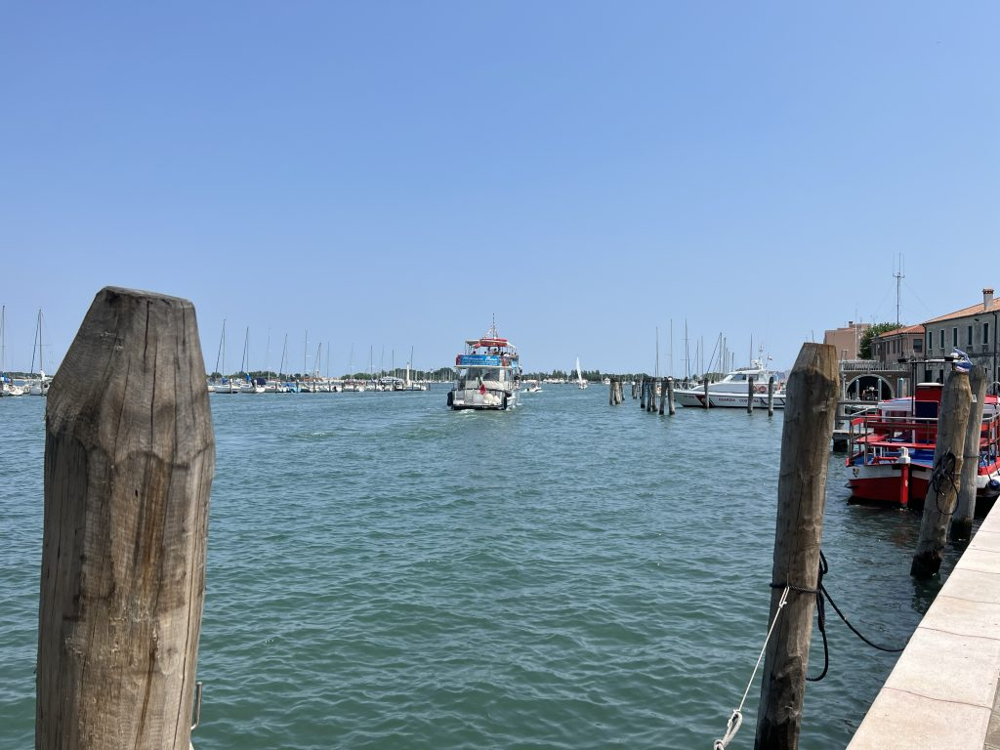

***18 Giugno 2023***

Dopo una nottata in agriturismo non proprio idilliaca, a causa di vicini di stanza insonni che facevano avanti e indietro con l'esterno, faccio una discreta colazione e mi metto in marcia per la lunga traversata fino a Venezia. 

## La partenza (e i 2€)
L'aria è abbastanza fresca e si sta bene, ma io non sono in gran forma. Sono stanco ma soprattutto non ci sto con la testa, e quand'è così i pedali sembrano sempre pesantissimi. Fatico un po' ma cerco di tenere duro. Alla fine riesco ad arrivare a Porto Levante, dove mi rendo conto di avere un problema: ho solo carte, non ho soldi contanti, nonostante fossi convinto di averne. Ed è un bel problema: mi serviranno 2 euro per passare il canale col traghettino, e non mi aspetto di poter usare le carte di credito. Decido di rivolgermi al bar, dove spiego la situazione e chiedo di poter pagare acqua e caffè un po' di più per avere 2 euro di resto in contanti. La gentile barista mi spiega che non può farlo, per ragioni amministrative. Racconto la situazione, il mio viaggio in bici, dove sto andando, il traghetto, e un ragazzo che stava ascoltando, si rivolge a me e mi dice "Ma quindi hai bisogno di soldi?", "Beh a dire la verità si, non ho i 2 euro per il traghetto". "Ma te li dò io, tranquillo" e mi porge una moneta da 2 euro, "vorrà dire che mi consiglierai un ristorante a Roma". "Senti, come ti chiami?" chiedo io. "Andrea". "Bene Andrea, io mi chiamo Fabrizio, segnati il mio numero di telefono, e che sia fra un mese o fra un anno, appena sei a Roma chiamami e ti darò tutte le indicazioni che vorrai". Ci scambiamo i numeri, e mi fiondo al porticciolo per prendere il traghettino che sarebbe partito da lì a pochi minuti.

## Il traghetto sul Po, e il risveglio
E infatti arriva. Sono solo, alla guida c'è Vanni, e durante il tragitto di qualche minuto chiacchieriamo di varie cose, del turismo in zona, dell'alluvione in Romagna, degli alberi che crescono nel fango ma solo a condizione che non si secchi, che poi è il dramma di quel che sta accadendo ai frutteti romagnoli. Saluto Vanni e lo ringrazio per la breve traversata. 

Queste piccole condivisioni mi lasciano una bella sensazione di umanità autentica, che mi "riaccendono" il motore. Mi sento meglio, ora ci sono anche di testa. Pedalo con convinzione, e mi metto a fischiare un po' di note a caso. Incontro molti ciclisti di strada, i drittoni asfaltati senza auto sono evidentemente un richiamo irresistibile, e tutti hanno un saluto o un sorriso per questo bizzarro ciclista con le borse che pedala a 19km/h fischiettando.

## A Chioggia,  e poi  a Venezia
Il percorso scivola via tranquillo, anche lungo l'Adige, che devo attraversare per iniziare ad arrivare nel territorio di Chioggia. Ed è lì, arrivato a Isola Verde, che mi impantano nel casino dei domenicali che vanno al mare. Che macello! Auto ovunque, un caldo opprimente, a un certo punto mi ritrovo anche in un parcheggio attraverso cui passava una sterrata che stavo seguendo. In qualche modo riesco a farmi largo e riesco ad arrivare a Chioggia, prima su un lungomare caotico come tutto il resto visto fino a quel momento, ma poi finalmente nel centro storico, dove si respira tutt'altra aria.

Mi fermo in una cicchetteria, ho fame e bisogno di riposarmi, e da quel che vedo il vaporetto per Pellestrina sarebbe partito circa 40 minuti dopo. Avevo tutto il tempo.

Dopo un po' di riposo e qualche cicchetto, mi avvio verso il porto, faccio il biglietto, e salgo sul traghetto. Lì mi ritrovo con diversi ciclisti che andavano nella stessa direzione, uno in particolare stava letteralmente facendo il mio stesso percorso, partito da Cesenatico e diretto a Venezia. Iniziamo a chiacchierare, ci raccontiamo un po' di cose, e arrivati a Pellestrina decidiamo di proseguire insieme per Venezia.

Pellestrina è bellissima, c'ero già stato anni fa e il ricordo di questa striscia di terra in mezzo al mare mi era rimasto molto caro. Pedaliamo abbastanza rapidi, si vede che abbiamo entrambi anche un po' voglia di chiudere il giro. Un traghetto dopo l'altro (Pellestrina-Lido e Lido-Venezia) arriviamo a Venezia. 

Saluto il mio compagno di viaggio che sarebbe ripartito subito, mentre io decido di mollare la bici al Bike Park (figata spaziale) dove in qualche rocambolesco modo riesco anche a cambiarmi, e vado a farmi due spritz aspettando il treno.

Tanti pensieri, tante immagini, tante cose. C'è davvero molto in un piccolo ma intenso viaggio come questo. Ancora una volta porto con me qualcosa che mi arricchisce, che mi stimola, che mi tiene vivo. Ringrazio te, che hai letto fin qui. Raccontare i miei viaggi in bicicletta è un modo per fermare i ricordi, ma soprattutto per riflettersi in essi, per trovare cosa hanno trasformato dentro di me. E ogni volta è una scoperta, e una conquista.

## La traccia

→ [Il_Delta_del_Po_da_Ravenna_a_Venezia_Tappa_3.gpx](../Il_Delta_del_Po_da_Ravenna_a_Venezia_Tappa_3.gpx)
