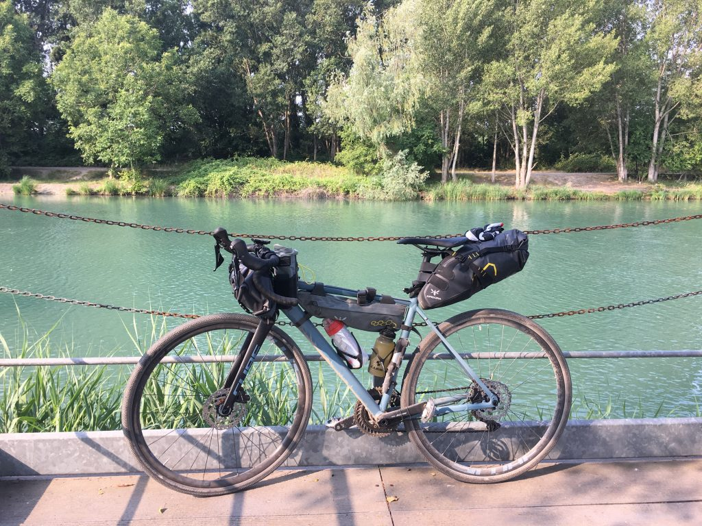
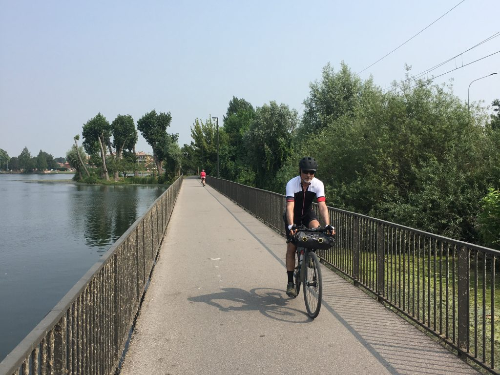
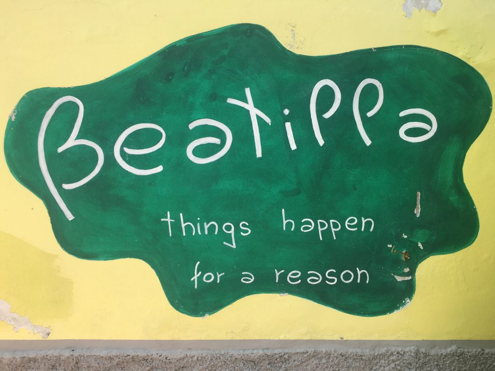

***28 Giugno 2019***

_La Pista Ciclabile del Mincio da Peschiera del Garda a Mantova, dove il cuore si spalanca inaspettatamente_

Che in questo viaggio il cuore si sarebbe spalancato me lo aspettavo, ma che sarebbe successo dopo i primi 3km, ecco questo mi ha sorpreso.

## La partenza
Sono partito alle 7.30 dopo una notte molto tranquilla all&#8217;[agriturismo Le Sigalette a Salionze,][1] pochi km da Peschiera, gestito da una famiglia sorridente e disponibile. Una discesa di pochi metri immette da lì direttamente sulla ciclovia a fianco del Mincio. È tutto facile e tutto chiaro, bisogna solo pedalare e respirare.

## Qui e ora
La ciclovia segue il fiume, che in quella zona alterna dighe e modifiche del letto fino a stabilizzarsi. Ci sono punti di solitudine assoluta e fresca ombra, dove acqua, ruote e respiro seguono un solo tempo è un solo ritmo. Ed è proprio lì, che all&#8217;improvviso tutto diventa dolorosamente perfetto. Sono completamente qui e adesso, è una nuova felicità che si infrange contro un&#8217;assenza che sto cercando di proteggere dallo scorrere del tempo. È una resistenza nella resilienza, ma è un muro fragile che viene giù davanti a un istante di bellezza assoluta. È un grande momento liberatorio di cui avevo bisogno.

 
## Valeggio e il Chiosco dei Mulini
[Borghetto di Valeggio sul Mincio][2], dove arrivo dopo una decina di km, è una perla. Vorrei fermarmi a visitarlo meglio ma ho paura che arrivi il caldo e preferisco proseguire. Mi fermo un attimo a fotografare lo splendido punto in cui il fiume e la ciclovia passano sotto l&#8217;arco e proseguo subito.

Decido però di fermarmi qualche minuto in più per far scorta d&#8217;acqua fresca al [Chiosco dei Mulini][3] a Volta Mantovana, un delizioso punto di ritrovo per gli anziani mattinieri (anche ciclisti in buon numero), ma dove probabilmente la sera l&#8217;età media si abbassa vertiginosamente. Io che sto nel mezzo tornerei volentieri per un bell&#8217;aperitivo, ma devo proseguire.

Da lì in poi il percorso si fa un po&#8217; noioso e comincia a far caldo. Per fortuna è ventilato anche se controvento, ma va benissimo così. Appena infatti mi fermo per bere la calura stordisce, e non sono neanche le 10.

## Things happen for a reason
Tiro dritto verso Mantova, mi ero fatto male i conti e il percorso non sarà di più di 40km, che come prima tappa ci può stare. E Mantova mi accoglie con un bellissimo tratto che costeggia il Lago di Mezzo, uno dei tre laghi formati dal Mincio che bagnano Mantova.

La prima tappa è andata, ho evitato il caldo eccessivo e ora mi riposo all&#8217;[Agriturismo Beatilla][4], un posto dove all&#8217;ingresso trovo una scritta che dice &#8220;Things happen for a reason&#8221;.

E mi chiedo se sia vero.

## La tappa

→ [GardaMare19_Tappa_1_da_Peschiera_a_Mantova.gpx](../GardaMare19_Tappa_1_da_Peschiera_a_Mantova.gpx)