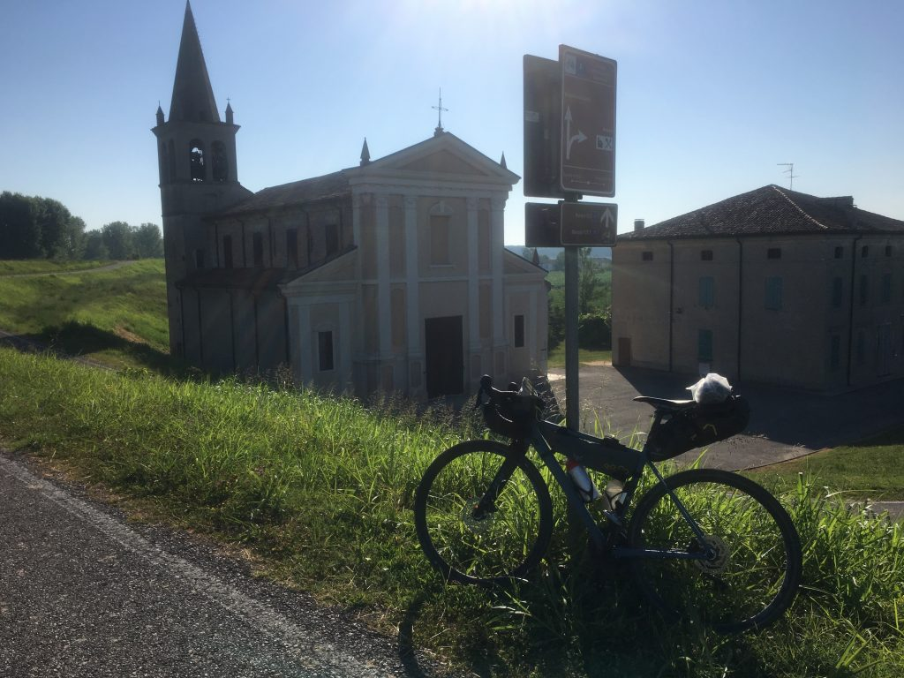
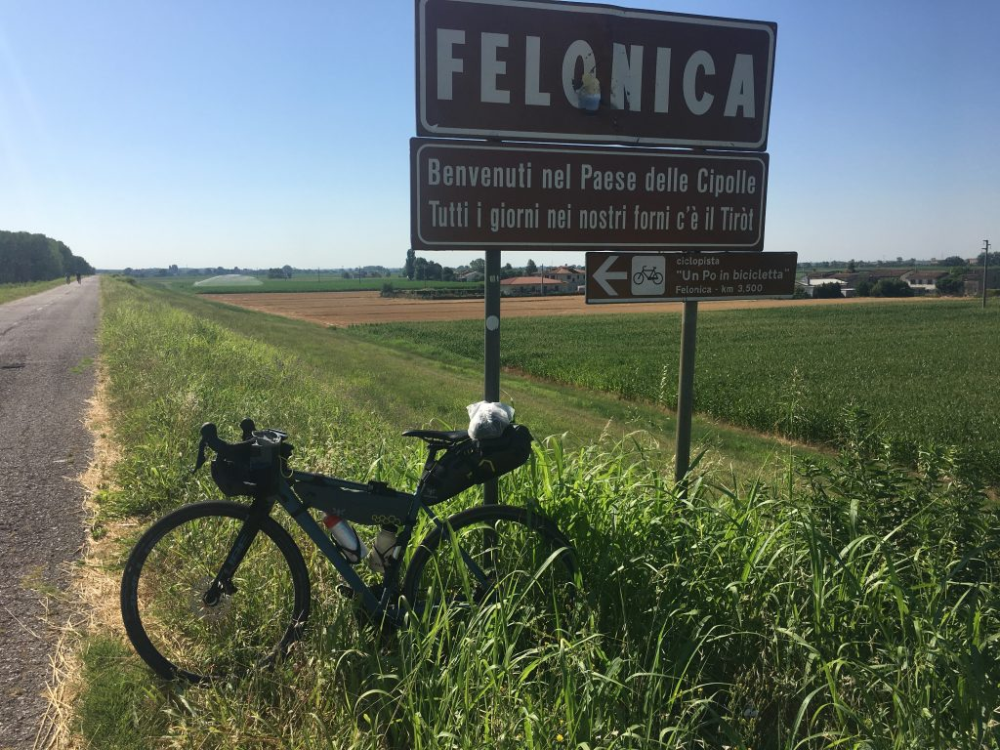

***30 Giugno 2019***

_Da Ostiglia a Ferrara, dove ho incontrato qualche persona, qualche storia, e persino una poesia_
## La partenza
Oggi sono partito un pochino più presto e senza vento contro, ma ho pur sempre fatto 80km di cui gli ultimi bruttini, che forse potevo evitare (ma mica l'ho capito).

Alle 8 ero già sul ponte di Revere sul Po (vertigini, vertigini... ) passato il quale mi sono diretto sulla ciclovia Destra Po. Il percorso è piacevole, è molto bello guardare il Po a sinistra e i micro paesini d'argine sulla destra (nella brutta foto controluce qui sotto Bonizzo)

## Un giorno di incontri, e una poesia
Dopo poco tempo incrocio un ciclista un po' più grandicello di me, su bici da strada/corsa. Lo supero perché sto tenendo un'andatura più veloce, ma mi riprende e si affianca. Ha voglia di far due chiacchiere.

Ci raccontiamo un po' di cose, mi dice che vive a Lugano da anni ma torna qui con la famiglia per mantenere le radici. Io gli racconto il motivo del mio viaggio, parliamo di figli. Lo saluto quando passiamo a fianco di uno di questi meravigliosi edifici della bonifica che mi fermo a fotografare. Ci facciamo gli auguri. Una bella chiacchierata piacevole che lasciamo andare nel vento.

Dopo pochi metri mi imbatto in tre ciclisti sempre di zona, anche loro un pochino più avanti di me con gli anni. Chiedo un'indicazione per via di una deviazione, partono con mille domande e va via qualche bel chilometro. A un certo punto ci imbattiamo in un lungo testo scritto in forma longitudinale sulla strada: mi raccontano che è una lunghissima poesia scritta "da un ubriaco" (magari poi è il più importante poeta contemporaneo). La fotografo al volo ma non mi fermo perché mi piace la compagnia. Certo la poesia è lunga, molto lunga.

I simpatici ciclisti mi lasciano poco dopo e si fermano per il caffè. Li saluto e penso alla bellezza di incontrare persone con le quali in fila alla posta o per strada non ti guarderesti neanche, e invece li, sotto il sole maledetto, sull'argine del Po, vestiti come deficienti, riconosciamo un tratto comune e parliamo con quella leggerezza che si, grazie, ma davvero, ché in questo paese martoriato da forcaioli a ore alterne e paraculissimi sfruttatori di dolore altrui, sembra non ci sia più spazio per un sorriso, un abbraccio, un saluto, un augurio.

Nel frattempo sono arrivato a Fellonica, che si presenta come il paese delle cipolle, dove in forno c'è sempre il Tiròt. Sono attratto ma per scendere in paese bisogna fare un giretto e poi risalire, e mi chiedo se il Tiròt lo infornano anche la domenica. Magari si, ma tiro dritto perché Ferrara è lontana.

Ecco appunto. I tre amici mi avevano indicato un percorso che parte da Bondeno per arrivare a Ferrara con l'ombra e in meno tempo rispetto alla ciclovia classica. Speriamo, io proseguo per Bondeno dove però decido di fermarmi a prendere fiato, acqua e un attimo di riposo. E trovo un bar evidentemente storico (Bar Olimpia Sport) dove la situazione è la seguente: fuori 4 anziani parlano di politica in un dialetto impossibile da capire. Dentro una decina di anziani si scannano a carte urlando e bevendo. Placido alla cassa il cinese che gestisce il bar. È un paese incattivito ma bellissimo (e io un sorriso mai, eh)

## Il sentiero che non c'era
Mi rimetto in pista e inizio a cercare questo fantomatico sentiero ombroso che avrebbe dovuto portarmi a Ferrara su un tappeto di rose. E non c'è. Non so a chi chiedere, alla fine mi fido della traccia che ho, pensando che se esiste un percorso così, certamente chi ha preparato la traccia ne avrà tenuto conto. Fatto sta che o il percorso non esiste o non ne hanno tenuto conto. E io mi faccio gli ultimi 24km per Ferrara sotto il sole battente e senza NULLA intorno.

Gniaafaccio. No, gniaafaccio. Impossibile, gniaafaccio. Alla fine, iaafaccio, non so con che forza d'animo perché spalle e gambe cominciavano a cedere.

Arrivo alle porte di Ferrara, ma per arrivare in centro ci sono voluti altri 10km. Finalmente arrivo al Castello, e come mi aspettavo mi arriva uno schiaffone: il ricordo della splendida serata passata al Teatro Comunale con Milena per vedere il meraviglioso concerto di Sufjan Stevens, l'ultima volta che eravamo stati a Ferrara. Sono molto stanco ed è dura.

Ma il viaggio serve a questo.

## La tappa

→ [GardaMare19_Tappa_3_da_Ostiglia_a_Ferrara.gpx](../GardaMare19_Tappa_3_da_Ostiglia_a_Ferrara.gpx)