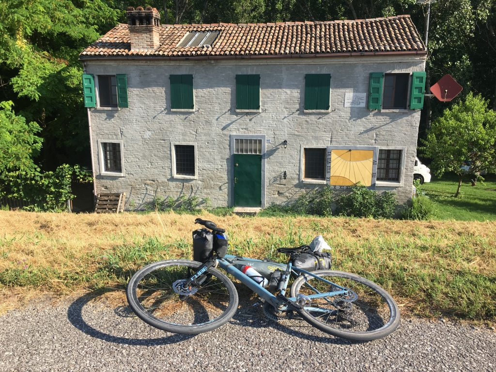
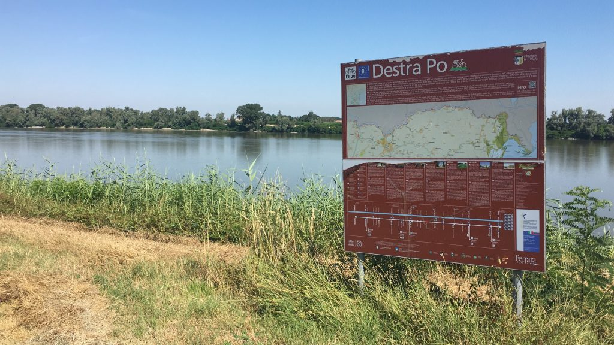
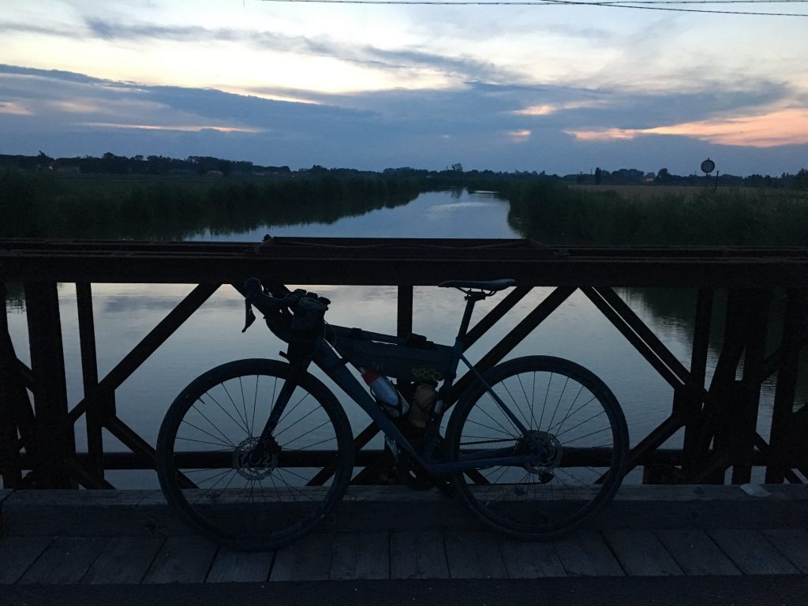

***1 Luglio 2019***

 _Da Ferrara a Mesola, dove non c'è molto da vedere, se non il Po, che è immenso, maestoso e silenzioso. Ma se c'è qualcosa che deve rompersi, è proprio qui che probabilmente succede. E infatti._

## La partenza
Oggi sono partito da Ferrara abbastanza presto, per limitare il caldo eccessivo. A differenza dell'arrivo ho trovato una strada più rapida e piu piacevole per uscire dalla città, tranne l'ultimo tratto in Pontelagoscuro dove, a parte il rettilineo ciclabile, c'è da stare un po' attenti alle auto.

Sono partito con buone sensazioni, anche grazie a una casa molto bella poco fuori Ferrara, con una splendida meridiana funzionante. Ho chiesto al giovane proprietario se potevo fare una foto, e mi ha risposto &#8220;certo, ci mancherebbe&#8221;. Aveva l'aria di uno che vive circondato di semplicità e bellezza. Non poco di questi tempi.

## Tutto bene, per ora
Dopo qualche chilometro trovo una struttura che sembra un bar all'aperto. Si trattava in realtà del luogo dove è stato ricostruito fedelmente uno dei tanti mulini sul Po di cui la zona era ricca più di cento anni fa, e che lo scrittore Bacchelli rese famosi con il romanzo che porta proprio il nome "Il mulino del Po". Ho però trovato l'accesso chiuso e anche il bar chiuso, peccato, non ho avuto l'impressione di un'opera e di un contesto valorizzato come meriterebbe.

Continuo ad andare, mi sento bene e mi rendo conto che le risorse fisiche mi sostengono. Non lo davo per scontato visto che si tratta pur sempre della prima volta in cui faccio tanti km tutti insieme.

Lungo il percorso trovo tanti piccoli paesini graziosi, dove generalmente c'è sempre una bella chiesa, segno di una presenza tradizionalmente importante della religione cattolica. Mi colpisce molto la Chiesa dell'Assunzione di Maria Santissima a Ro, eretta nel 1192, che ha la particolarità di essere rivolta verso il Po, che è proprio a un centinaio di metri.

Già il Po. In questo tratto il grande fiume è quasi sempre molto visibile dalla ciclabile sull'argine, e ci sono punti in cui il letto è talmente grande da sembrare più un lago che un fiume. Mi lascio accompagnare da questa presenza silenziosamente maestosa, immaginando di trarne calma e pace. Eppure qualcosa non va. Mi sento strano e non riesco a godermi fino in fondo la evidente tranquillità e bellezza che mi circonda. Sarà il caldo, penso. Ma non è l'unico pensiero. Mi accorgo che la mente macina ricordi, riflessioni, immagini, e più si diradano i paesi, più aumentano i pensieri. Mi rendo conto di essere stanco.

Poi qualcosa si rompe.
## Qualcosa si è rotto
È difficile dire che cosa scateni un crollo emotivo importante. Sarebbe successo comunque? Colpa del caldo? Qualche associazione mentale? Non è importante. Quel che so è che aspettavo questo momento, in cui il dolore, la rabbia e il senso di colpa diventano travolgenti, e niente li può controllare. Solo una cosa posso decidere: mi fermo? No, non lo farò, perché questa roba va attraversata, ricordando sempre che la bici resta in equilibrio finché cammina. Mi aggrappo inconsapevolmente a questo equilibrio, e, in qualche modo, ne esco.

Ormai mancano pochi km a Mesola. Sono contento di tornarci, l'ultima e unica volta avevo forse 11/12 anni, eravamo ospiti di amici, è tutto ciò che ho visto mi è rimasto scolpito nella mente. A Mesola arrivo stanco, ma con la forte sensazione di aver conquistato un pezzo importante di leggerezza in più.

Stasera, non potendo fare diversamente, ho fatto qualche km in bici da S. Giustina (dove alloggio per la notte) a Mesola, dove ho cenato alla Locanda Duo, già sperimentata a pranzo, dove letteralmente sei a casa di una famiglia che ti ospita e ti prepara i pasti.

Poi, al ritorno, ho passeggiato in bicicletta senza fretta, godendomi uno dei tramonti più belli mai visti.

