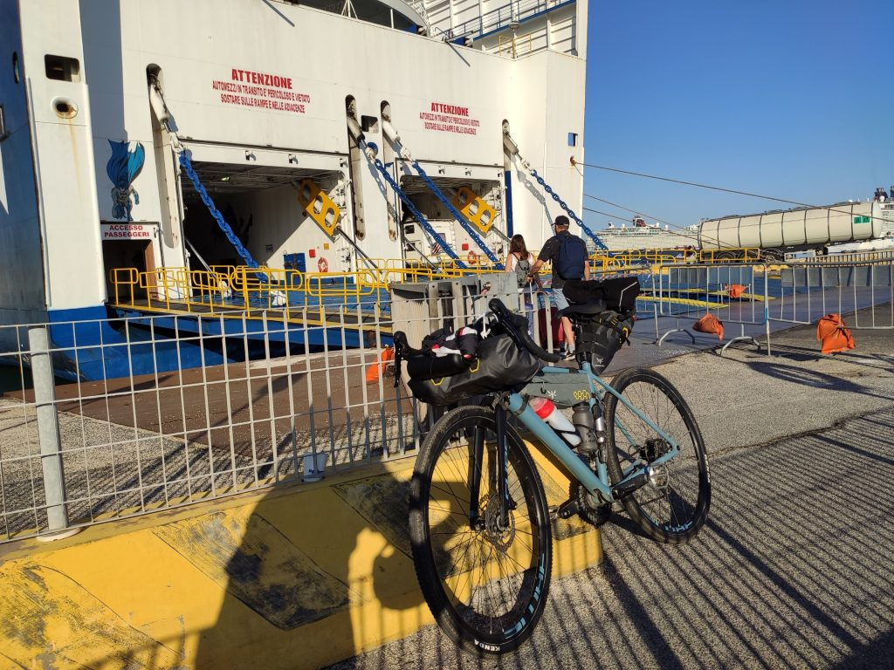
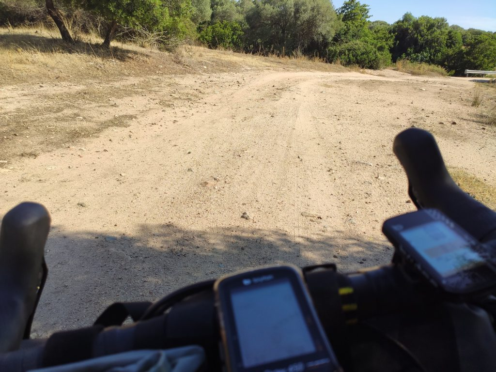
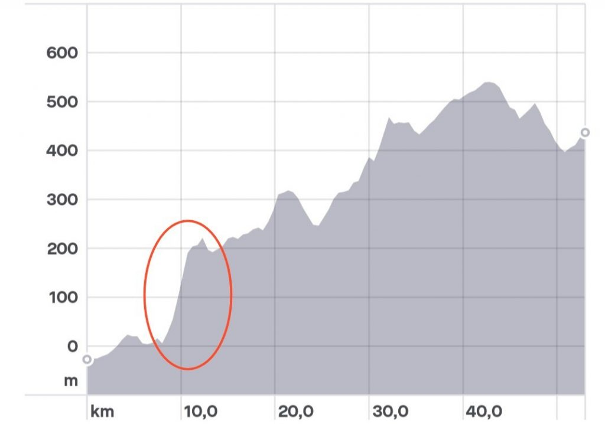
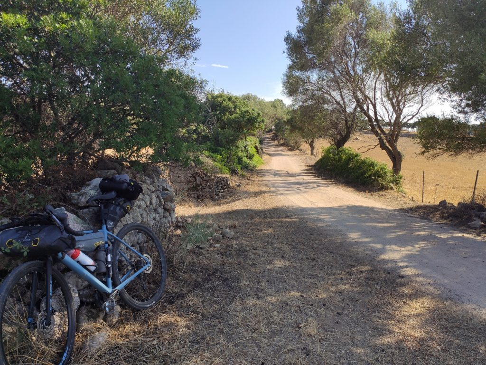
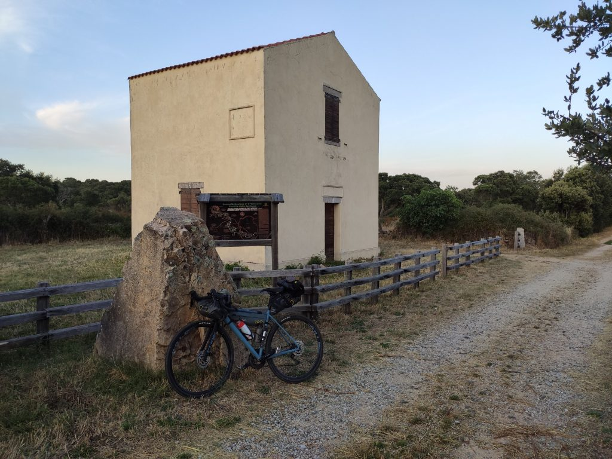
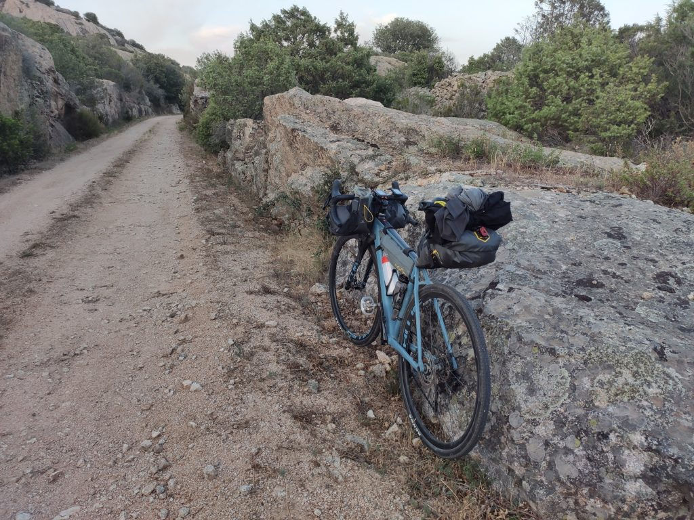
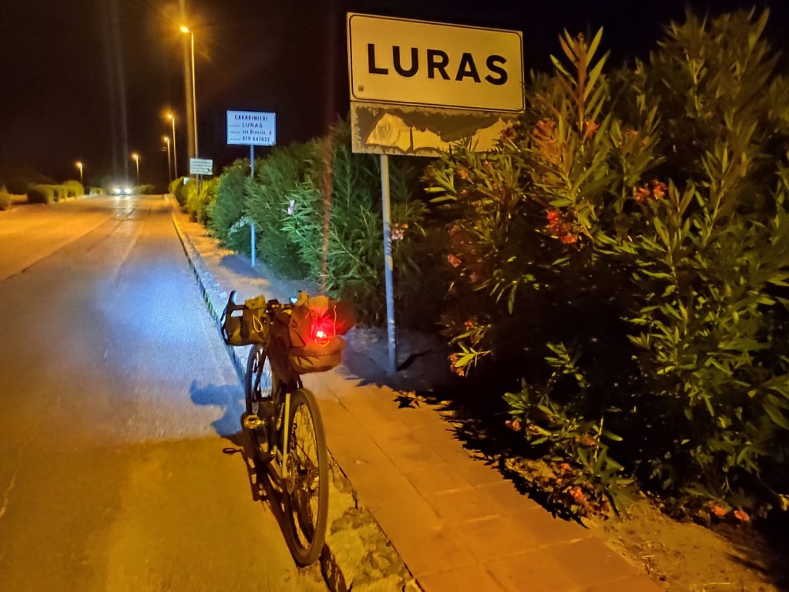

***31 Luglio 2019***

Sapevo che decidere di accorciare i tempi e mettermi in marcia appena arrivato a Olbia sarebbe stata una scelta discutibile. Invece è stata proprio una solenne, fragorosa stupidaggine.

## La partenza
Sono partito da Civitavecchia alle 8.30, caricando la bici a bordo non senza qualche ansia (nel garage: "dove la metto? La appoggi là. Ma senza un'imbracatura? Poi ci pensiamo noi" e meno male che l'avevo bloccata fra due tubi). Il viaggio è iniziato con un'ora di ritardo a cui si è aggiunta almeno un'altra ora. Nel mio infinito candore avevo fatto affidamento sull'arrivo in orario per poi mangiare qualcosa, riposarmi e partire, anche se un po' preoccupato per il caldo. Ovviamente una persona intelligente si sarebbe organizzata con del cibo sostanzioso da portare a bordo, io no. Risultato? Sono sceso dalla nave alle 15.30 con davanti a me una tappa non lunga ma sicuramente impegnativa, ho trangugiato in fretta un mezzo panino per non appesantirmi, e sono partito.

## E subito, i muri 
Dopo pochi facili km in asfalto la traccia mi ha subito condotto su sterrati che non mi avrebbero più abbandonato. Il primo tratto piacevole, ma il caldo infernale si è fatto sentire subito: faticavo a respirare e sudavo moltissimo. E lì sono cominciati i guai che temevo. In questo primo tratto da Olbia a Monti ci sono dei muri con pendenza all'11 / 12% per i quali in condizioni fresche e ben nutrito avrei comunque grosse difficoltà, per il tipo di bici ma soprattutto per una tutt'altro che eccellente preparazione atletica. L'immagine qui sotto vale più di mille parole.

Che fai? Spingi, ovviamente, deficiente, così impari che la realtà è cento volte peggiore dei profili altimetrici in ciabatte. A quel punto ho cominciato a fare due conti tra distanza e tempo, e il serio sospetto che sarei finito a fare gli ultimi km al buio si è cominciato a concretizzare. Ovviamente tiro dritto, ma dopo due ore di fatica e caldo l'incantevole bellezza degli scenari è finita in secondo piano.

Per un lungo tratto ho avuto diversi momenti di sconforto. La ricerca di un equilibrio personale in questi percorsi solitari a bordo di un mezzo così filosofico come la bici, rischia di trasformarsi in patetica sfida contro i limiti dei miei cinquant'anni scarsamente sportivi, sfida che ovviamente si perde clamorosamente con buona pace proprio della ricerca dell'equilibrio. Quindi oltre alla fatica delle salite, anche gli schiaffoni auto inferti. Immaginate sto matto che pedala e spinge a 5km/h e che ripete ad alta voce "così impari, imbecille che non sei altro, ti sta bene, cretino" ecc. Sì, volersi tanto bene.

## E sbaglio la porta
Passo indietro: tutta questa storia nasce per la curiosità di percorrere il tracciato della ferrovia dismessa da Monti a Calangianus: diciamo che le varie ipotesi di percorso avevano comunque questa traccia come elemento centrale. Bene. Quando dopo km e km di fatica mostruosa mi trovo finalmente al bivio che dovrebbe immettermi in questo percorso, mi rendo conto che la traccia del navigatore mi dice di proseguire sull'altra strada. Penso "boh, strano, l'avevo fatta con cura, magari mi farà accedere più avanti. E proseguo. P.r.o.s.e.g.u.o.

Un mese a girare intorno a questo percorso, caldo, fatica, sudore, e **davanti alla porta me ne vado da un'altra parte.** Dopo circa due tre km ovviamente di salita, mi rendo conto che non ci sarà più un altro ingresso, e parte un attacco fulminante di ridarola nervosa. Vedo tutta l'assurdità della situazione, dal primo movente che mi ha spinto ad abbracciare questo progetto, all'assoluta inadeguatezza della preparazione fisica, tecnica e forse anche psicologica, ma anche di banale perspicacia e intelligenza persa chissà dove. E rido, rido come un matto, gridando "Ma ndo cazzo vai!", osservato da due enormi e perplesse mucche bianche. È un buon momento però, mi rendo conto che sto facendo pace con me stesso e con i miei limiti. Ci voleva.

Arrivato ad un incrocio dello sterrato con la statale per Monti senza più acqua, ho due possibilità: proseguo senza acqua, o scendo verso Monti sperando di non dover rifare la salita per tornare allo snodo. Stavolta scelgo di privilegiare l'acqua e mi lancio in questa corroborante discesa. Trovo un bar, compro l'acqua e ricarico le borracce. Bene. Poco prima di ripartire mi raggiunge un ciclista locale, di questi sessantenni che fanno la Parigi - Luna - Marte due volte di seguito bendati, che con aria compassionevole squadrandomi con tenero disprezzo mi spiega che devo per forza tornare indietro. Riparto, e la salita non estrema tutto sommato si fa con facilità. Arrivato in cima riprendo il percorso che avevo lasciato. Pazienza per la ferrovia, ormai bisogna solo arrivare prima possibile. Dopo due km incontro una nuova strada asfaltata, dove incontro tre MTBikers locali con cui mi fermo a chiacchierare. Uno di loro ha un crollo fisico, gli do un gel di carboidrati e vitamine (ché ste cazzate io ce l'ho tutte eh, magari sbaglio strada, faccio casino, ma gel e barrettine fighette non mancano mai). Mi spiegano che posso ancora fare un buon pezzo della ferrovia se proseguo sulla statale e giro a destra. Lascio allora la traccia bacata e finalmente arrivo alla ferrovia!

## Verso la notte
Il percorso è bellissimo, in salita costante ma leggera, immaginare un trenino sfilare fra muretti a secco, rocce granitiche dai disegni morbidi, e boschetti di mirti è una sensazione molto forte, tanto più se il percorso viene fatto alla luce magica del tramonto.

Ecco. Il tramonto. La salita leggera ma costante e la stanchezza accumulata mi hanno costretto a viaggiare ad una velocità bassa e a fermarmi spesso per bere e riprendere fiato. Due conti rapidi e ho capito che difficilmente sarei uscito da lì con la luce. Ma non c'era molto da fare se non continuare, confidando nelle luci che per fortuna avevo con me. Ho però tirato il più possibile prima di metterle, questa penombra mi faceva un po' paura ma tutto sommato era anche un po' eccitante, e ho provato a evitare di tirarle fuori dalle borse praticamente fino all'ultimo.

Dopo circa 10 km così, arrivo alla fine della ferrovia, a sinistra una discesa verso Calangianus. Ce l'avevo fatta, erano le 21.40, ormai buio pesto. Prima di immettermi sulla statale attacco tutte le luci (strada di notte, non si scherza), e mi lancio nella discesa. Lunga. Fresca. 35km/h con sorrisetto stampato sulla faccia. Arrivo a Luras alle 22 con solo qualche piccola salitella, niente in confronto ai muri del pomeriggio. La giornata pazzesca era finalmente FINITA.

Voglio segnalare la preziosa gentilezza e ospitalità della gestrice del <a href="http://legemelleluras.it" target="_blank" rel="noopener noreferrer">B&B Le Gemelle</a>, che vedendomi arrivare in quello stato, oltre ad avermi fatto fare check-in alle 22, è anche andata a prendermi una pizza da asporto, unico pasto disponibile a quell'ora (e l'unico della giornata). Grazie di ❤️

## La tappa

→ [Sardegna_Tour_Tappa_1_da_Olbia_a_Luras.gpx](../Sardegna_Tour_Tappa_1_da_Olbia_a_Luras.gpx)