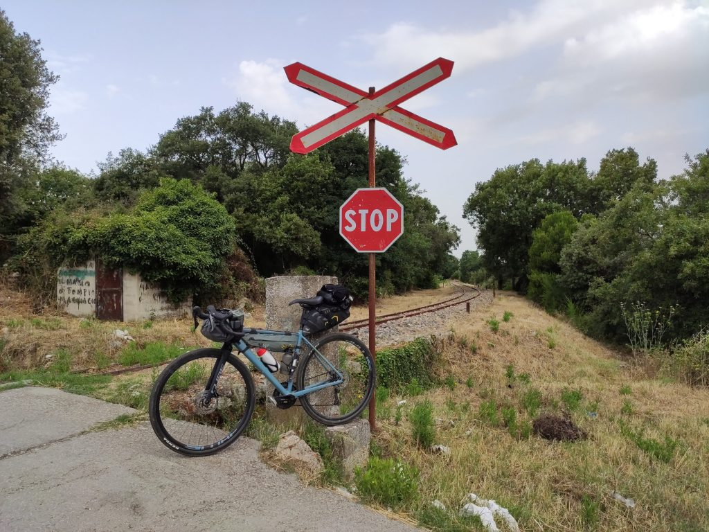
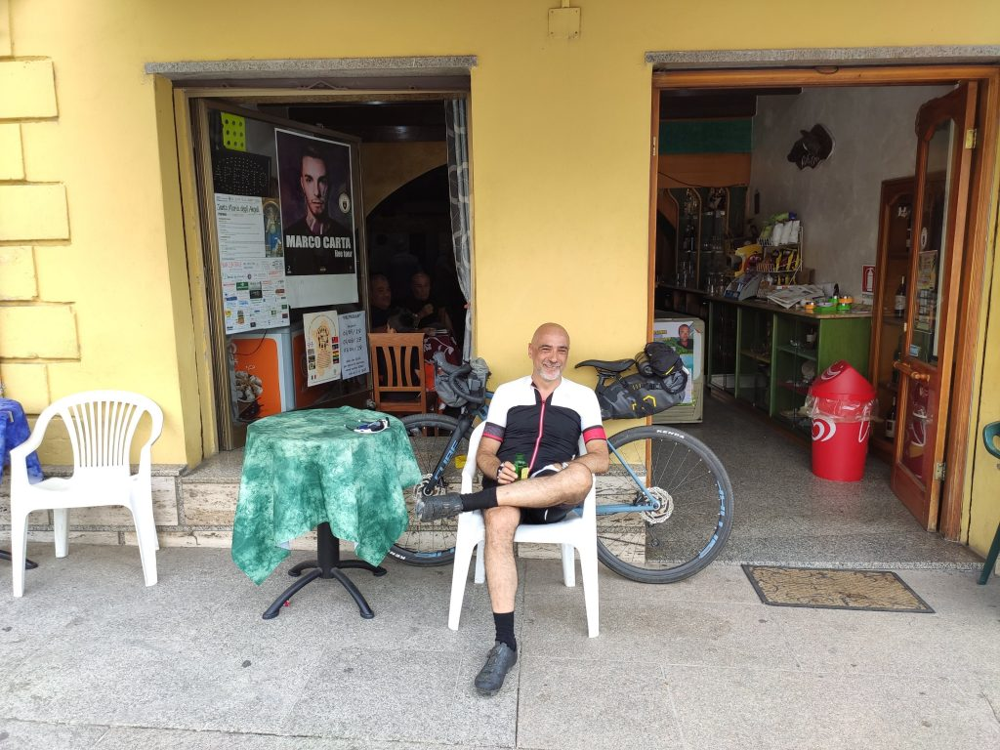
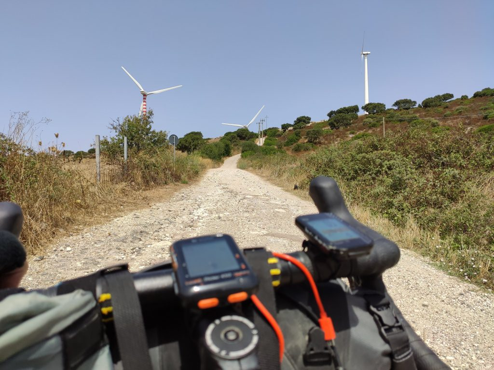
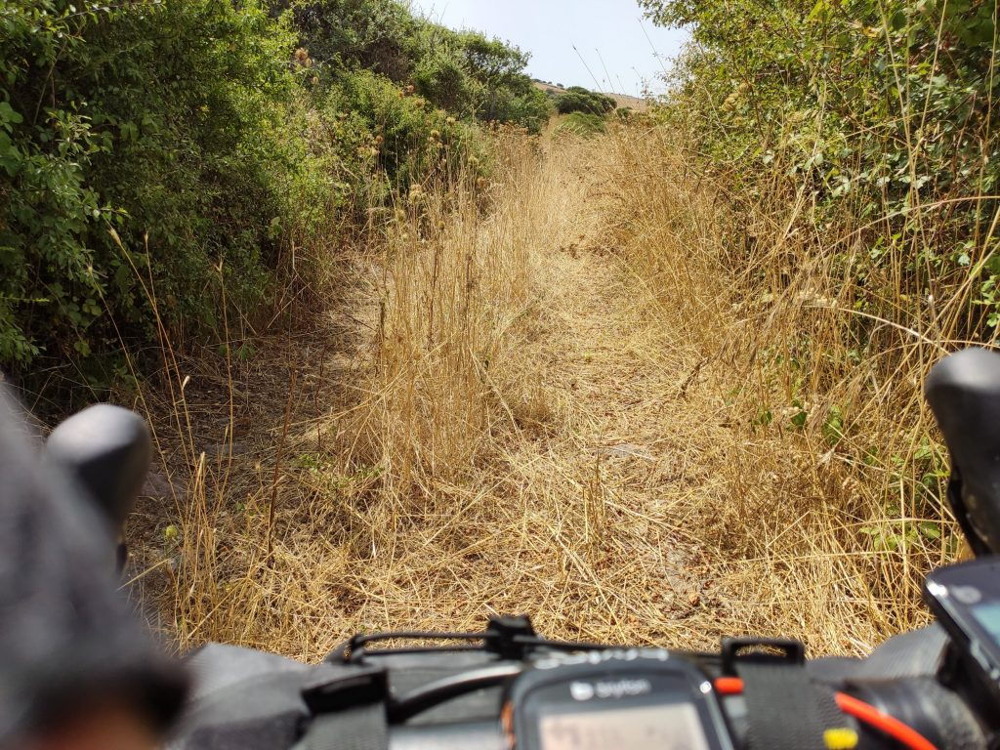

La tappa di oggi sembrava segnata dal vento, ma sarebbe stato troppo facile.

## La partenza 
Sapevo che la tappa di oggi avrebbe avuto uno start un po' faticoso (la salita fino a Tempio Pausania) una lunga parte di grandi discese e un finale misterioso per via della scarsa chiarezza della mappa (nota per me e per il futuro: misterioso = _pussa via_). Ho deciso quindi di partire alle 7.30 per darmi tutto il tempo e, sperabilmente, prendermi un po' del fresco di primo mattino. Appena uscito dal b&b però, la situazione era la seguente: una bolla di afa mortale, cielo grigio e minaccia di pioggia. Molto bene. Boccheggiando quel filo di ossigeno disponibile mi avvio verso Tempio Pausania imprecando (con grazia e misura e chiedendo anche scusa, ché non si sa mai).

Primo tratto pesantino. Asfalto, camion mattinieri molto sportivi, e appunto, afa. Dopo qualche km di spinta, il navigatore mi propone un fuori strada. Decido di dargli fiducia pur di levarmi dalla strada e faccio bene. Il percorso sterrato è chiaramente una scorciatoia per Tempio, passa accanto a piccole fattorie con mucche molto belle, ma soprattutto attraversa una minuscola, deliziosa ferrovia (la turistica Sassari - Tempio - Palau del <a href="https://it.wikipedia.org/wiki/Trenino_Verde" target="_blank" rel="noopener noreferrer">Trenino Verde</a>), le piccole scoperte che danno senso al viaggiare in questo modo.

Proseguo nel percorso, decisamente non difficile a parte l'inizio, e finalmente arrivo a Tempio. Avrei voglia di un caffè ma visto che inizia la discesa decido di rimandare.

## La discesa

Qui stiamo parlando di **circa 15km praticamente senza pedalare** (la chiamano la Fumosa); per i primi cinque, dieci minuti ho alternato un sorriso _regazzino_ a 48 denti col terrore di quello che mi avrebbe aspettato dopo, ma poi per fortuna il regazzino ha preso completamente il controllo, e mi ha imposto di lasciarmi andare, e di godermi _totalmente_ e _incondizionatamente_ i 37-40 km/h, la bici a briglia sciolta, il vento in faccia, e tutti i pensieri lasciati volar via alle mie spalle. Via. Via

La corsa è finita a Perfugas, dove mi sono fermato nel classicissimo 'bar dei maschi' del paese, dove il più sobrio beveva Ichnusa, e io invece ho optato per un succhetto Ace. Immaginatevi le loro facce vedendomi entrare col completino attillato e chiedere il succhetto. A uno ho chiesto persino di farmi la foto!

## Il lastrone verticale
Parto da Perfugas e di nuovo sembra tutto facile, qualche saliscendi ma niente di complesso. Passo per Bulzi e per Sedini, dove mi fermo per risolvere la questione caffè rimasta in sospeso. Molto baldanzoso riparto sulla statale in piano ma mi accorgo che secondo il navigatore la strada era un'altra. Faccio avanti e indietro ma questo bivio non si trova. Poi capisco: quel lastrone di cemento verticale su cui avevo buttato gli occhi distrattamente è in effetti un'ipotesi di strada, e il navigatore vuole proprio farmi passare di là. Freneticamente consulto le mappe e niente, per andare verso Nulvi ormai la strada (chiamiamola) pare sia quella, a meno che non decida di circumnavigare la Sardegna e anche un po' di Corsica. Naturalmente spingo la bici (impossibile diversamente) e pian piano arrivo fin su, dove incontro due uomini intenti a fare lavoretti all'esterno di una casa. Mi fermo a chiacchierare, uno è di Roma, gli racconto del viaggio, ci salutiamo augurandoci buona vita. Parlare con gli sconosciuti incontrati in bicicletta è affascinante, un piccolo ponte di gentilezza reciproca e di sorrisi spontanei; sono convinto che in quei momenti si riesce per un attimo a leggere la persona per ciò che è, al di là delle rabbie e delle frustrazioni che corrodono l'anima.

Dopo un breve tratto di strada incontro un percorso sterrato piacevole, fino a una nuova salita mostruosa che conduce direttamente ad un parco eolico che intravedo da lontano. Bene, penso, sarà dura ma poi mi godrò un po' d'aria. E infatti dopo la salita fatta un po' pedalando un bel po' spingendo, arrivo nel pieno del piccolo altopiano dove sono state installate le pale eoliche. Il vento è fortissimo!

Considerando l'ora e il caldo micidiale, pedalare con quella bella aria impetuosa e fresca (in piano) è stato piacevole quasi come i 15km di discesa, e che bello il rumore delle pale mosse dal vento! Ma proprio quando mi sembrava di poter intitolare la giornata al piacere del vento in faccia, lo sterrato finisce e mi ritrovo in una giungla di rovi. È il percorso single track, che avevo dimenticato, e che è davvero inagibile.

## Sembrava facile, oggi
Erba altissima, rovi di more, sassi, buche e, manco a dirlo, salita. Decido di proseguire a mano, anche volendo pedalare le trappole erano veramente troppe. E comincia un'ammazzata pazzesca, alle 12.30, col sole a picco, a farmi strada fra i rovi spingendo in salita.

Ora, il problema di questi momenti è che la testa lavora moltissimo, per chi come me non ha quel tipo di preparazione spirituale che ti porta a concentrarti interamente su ciò che stai facendo in quel momento. E nel mio caso, purtroppo sono stato raggiunto da molti di quei pensieri lasciati al vento qualche decina di km prima. Subdoli, quei pensieri, trovano spazio facilmente in un momento di fragilità fisica e psicologica. Non offro molta resistenza, anche perché non ne ho, e poi penso sempre che in fondo è meglio lasciar passare che respingere. Ma stavolta è diverso, perché a sobbollire sono i sensi di colpa.

È troppo, e come <a href="https://ciclogravelista.it/2019/07/01/gardamare-tappa-4-da-ferrara-a-mesola-dove-ho-attraversato-bellezza-silenzio-e-un-momento-difficile/" target="_blank" rel="noopener noreferrer">a Luglio sul Po</a>, viene giù tutto in dieci minuti. Ma stavolta mollo la bici, non ce la faccio a tirare avanti. Lascio uscire tutto e non è facile, ma è importante, e capisco che mi serve.

Dopo qualche minuto mi accorgo per caso di aver perso i guantini tolti prima. Mi riprendo, e provo a scendere qualche metro alla loro ricerca. Va meglio, camminando mi rendo conto di essermi alleggerito. Un piccolo passo, forse importante.

Dichiarati persi i guantini continuo un po' a pedalare un po' a spingere, e finalmente questo maledetto percorso accidentato finisce. Sono sulla strada, ho due km di salita facile per arrivare finalmente all'agriturismo dove sono ora, e dove passerò la notte.

Sembrava facile, oggi.

