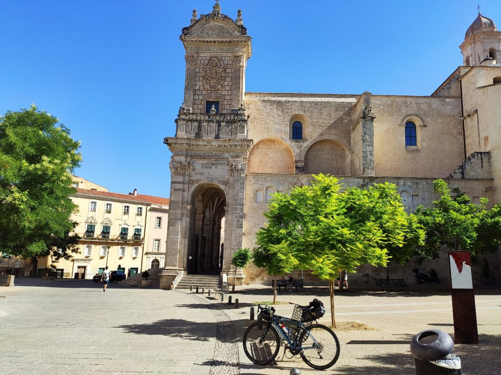
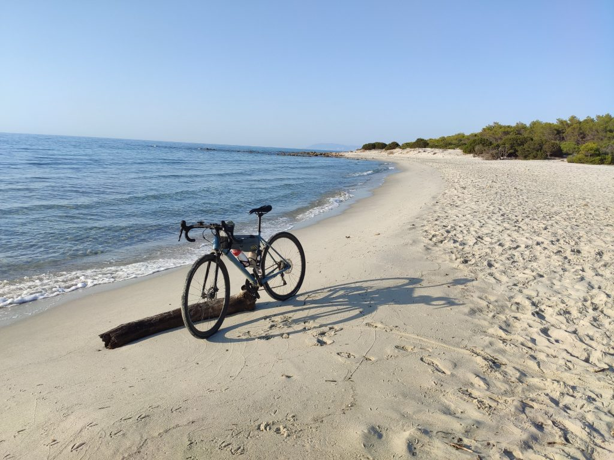

***3 Agosto 2019***

Originariamente la fine del mio viaggio avrebbe dovuto essere a Orosei, il 3 sera, per la prima cena con gli amici appena arrivati da Roma in cui avremmo anche festeggiato due compleanni. Ma la mia partenza il 31 mi avrebbe lasciato pochissimo tempo per le mie tappe in solitaria; per questo ho scelto di mettermi in marcia immediatamente da Olbia con il serio rischio di fare notte sulla ferrovia dismessa Monti Calangianus.
Purtroppo però la giornata pesante del 31 luglio mi ha costretto ad uno stop il 1° agosto e il vantaggio si è perso. Il risultato è che mi sono trovato il 3 agosto mattina a Nulvi col problema di dover arrivare la sera a Orosei, o perdermi tutto il weekend con gli amici. Avevo quindi due possibilità: sacrificare Alghero e fermarmi a Sassari e da lì arrivare a Nuoro con il pullman, oppure arrivare ad Alghero e ripartire subito praticamente per tornare indietro con il rischio di fare tutto di corsa e male.

## La partenza
Insomma, per farla breve, quando mi sono messo in movimento da Nulvi non avevo le idee molto chiare, tant'è che sono partito in un orario un po' scemo: non era sufficientemente presto da pensare di poter tentare l'arrivo ad Alghero salvando la serata con gli amici, né abbastanza tardi da riposarmi un po' di più rinunciando in partenza ad arrivare ad Alghero. Alle 8.00 ero in viaggio e non avevo ancora idea di cosa avrei fatto, però una cosa la sapevo: oggi niente avventure, solo tranquille strade asfaltate.

Con questo spirito ho viaggiato per una trentina di km agevolmente e senza intoppi (a parte qualche disorientamento dentro il paese di Nulvi) sulla statale per Sassari: poco traffico, saliscendi ragionevoli, una lunga salita sul finale e poi un discesone infinito dalla periferia di Sassari fino al centro e al bellissimo Duomo.

## E ora?
Eh. Per prima cosa un bel caffè con un pasticcino di pasta sfoglia e crema, poi qualche considerazione. Arrivare ad Alghero solo per mettere la bandierina e poi stressarmi per trovare il modo di essere la sera a Orosei mi sembrava una roba stupidamente faticosa di cui non avevo voglia né bisogno. Quindi, stravolgo i piani, rinomino il viaggio e trovo il modo di arrivare a Nuoro in pullman per poi farmi la cinquantina di km in bici necessari per arrivare a Cala Liberotto. Con questo spirito mi avvio girellando per il centro di Sassari verso la fermata degli autobus regionali ARST.

## Il pullmann 
Quando arrivo, trovo un gabbiotto con un giovanotto tanto gentile quanto confuso. Gli chiedo l'orario del pullman per Nuoro (11.45, ed erano le 11.15) e gli faccio notare che avrò bisogno di un biglietto per la bici. Il giovanotto esce trafelatissimo dal gabbiotto, mi spiega che non ha la più pallida idea di come si debba fare pagare una bicicletta, e che dobbiamo chiedere agli autisti. Inizia tra lui e due autisti un balletto di cifre, tipologie di biglietti, vecchie tariffe, nuove tariffe, mentre si avvicina l'orario di partenza. A un certo punto chiedo al giovanotto se mi indica la fermata da cui partirà il pullman (non ci sono paline parlanti, solo numeri) e mi viene grossolanamente indicata una direzione che mi pare coincida con un pullman parcheggiato che riporta la destinazione Ittiri. Mah. Mi avvicino e chiedo all'autista, che senza aprire il finestrino mi indica davanti a lui un parcheggio vuoto. Capisco che devo aspettarlo e mi siedo buono buono accanto alla mia bici. Passa il tempo e arriva un pullman ad occupare lo spazio vuoto. Sarà lui, penso. Mi avvicino e l'autista mi fa notare che il pullman per Nuoro parte dall'altro lato della strada molto più in fondo. Incazzato nero vado di corsa verso il pullman parcheggiato che, scopro, non è più quello per Nuoro che invece è partito poco prima. Torno imbufalito dal giovanotto nel gabbiotto, che ovviamente sosteneva di essere stato chiarissimo, lo mando a quel paese, rimonto in bici e torno in centro per aspettare il pullman successivo alle 14.

Dopo un panino veloce torno alle fermate e al gabbiotto con l'intenzione di chiarire la questione biglietti rimasta in sospeso. Stavolta però trovo per cambio turno una ragazza un po' più preparata, che sa esattamente quali biglietti occorrono e quanto costano, e che mi indica precisamente dov'è la partenza per Nuoro. Quando arriva il pullman spiego la situazione all'autista che scendendo mi mostra il portabagagli orizzontale dove infilare la bicicletta. Un po'perplesso reclino la bici e la infilo nel portabagagli legandola alla bell'e meglio, ma sono un po' preoccupato. L'autista mi tranquillizza spiegandomi che non avremmo trovato curve nel percorso. E partiamo.

Naturalmente l'uscita da Sassari è un percorso di montagne russe, ma era scontato. Io sono piuttosto stanco e decido di rilassarmi e godermi il viaggio al fresco, dormendo anche un po'. La strada è rapida e piacevole, e un paio di ore dopo siamo a Nuoro, dove il termometro segna 40°. In questo caldo infernale mi metto in marcia, con l'idea di arrivare a Orosei e poi a Cala Liberotto percorrendo la statale 129, una bella strada panoramica poco trafficata perché ormai affiancata da una nuova superstrada.
## La strada panoramica verso il mare
La strada è in effetti molto bella, tendenzialmente in discesa ma con vari saliscendi non impegnativi, a parte il forte vento caldo che in alcuni momenti mi costringe a spingere anche in discesa! In effetti passano pochissime auto e moto, e con i più disparati comportamenti: alcuni mi incitano, altri aspettano il mio segnale per superarmi, altri mi suonano e mi sfiorano di mezzo centimetro, ci si rende conto facilmente di quanto ormai questo paese sia spaccato fra gente civile ed equilibrata e gente incivile e rancorosa. Niente che non sapessi già, purtroppo.

Dopo qualche ora arrivo finalmente a destinazione, sfiancato da una lunga salita finale che concludo ansimando per via del gran caldo e degli 80km complessivi che ho nelle gambe.

Mare, finalmente.

Nei giorni successivi mi sarei finalmente fermato qualche giorno per godermi la famosa cena (a Su Gologone, posto splendido vicino a Oliena) e qualche giorno di mare con gli amici, cosa che sto facendo mentre scrivo, sempre accompagnato da una piccola malinconia quotidiana che so che mi farà compagnia molto a lungo.

Prossima tappa il 10 agosto, quando mi percorrerò tutta la costa per tornare a Olbia, e da lì a casa.

## La tappa

→ [Sardegna_Tour_Tappa_3_bus_da_Sassari_a_Nuoro_e_bici_fino_a_Cala_Liberotto.gpx](../Sardegna_Tour_Tappa_3_bus_da_Sassari_a_Nuoro_e_bici_fino_a_Cala_Liberotto.gpx)