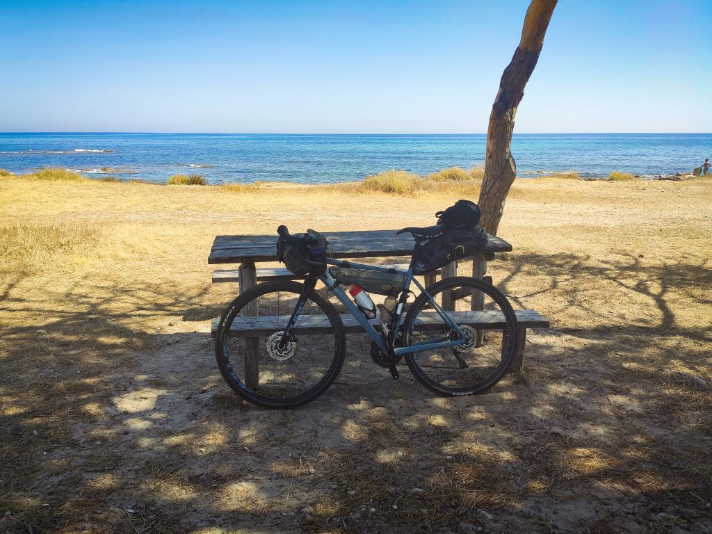
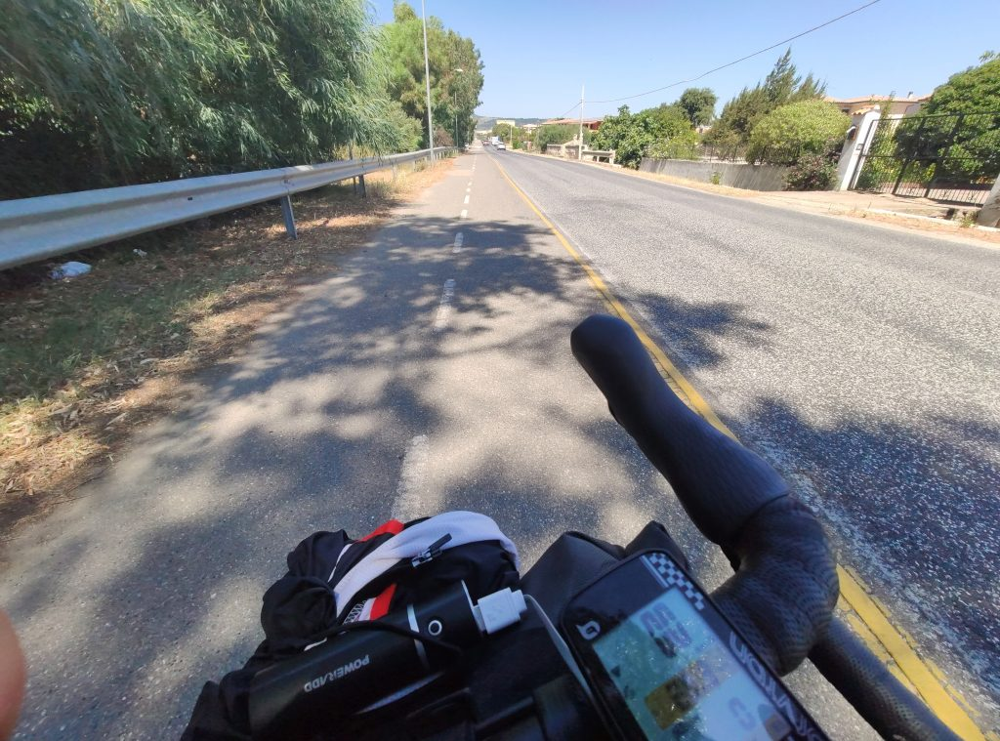
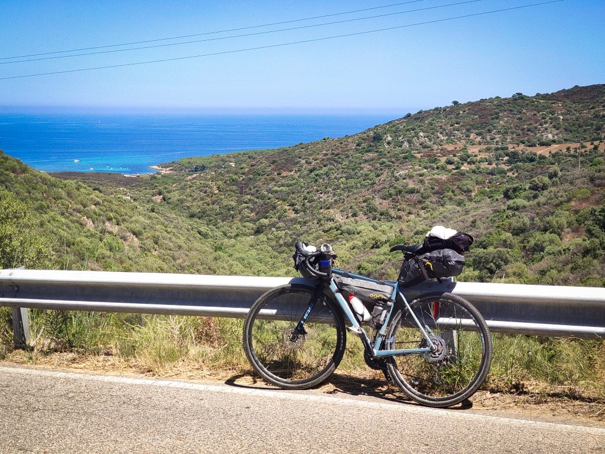
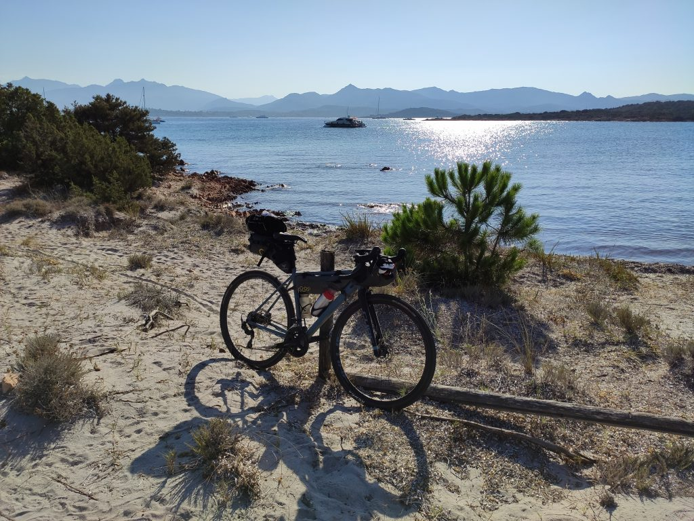
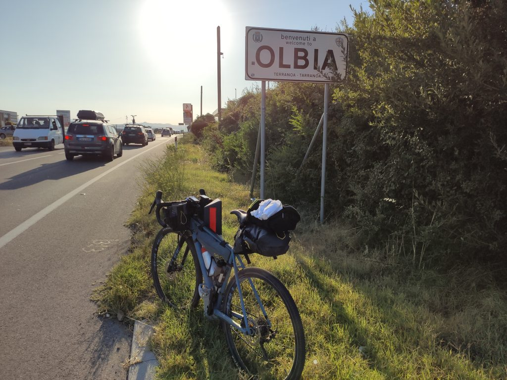

***10 Agosto 2019***

Finita la breve vacanza nel Golfo di Orosei con gli amici, in previsione di ripartire l'11 da Olbia ho deciso di partire il giorno prima per farmi l'Orientale Sarda senza correre, fermandomi in zona porto per partire l'indomani fresco e riposato. Come no.

## La partenza
Sapendo che avrei avuto a disposizione l'intera giornata mi sono messo in moto non prestissimo, con l'idea condivisa con gli amici di fermarci dalle parti di Posada per un concerto di Paolo Fresu, nell'ambito del suo festival [Time in Jazz][1]: io mi sarei avviato in bici, e loro mi avrebbero raggiunto (e superato) più tardi. Tutto abbastanza facile sulla carta, ma un po' di disordine nei calendari online del festival ci ha complicato un po' la mattinata: sembrava che Fresu fosse a Torre San Giovanni e altri due jazzisti alla Pineta di Orvile, e invece a Orvile c'era Fresu con il risultato che siamo tutti arrivati troppo tardi. Comunque una buona occasione per vedere qualche bel posto.

## La salita di San Teodoro 
Dalla pineta di Orvile, dove ho potuto giusto fare una bella sterrata di qualche km per poi tornare indietro con le proverbiali pive nel sacco, ho proseguito sulla statale 125 con l'idea di superare la salita di San Teodoro prima di fermarmi per pranzo da qualche parte. Ma non avevo fatto i conti con il caldo furente, che alle 13 ha cominciato a farsi sentire in tutta la sua potenza proprio quando, dopo Budoni, iniziava l'arrampicata. A proposito di salita, agevolo immagine di una surreale ciclabile di poco più di 500 metri contromano, che per un attimo mi ha fatto pensare di avere delle strane visioni. 

E a proposito di deserto e di visioni, mentre sudavo via diversi chili di anema e core lasciati sull'asfalto rovente, mi tornava in mente il libro di Marcello Fois [In Sardegna non c'è il mare][2], che non ho (ancora) letto, ma che ha un titolo talmente efficace da restare in testa come un claim pubblicitario. Il libro parla della Barbagia e della cultura prettamente montana della Sardegna, ma percorrendo l'Orientale e le altre statali sarde davvero non si ha la percezione di vivere in una regione circondata dal mare, e vissuta in estate prevalentemente per questa ragione. Sono questi nuovi paesi di costa, costellati di villaggi e insediamenti moderni a fornire giusto qualche indizio, e a costringere i cicloviaggiatori casuali a prepararsi con grande precisione o a seguire le tracce che conducono al mare, con il rischio di trovarsi in megaparcheggi di spiagge caotiche o anfratti irraggiungibili se non a piedi e con grande fatica. 

Spillando sudore e pensieri finissimi, finalmente arrivo alla vetta di San Teodoro che, considerando la sempre scarsa preparazione atletica e il caldo fuori scala, corrispondeva grosso modo al mio Stelvio personale. La foto non rende giustizia, ma da lassù capisci che si, il mare c'è eccome. È solo difficile da raggiungere, o fin troppo facile.

San Teodoro è una cittadina più carina delle altre, sempre funzionale a un certo tipo di turismo ma sicuramente più gradevole di altre località in zona. Purtroppo non conoscendone le spiagge e avendo anche un po' perso l'orientamento, sono finito all'ingresso della Cinta, spiaggia sicuramente splendida ma totalmente inadatta a presentarsi sulla passerella d'ingresso con la bici e vestito da fesso. Come spesso accade in questi posti bisogna fare diversi chilometri a piedi per togliersi di torno la folla agostana, e certamente non ero nelle condizioni di farlo. Morale della favola, l'idea di trovare un posto dove mangiare qualcosa davanti al mare prendendo un po' d'ombra è risultata essere un'utopia, e son finito a mangiare un panino in un posto qualsiasi che avrebbe potuto essere a Torvajanica.

## Un bel bagno ci sta
Rifocillato, riparto con l'obiettivo di trovare un posto dove fermarmi un'ora a riprendere fiato e a rinfrescarmi con un bagno, e dopo aver superato lo Stagno di San Teodoro, trovo il bivio di Capo Coda Cavallo e decido di avventurarmi. La strada è lunga, asfaltata per lo più e con un breve finale sterrato, sono circa 6km dalla statale. Riguardando poi la traccia del GPS mi rendo conto che avrei potuto evitare un po' di strada ma soprattutto di ritrovarmi con Tavolara davanti invece che alle spalle. Ma l'angolino che ho trovato mi ha consentito di stare finalmente un po' all'ombra e soprattutto di farmi un bel bagno rinfrescante.

Dopo una bella pausa piacevole e rilassante, non mi restava altro che rimettermi in marcia, tornare sulla statale, e con tutta calma ultimare la strada per Olbia, concludendo così un percorso lungo ma piacevole, e soprattutto molto comodo per trovarmi pronto per la partenza il giorno dopo.

O almeno questo è il finale che avevo immaginato. In realtà le cose non sono proprio andate così.

## Il finale alternativo 
Mentre ero tranquillamente sdraiato sotto il mio albero, ho preso il telefono per vedere un po' qualche soluzione per fermarmi a dormire, fra le varie opzioni che avevo immaginato mentre pedalavo: più qualcosa in centro a Olbia per avere il porto comodamente vicino, e fare magari un piccolo aperitivo e una bella cena appena arrivato? O meglio un agriturismo fuori città per una cena tipica e una sistemazione più verace? Continuavo a baloccarmi con queste ipotesi anche in attesa dei risultati di ricerca di Booking, quando mi trovo di fronte alla verità: **NULLA**. Non c'era alcuna disponibilità da Capo Coda Cavallo fino a Olbia al di sotto dei € 500 per una notte. Inizio a preoccuparmi e mi metto a cercare altre soluzioni su Trip Advisor e su Google. Mi attacco al telefono e chiamo agriturismi, bed & breakfast, posti consigliati dalle strutture contattate. NULLA. TUTTO PIENO (ovviamente, pirla, è il 10 agosto, chissà che speravi di trovare??). Ok. E ora? Improvvisamente continuando a cercare mi imbatto in un hotel di Olbia con una stanza disponibile (l'ultima, dice) a € 150. Vabbè, piuttosto che restare per strada. Concludo la prenotazione, mi arriva la conferma, e mi rilasso un attimo. Ma proprio un attimo, perché pochi secondi dopo mi arriva una telefonata: è l'hotel, c'è un errore su booking, la stanza in realtà non è disponibile e sono costretto a fare la rinuncia gratuita. Solo il giorno dopo a mente fredda mi rendo conto che avrei potuto farmi una bella risata e scaricare il problema su booking o sulla struttura che in qualche modo avrebbero dovuto ricollocarmi a spese loro. Ma in quel momento sono più preoccupato di evitare l'addebito per il no show e non penso alla soluzione più elementare.

Sfilato da questo problema, comincia a farsi strada il pensiero più assurdo: e se&#8230;.. tornassi indietro? Non in bici ovviamente ma in pullman. Ridicolo eh? Assurdo veramente. E però. La casa a Cala Liberotto c'è ancora, la stanza è sempre lì&#8230; Inizia un giro di telefonate, e alla fine partoriamo il piano: vado all'Aeroporto di Olbia, mollo la bici al deposito bagagli, salto sul pullman che parte per Nuoro e mi faccio venire a prendere al cosiddetto Bivio Sologo per riuscire ad arrivare a Orosei e Cala Liberotto in serata.

Detto fatto, inizio a pedalare come un forsennato per arrivare in tempo per fare tutto. La strada è un inferno: traffico, casino, a Porto San Paolo becco la Sagra del Porcetto, avvicinandomi a Olbia sempre più SUV e megamacchinoni che specialmente in salita mi sfiorano, mi insultano o mi suonano, non proprio l'idilliaca passeggiata in bici. Ma in qualche modo riesco ad arrivare a Olbia.

Arrivo all'Aeroporto di Olbia stanco, sudato e puzzolente, e per fortuna trovo impiegati disponibili che mi aiutano a risolvere il problema nonostante sia la prima volta che gli capita di accogliere una bici intera e non smontata, letteralmente parcheggiata nel deposito bagagli. La difficoltà principale è l'impossibilità di far entrare la bici sul tapis roulant del controllo bagagli, che ci costringe a chiamare un addetto per il test manuale sul telaio della bici! Per fortuna il problema si risolve rapidamente, e con 12 euro di deposito bici, 8 di biglietto, e diversi metri di coda fra le gambe, me ne torno all'ovile dopo aver percorso 100km. Anzi il GPS me ne registra 99,97, neanche la soddisfazione del centone! Meno male che l'ho presa veramente a ridere, segno che il cuore comincia a essere un po' più leggero.

Con questa tappa si è concluso il mio strano e un po' sconclusionato giro sardo, con 300km totali e 3165m di dislivello, per me una grande esperienza fisica e umana, davvero impensabile fino a un anno fa. Difficile non pensare a quanta tristezza lo abbia reso possibile e necessario, ma non si può fare altro che pedalare in avanti, con le borse piene di ricordi, che per fortuna quanto più sono belli, tanto più sono leggeri.