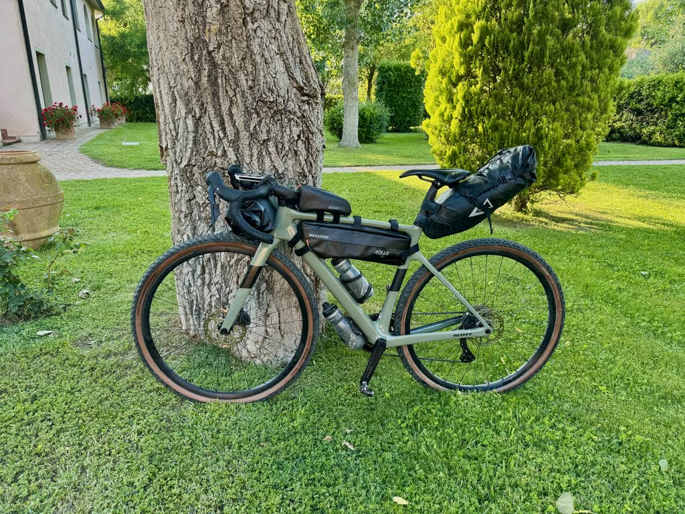
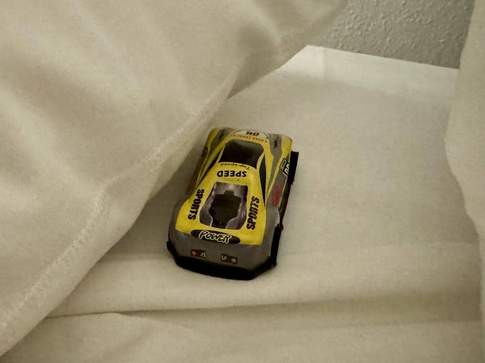

***21 Maggio 2026***

Non ho mai scritto un prologo prima di partire per un viaggio, ma stavolta ci voleva.

## Cos’è il Tuscany Trail
Viene chiamato “L’evento bikepacking più grande al mondo”, magari con un filo di esagerazione, però oggettivamente porta quasi 7000 persone da tutto il mondo a pedalare sulle colline e sul mare toscano. Modalità “unsupported” (che vuol dire “ti do la traccia e i campi base poi sono fatti tuoi”) ma con uno straordinario ecosistema di alloggi, ristori, servizi che si attiva ogni anno per l’occasione. Da molto tempo volevo farlo, ho scelto il periodo della mia vita in cui sono meno allenato e più sfiancato di sempre. Ma ho la bici nuova e soprattutto sono **motivatissimo**

## Domani si parte

Stasera io, Vincenzo (con cui ho già fatto [Dolomiti](/viaggi/anello-dolomiti) e [Delta del Po](/viaggi/delta-del-po)) e Fabrizio, con cui viaggio per la prima volta, siamo a Campiglia Marittima, da dove domattina partiremo per la prima tappa. E stavolta descrivere le emozioni sarà molto diverso.

## A cuor leggero 

Le gambe non ce l’ho, e forse neanche il fiato. Ma il cuore ha fatto un lungo giro, e ha scoperto nuovi modi di sentire e, soprattutto di esprimersi. Domani e nei prossimi giorni mi sfiancherò, farò e faremo cose assurde e comiche come in tutti i miei viaggi, ma trarrò forza e coraggio direttamente dall’amore di, e per, chi fa profondamente parte della mia vita. 

## La macchinina gialla

Con me ho una macchinina gialla. Ho chiesto a mio figlio (ormai quasi 4enne) di sceglierne una da portarmi in questo viaggio. Mi piaceva molto l’idea di una sua macchinina che gira la Toscana insieme a me e alla mia bici: un modo per stare insieme anche a distanza, creando tante storie da raccontare, come [il nano di Amelie](https://www.amica.it/gallery/le-foto-piu-favolose-di-il-favoloso-mondo-di-amelie-e-le-clip-del-film/).

