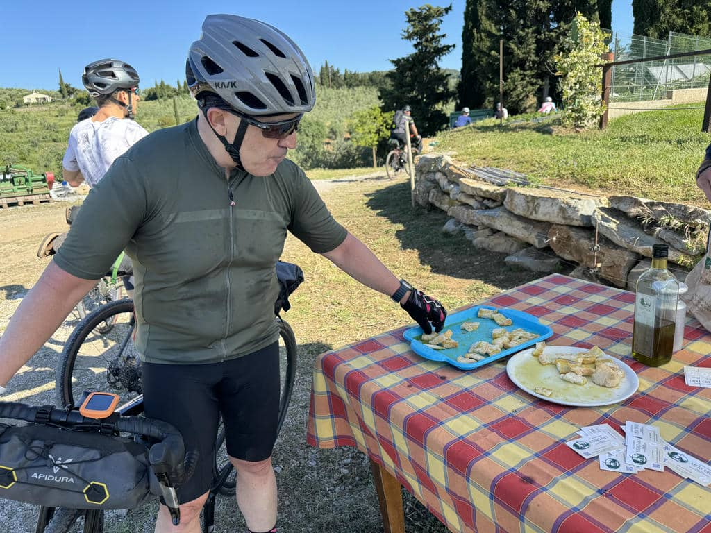
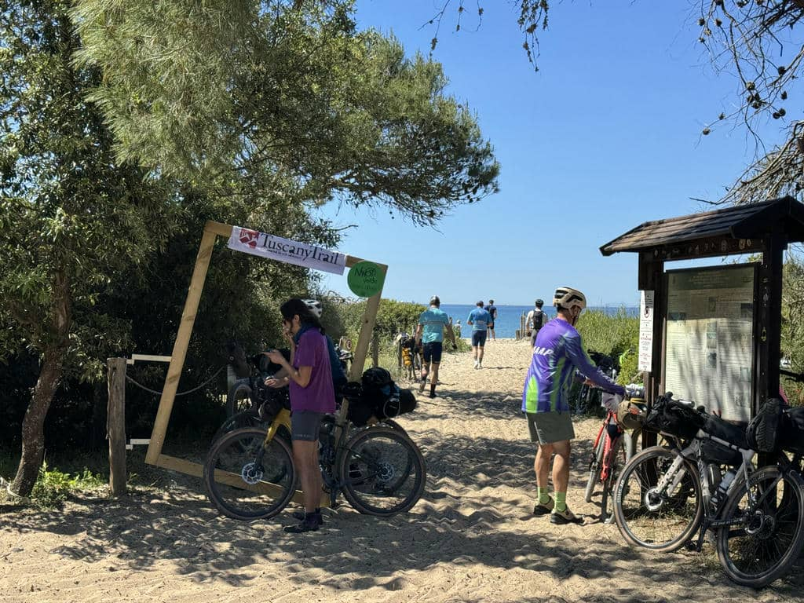
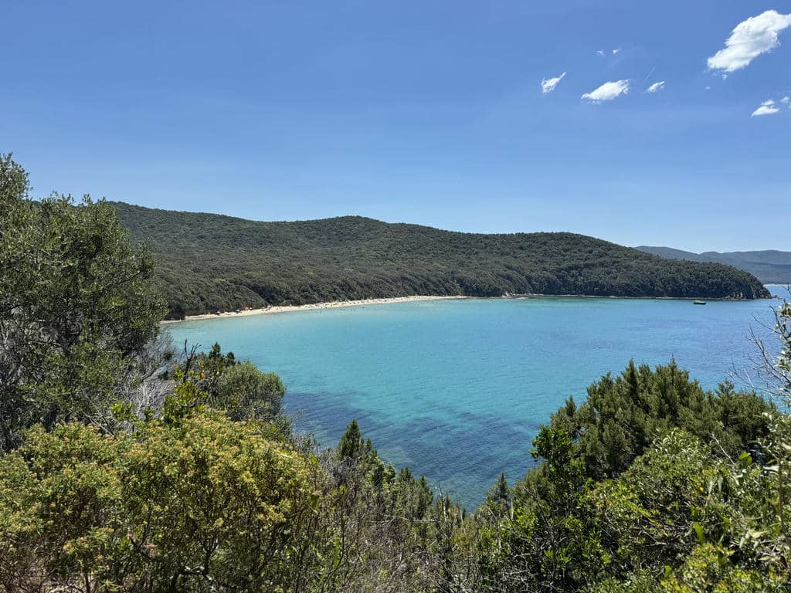
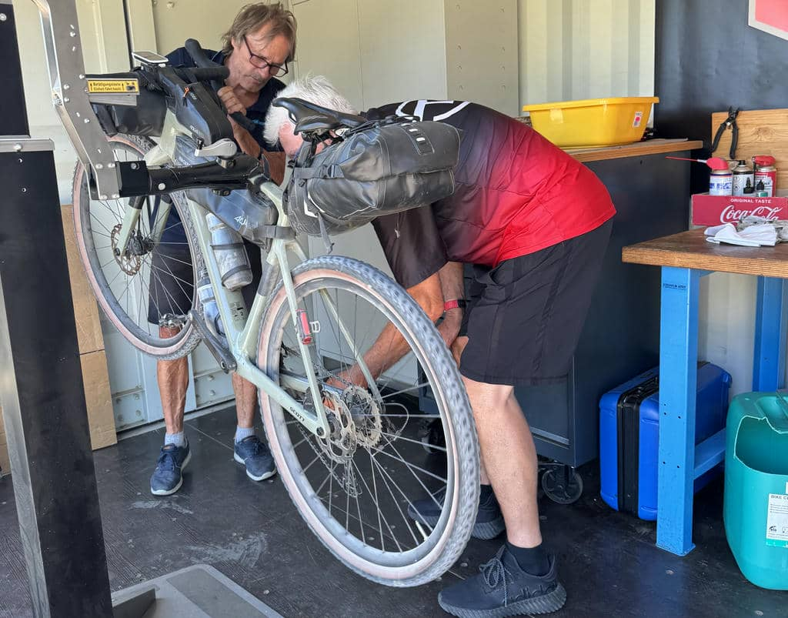
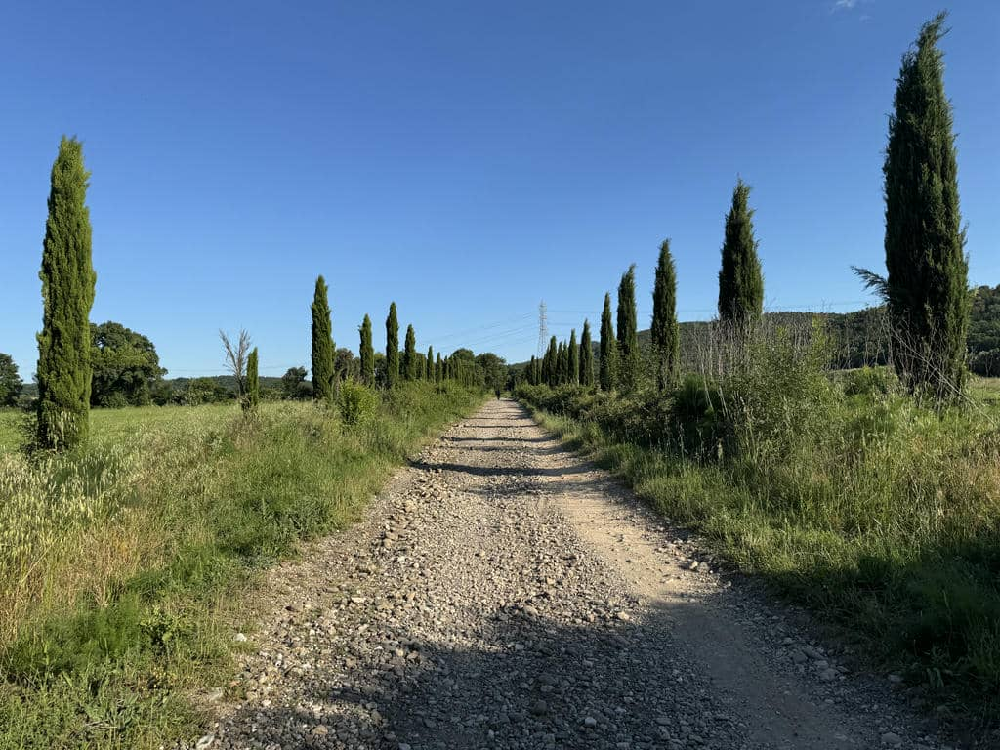
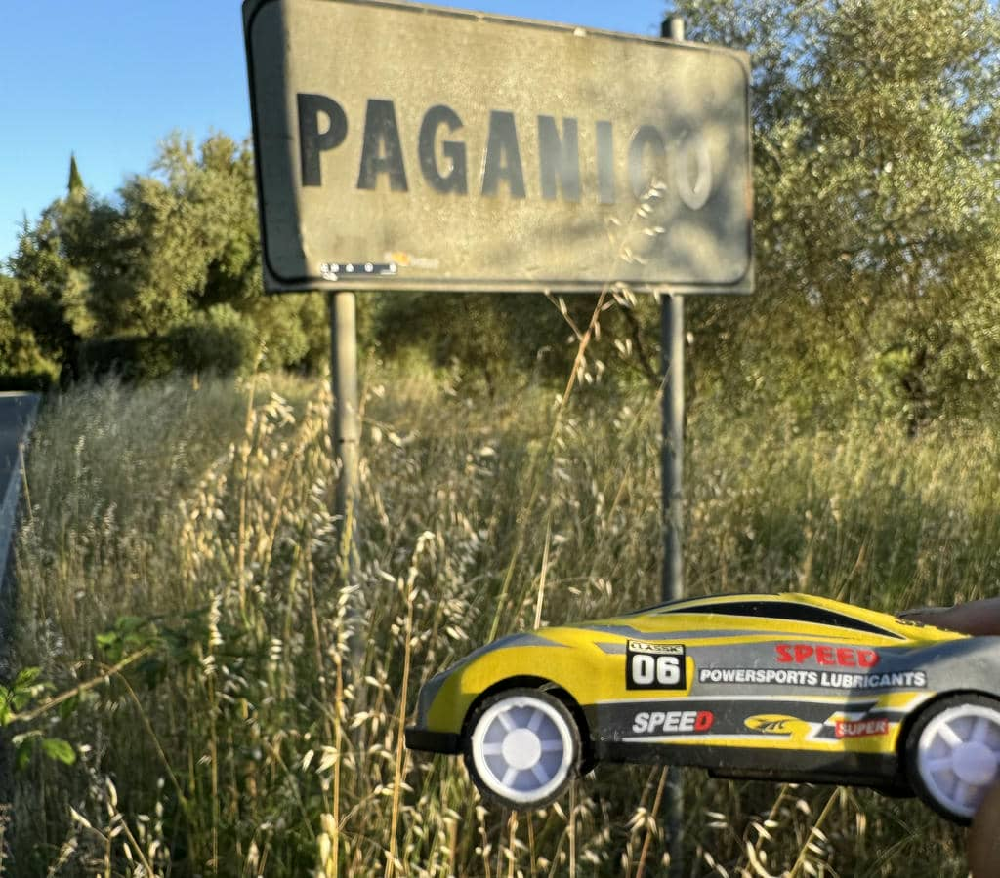

***22 Maggio 2026***

È importante conciliare ciò che siamo e possiamo fare, con il desiderio di fare.

## La partenza 
La prima tappa è lunga, e come dicevo ieri nel prologo, sono davvero preoccupato di non farcela. Ma la partenza mi sorprende. L’aria è fresca, si sta bene, pedalo con convinzione fin dai primi km ma anche e soprattutto nelle primissime faticose salite. Sono contento, e anche se la strada è lunga comincio ad avere un po’ di confidenza. Alla fine della prima salita importante, ci aspetta il gestore di un agriturismo che offre a tutti noi ciclisti del pane con il suo buonissimo olio.

## Il mare
Facciamo un lungo giro in campagna fino ad arrivare nella zona di Sterpaia, e a una spiaggia bellissima che si chiama Nano Verde, una bella scoperta per me che non conosco molto quella parte di mare toscano. C’è un atmosfera splendida, un sacco di gente di tutte le nazionalità, tutti felici di essere lì.

Il percorso è davvero bellissimo: un  saliscendi sterrato lungo tutta la zona di Follonica, fino all’area protetta di Scarlino, passando tra l’altro da una vista mozzafiato di Punta Ala dall’alto

## Primi problemi 
Siccome non c’è mai niente di facile, la bici appena comprata usata in quelle che sembravano perfette condizioni, mi accolla un primo problema, che mi sembrava di aver risolto prima di partire con il meccanico di Ravenna: la corona non “sale” rimanendo bloccata sulla corona piccola. Non è un dramma, la conformazione del territorio fa sì che mi occorra più la piccola (sconnesso e salite) che la grande. Diventa faticoso sui rettilinei lunghi, dove sono costretto a frullare pedali come un criceto per riuscire a fare due metri. E questo stanca parecchio. 
A Follonica troviamo sulla strada costiera un officina di bici. Decido di fermarmi e provare. Ma la situazione è surreale: si tratta due due “meccanici” svizzeri di Berna, che non spiccicano più di due parole in italiano, a cui faccio molta fatica a spiegare la situazione. Loro provano lo stesso, e la situazione è sconfortante ed esilarante al tempo stesso

Alla fine si arrendono, e io decido di smettere di cercare la soluzione e adattarmi. Che poi sarà il tema delle ore successive.

## Qui e Ora 
Dopo un pranzo veloce a Castiglion della Pescaia, proseguiamo il percorso nell’ entroterra, verso Vetulonia. Inizia a fare caldo, e io inizio a soffrire. Durante le salite maturo questo pensiero: non è tanto importante il “dove arrivare”, quanto il “come stare” nella condizione in cui ti trovi. Questo pensiero, vista la fatica che inizio a fare per via del mio scarso allenamento, mi spinge a trovare uno stato di equilibrio: il mio passo, la mia cadenza e velocità. Uno stato tale da poter essere virtualmente infinito. Uno stato, non una meta. 
Iniziano però a farmi molto male il collo e le spalle, la tensione continua in salita e in discesa sullo sconnesso cominciano a farsi sentire, e inizia anche a farmi male la testa. Decido di fare una cosa che si è rivelata molto stupida: mi prendo una pasticca di Ibuprofene. Dopo dieci minuti ho un crollo di pressione e sono costretto a fermarmi. Da allora in poi, l’aumento di stanchezza e fatica, in una condizione per niente ottimale, mi metteranno ko.

## E se non pedali, spingi
Due anni fa sul Carso, il troppo caldo, l’allenamento e la paura di non farcela mi fecero mollare dopo la prima tappa e tornai indietro sconsolato. Oggi per diversi momenti ho avuto la stessa tentazione. Lo “stare nel momento” non aiuta quando vedi che non riesci a trovare un tuo equilibrio sui pedali. Ma avere consapevolezza dei tuoi limiti, e accettarli serenamente, ti porta a superare gli imbarazzi e a decidere che il tuo equilibrio è anche fermarsi più spesso, spingere la bici a piedi dove non riesci a salire, e soprattutto chiedere una mano quando hai bisogno. I miei due compagni di viaggio mi hanno aiutato aspettandomi e infondendomi fiducia, e con fatica sono riuscito a concludere il percorso. Poi certo la domanda può essere “ma chi te lo fa fare”. Ma il punto è proprio lì: conciliare limiti e desiderio. Si può fare tutto, o molto, se lo fai in un modo coerente con i tuoi limiti.

## Fine giornata 
Arrivo alla fine in qualche modo, sono davvero molto stanco ma felice di aver fatto il mio percorso più lungo di sempre nonostante lo scarso allenamento. Non una prova di forza, ma una prova di determinazione.
La cosa più importante, è che anche la macchinina che viaggia con me è arrivata a destinazione insieme al cuore che l’accompagna.

