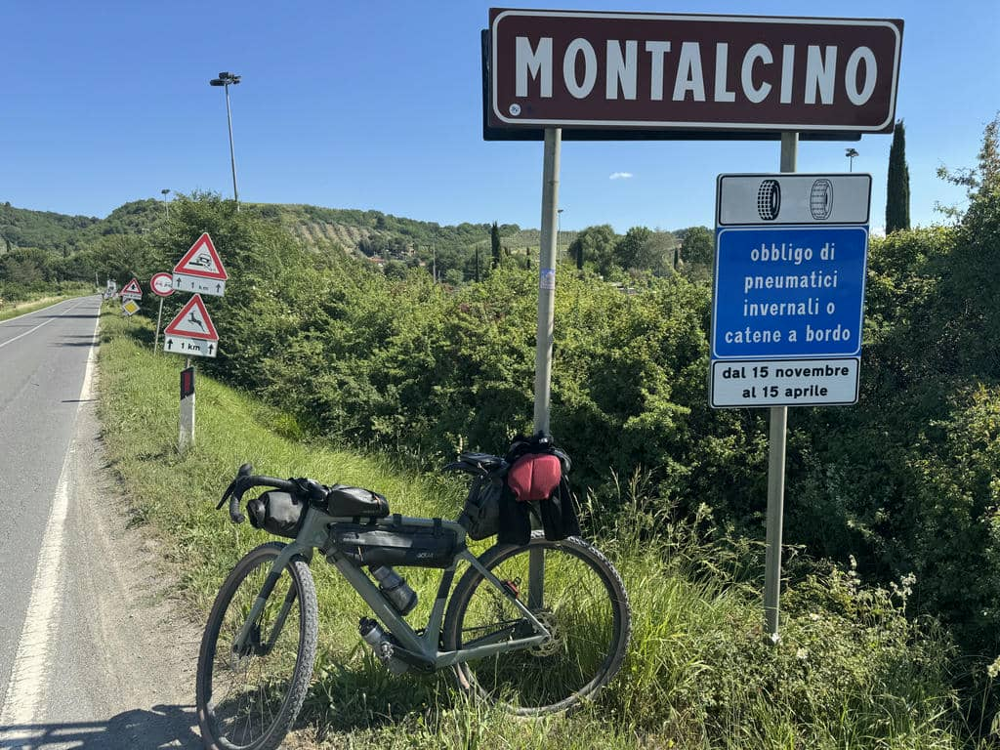
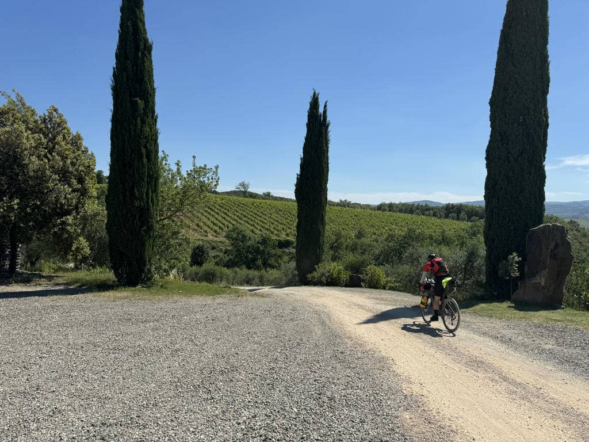
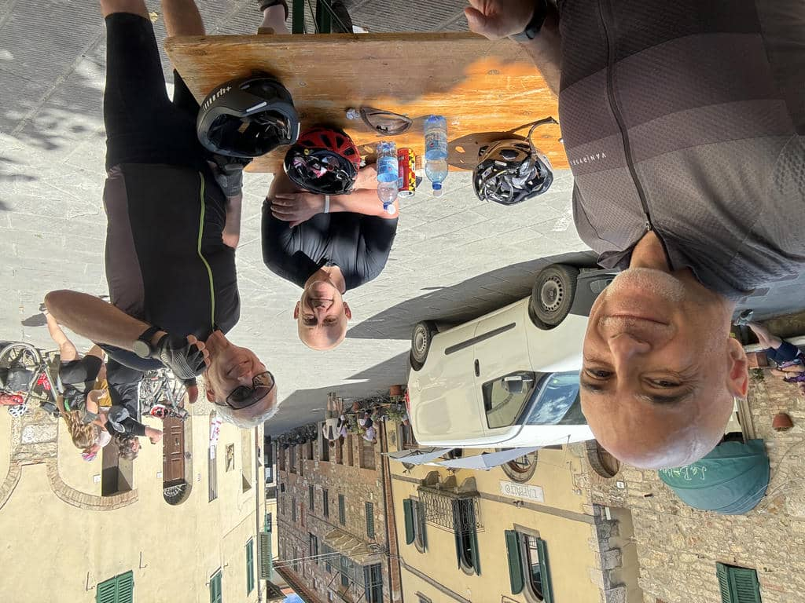
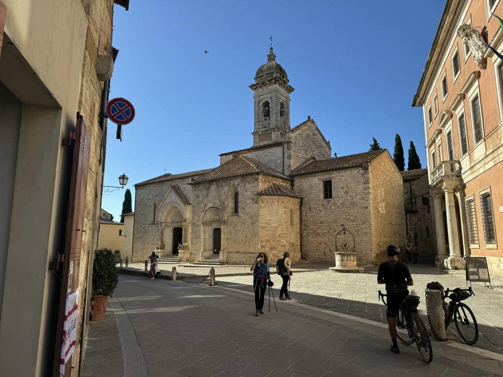
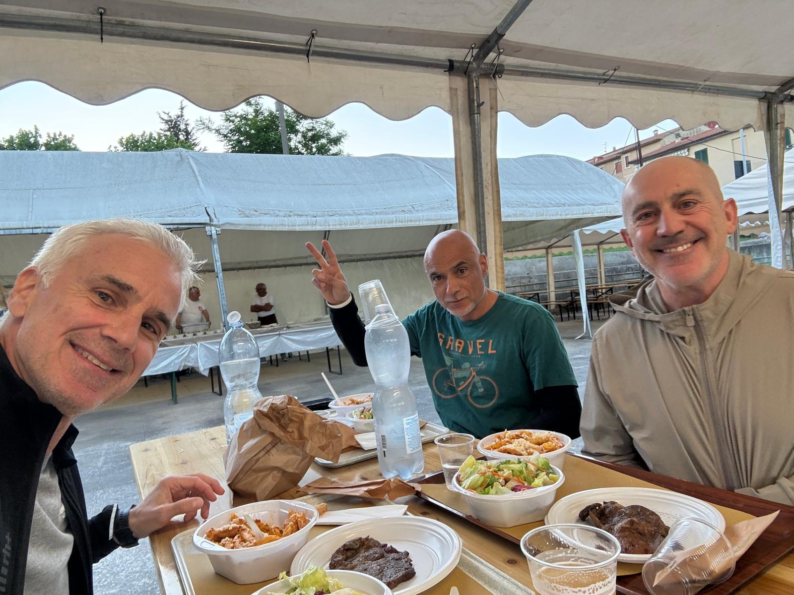

***23 Maggio 2026***

I desideri sono illusioni, ma aiutano a capire meglio cosa è giusto per noi. 

## La partenza 
Dopo la giornata di ieri chiaramente mi aspettavo fiacca e dolori, invece per fortuna (ma anche per “dosaggio” dello sforzo) dolori non ne avevo. Ho però trovato il modo di rimediare subito: scendendo dalla sterrata dell’agriturismo dove abbiamo passato la notte, ho preso male uno spacco nella terra e sono caduto, rimediando due belle botte ai lati delle ginocchia (giusto per infierire là dove non me la passo benissimo). E vabbè. 
Un po’ sgraffiato e dolorante mi rimetto in sella e partiamo. Prima tappa Sasso d’Ombrone, per poi raggiungere Montalcino.

## La scalata
Siamo nel territorio dell’[Eroica Montalcino](https://www.eroica.cc/eventi/eroica-montalcino), una delle più importanti gare a sfondo ciclostorico d’Italia, e infatti gli scenari sono spettacolari ma le salite sono durissime. Fa caldo, le pendenze sono importanti, il terreno ghiaioso ma sconnesso, si fa una fatica tremenda. Io faccio una fatica non sostenibile. Non ho problemi di fiato né di dolori muscolari o gambe bloccate: semplicemente non riesco a pedalare su pendenze estreme per mancanza di forza muscolare. Su pendenze inferiori pedalo piano, senza sforzi, rimanendo nel mio “qui e ora”, e questo mi aiuta a non stancarmi in modo irrecuperabile, ma appena si supera il 10% sullo sconnesso devo scendere e spingere, come ieri, ma oggi di più.

## Gli scenari. E l’umanità 

Ci sono due cose preziose però, in tutta sta fatica: la bellezza di questo incredibile percorso da Montalcino alla Val d’Orcia, con meraviglie difficilmente fotografabili in modo che rendano in tutto il loro splendore, e - ancora più importante - la straordinaria umanità che incontro. Al Trail partecipano ciclisti da tutto il mondo, di tutte le età e con le bici e i setup più disparati. Mi soffermo a parlare con molti di loro mentre si spingono le bici o durante le soste. Ci incoraggiamo, ci raccontiamo da dove veniamo. È tutto molto bello, e aiuta a ricordare perché siamo lì a sudare e a imprecare. Però io fatico tanto, e il dubbio di tornare indietro si fa sempre più vivo. Alla fine, il desiderio di completare il tour è forte, ma bisogna stare attenti a non desiderare ciò che non si può avere, perché forse, semplicemente, non è giusto per noi. Mentre fatico pedalando mi viene in mente la canzone dei Rolling Stones “You can’t always get what you want”. Ed è proprio vero. 

## La Val d’Orcia

Dopo un pranzo a Castiglion d’Orcia, io e Vincenzo decidiamo di tagliare per S. Quirico evitando una deviazione lunga e pesante per Pienza. Si rivela un’ottima idea, arriviamo a San Quirico e aspettiamo con molta calma l’arrivo di Fabrizio, che invece fa il giro completo. E intanto ci godiamo San Quirico che è sempre una meraviglia e che porto nel cuore.

## Fine giornata 

Arriviamo a Torrenieri e sono curiosamente meno stanco, faccio le ultime salite senza sforzo, evidentemente la lunga pausa di oggi mi ha aiutato. Stasera abbiamo cenato nel campo della Polisportiva Torrenieri, attrezzato a Base Camp per i ciclisti con le tende, ma aperto a tutti gli iscritti per la cena, ottima ed economica. 

Domani si va verso Siena, e vediamo come va.

