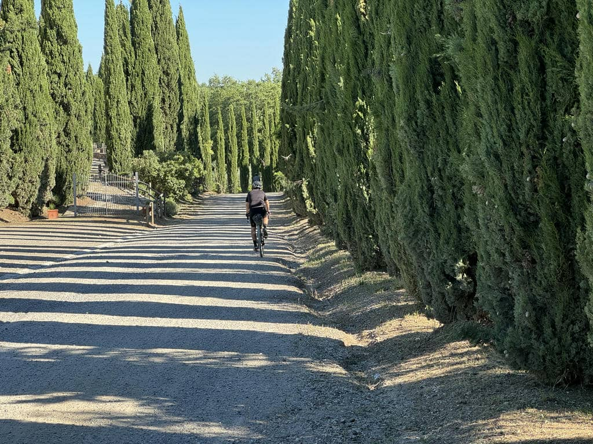
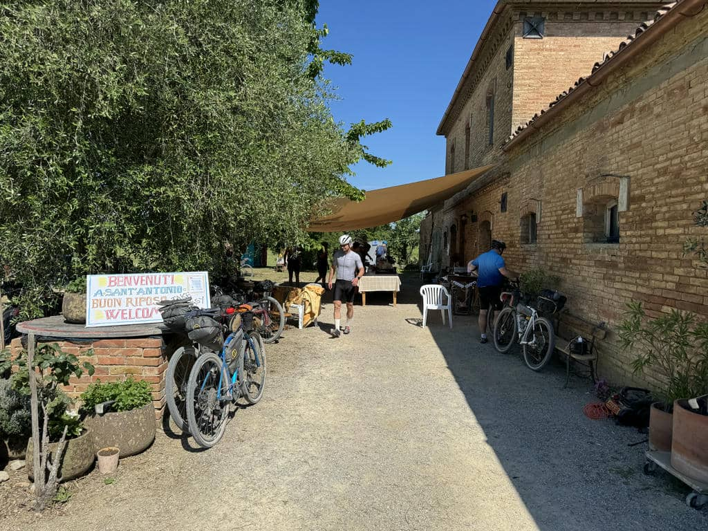
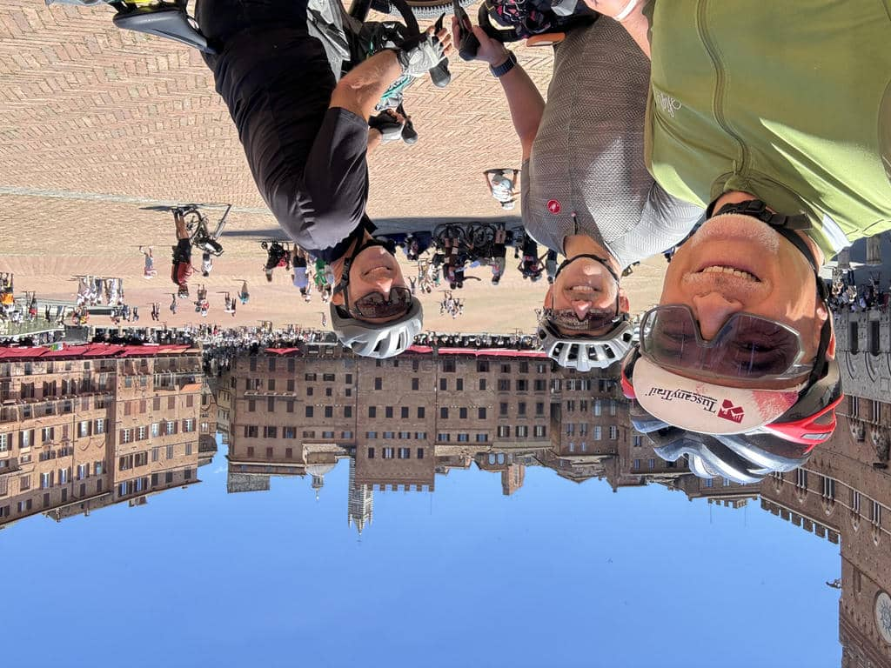
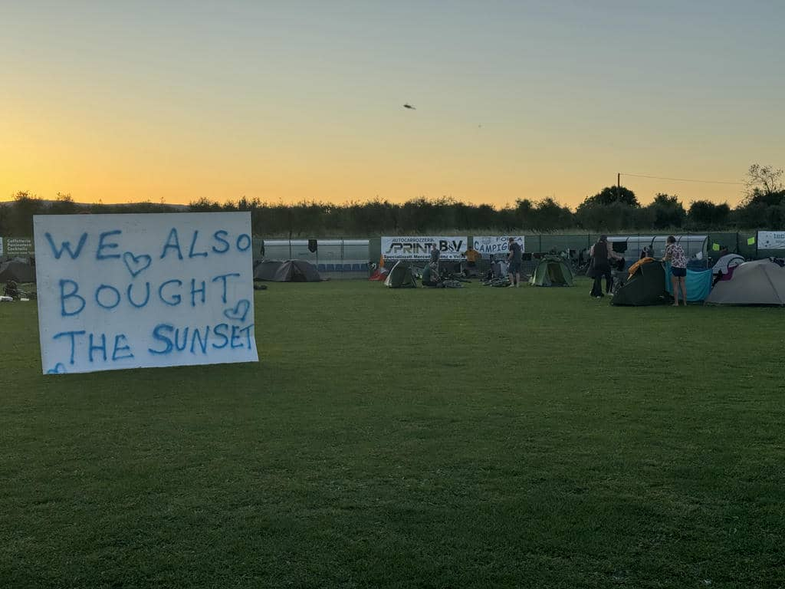

***24 Maggio 2026 - 84,57km 1350 DSL +***

Esistono tante forme di resilienza. C’è una resilienza passiva, che è la capacità di accettare le situazioni per ciò che sono e basta, e c’è la resilienza attiva, quella che ci fa reagire con la nostra determinazione alle situazioni in cui siamo e che vogliamo vivere. 

## La partenza 
Ieri ho pensato di mollare. Troppa stanchezza, ma soprattutto troppa fatica. Stamattina invece mi sono detto: vabbè, proviamo ancora oggi e vediamo che succede. 
Siamo partiti come al solito abbastanza presto dopo una robusta colazione, e subito ci siamo trovati immersi in un paradiso: le colline senesi dove si snoda il percorso dell’Eroica Classica e dell’altrettanto importante Strade Bianche. L’aria era fresca, e ho avuto subito la sensazione di stare bene. Mi sono accorto di non essere stanco e di avere forze e nessun dolore ai muscoli. Dopo le prime salite ho capito che sarebbe stata una giornata diversa, come se il mio corpo si fosse svegliato e mi avesse detto “ah ok, ho capito cosa vuoi fare in questi giorni”. 

## Verso Siena
Lo scenario è pazzesco: larghi sentieri ghiaiosi, file di cipressi lungo il crinale delle colline, vasti panorami a perdita d’occhio. Di sale e si scende senza soffrire a parte una salita ripida e sconnessa dove in molti siamo costretti a spingere, ma dalla quale riparto tutt’altro che disfatto. Oggi sembra tutto diverso.
 A un certo punto dico agli amici che avrei davvero voglia di un caffè con qualcosa di dolce da mangiare (avevo fatto una bella colazione salata) e proprio dopo pochi chilometri troviamo il Podere Sant’Antonio, un agriturismo che aveva organizzato un campo di ristoro per i ciclisti del Trail. Una bella atmosfera, caffè, succhi, dolci e panini oltre alla possibilità di riempire le borracce con l’acqua fresca. 

Ripartiamo, e in un crescendo di bellezza, salite, e un divertente guado di un torrente, nonostante il sole inizi veramente a picchiare, arriviamo a Siena in perfetto orario per il pranzo e con già più di metà percorso alle spalle. 

## Sto bene
Dopo un pranzo rilassato in un locale carino di Siena che si chiama Bottega Roots, ripartiamo con la consapevolezza di esserci presi il tempo necessario per rifiatare, e di averne ancora abbastanza davanti. 
Inizia a fare veramente caldo, ed è qui che mi accorgo di avere un altro passo rispetto ai giorni precedenti. Si sa, il corpo si adatta (più o meno velocemente) alla “richiesta”, ma accorgermi di avere ancora questa flessibilità, questa memoria del corpo, ma anche la capacità di resilienza attiva, di “accettare reagendo”, senza dover scegliere fra passività e fuga, mi fa bene e mi rallegra. Pedalo con calma,
senza sforzo eccessivo, dosando le energie, e sono molto contento.

## Verso Campiglia 

Alternando strada provinciale, percorsi sterrati e campagna, passando anche dal bellissimo castello di Monteriggioni, arriviamo a Colle Val d’Elsa, dove ci infiliamo in un fuori traccia senza senso suggerito dall’app Komoot per arrivare prima al nostro bed and breakfast, arriviamo a Campiglia, destinazione della tappa di oggi. E il cartello che troviamo nell’organizzatissimo basecamp dice molto di questo splendido percorso e della gente che lo anima. E di ciò che si può fare per amore.

