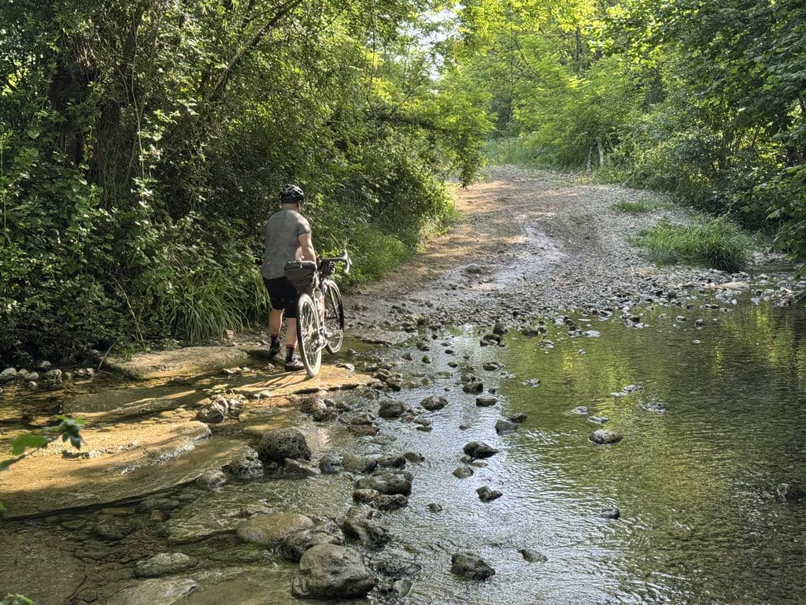
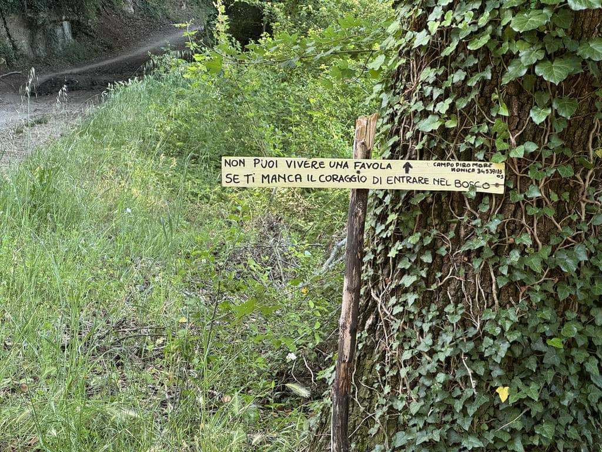
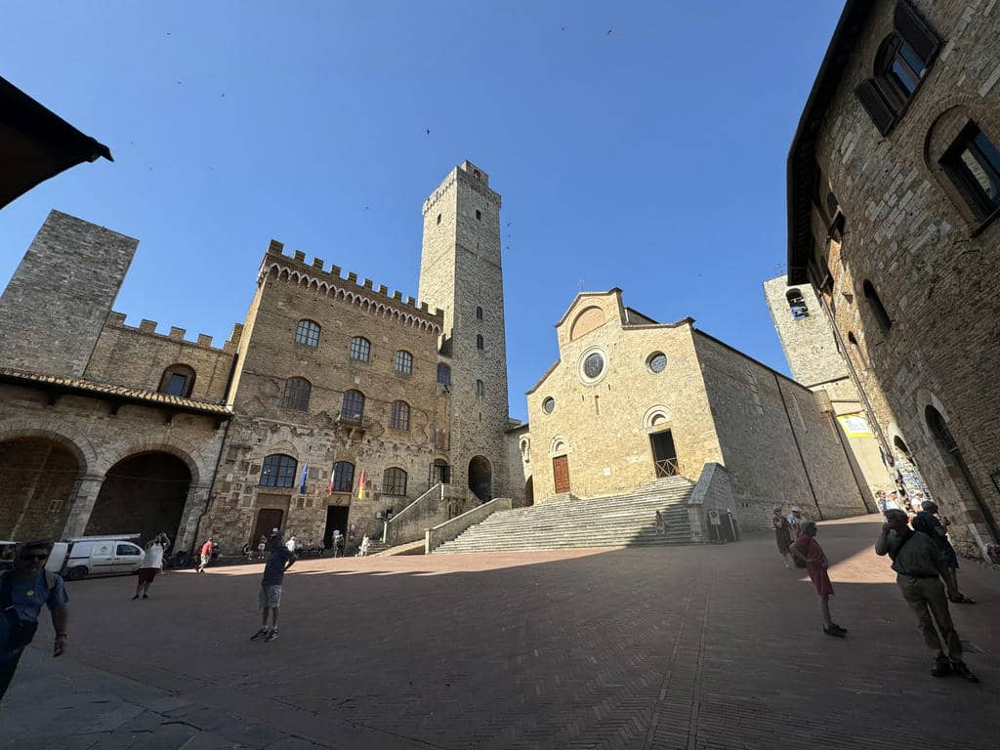
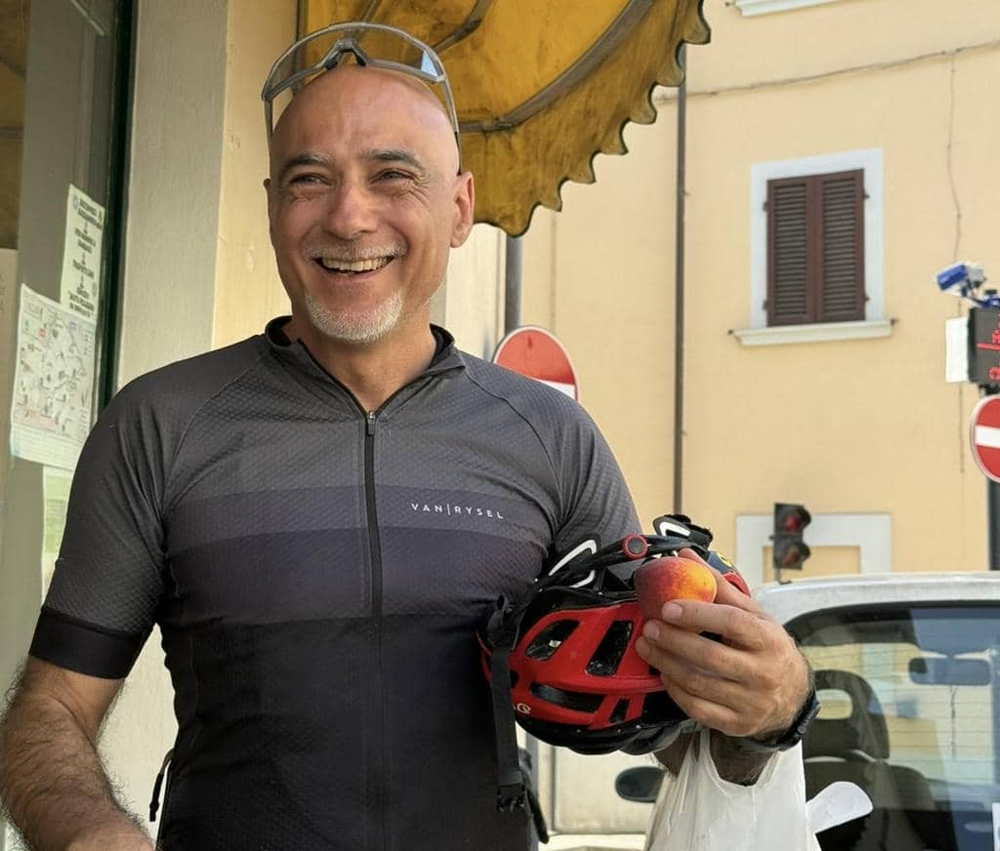
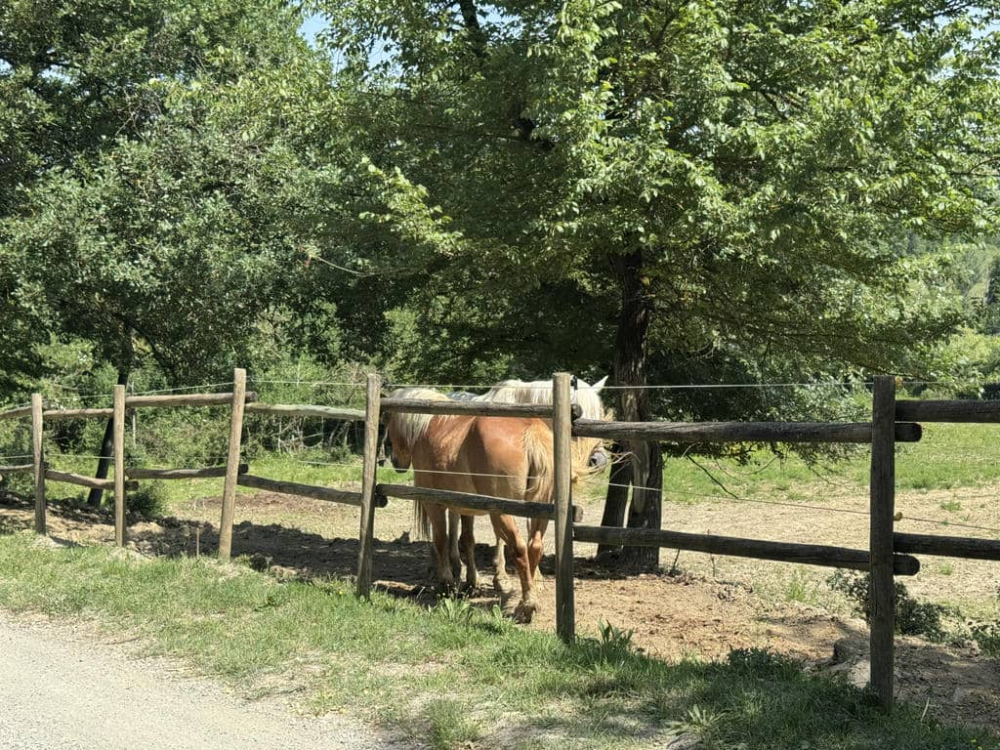

***25
Maggio 2026 - 60.1km 1160 DSL +***

C’è una frase molto bella che dicono i ciclisti: “I am the engine”, perché siamo noi che pedalando muoviamo la bici. Oggi ho pensato di estenderla: “I am the engine / The smile is my engine”

## La partenza
Le prime fresche pedalate di oggi ci hanno portato in un bellissimo bosco proprio alle porte di Campiglia dei Foci. Siamo ancora nel senese, e un cambio di scenario rispetto alle pur splendide strade bianche, ci può stare. Per qualche ragione questo bosco mi ricorda l’amato bosco di Nemi, nelle mie zone intorno a Roma. Fa fresco, ed è un bene perché durante la giornata ci aspetterà l’inferno. 

Lungo il percorso troviamo un cartello con i riferimenti del Campo Piro e More, un bivacco privato dove piantare liberamente la tenda e trovare ristoro, dedicato per lo più ai viaggiatori sulla Via Francigena, il tutto a donativo. La frase sul cartello mi risuona molto. 

## Verso San Gimignano
Lasciato il bosco torniamo a pedalare sulle splendide strade bianche tipiche di questa zona. Sta iniziando già a fare caldo, ma si sale con calma e ritmo. Anche oggi sto davvero bene, gli amici mi fanno notare che ho completamente un’altro passo rispetto ai primi giorni, soprattutto meno ansia e più confidenza. Sono contento di averla trovata, e sono molto  contento di essere stato aiutato a trovarla. 
Dopo un lungo percorso in salita sulla ghiaia in luoghi dove da anni sognavo di venire con la mia bici, approdiamo a San Gimignano, che non avevo mai visto e che mi colpisce come succede a chiunque. 

Che bella che è! Tutto in questa zona della Toscana è meraviglioso, ed è facile capire come mai sia una meta così gettonata soprattutto dagli stranieri.

Dopo un caffè e un po’ di riposo, ripartiamo a pedalare: sempre più caldo e sempre più salite. 

## Gambassi Terme
Dopo una lunga, infinita salita raggiungiamo il paesino di Gambassi Terme, dove sapevamo di dover comprare qualcosa per pranzo perché nei chilometri successivi avremmo trovato solo caldo e polvere. Ci fermiamo in un alimentari dove il gestore, Massimo, ha particolarmente piacere di chiacchierare. I miei due compagni di viaggio tirano via velocemente, io gli do spago ed è una chiacchierata piacevole. Mi racconta dei suoi viaggi a piedi da Firenze a Auschwitz e da Roma a Gerusalemme, mi parla del negozio, che ormai gestisce da solo dopo la scomparsa dei genitori, parliamo delle province toscane, mi racconta che Gambassi è passata a Firenze nel medioevo ma è stato teatro di lunghe trattative politiche. Mi dice anche che il bello del suo lavoro è parlare con la gente. “Una volta che gli ho venduto il pane, se non si parla un po’ finisce lì”.

Esco dal negozio sorridendo, e Vincenzo coglie con una foto tutto quel sole che mi sto portando dentro in questi ultimi giorni

## Si chiude in salita
Mangiamo un po’ (senza esagerare perché la strada è lunga e in salita) e ripartiamo. Ma fa veramente tanto caldo. E si sale. Si sale per chilometri e chilometri, senza requie. Facciamo diverse soste, ci confrontiamo con gli altri compagni di viaggio, tedeschi, francesi, inglesi, cechi… oggi mi ero intrattenuto a parlare con un olandese che sta facendo il Trail con una bici vecchia di trent’anni che con le borse e la tenda pesa 20kg! È davvero gradevole condividere con tanta gente diversa un’esperienza cosi stancante ma anche cosi luminosa.
Dopo tantissima salita e tantissima fatica, che anche oggi ho gestito al di là delle mie più rosee aspettative, arriviamo all’agriturismo con vista incredibile su tutte le valli senesi e pisane. Ma per tutta una serie di ragioni, chiudo il racconto di oggi con la foto di due cavalli che oggi cercavano, uno accanto all’altro, ristoro dal caldo. 

The smile is my engine.

