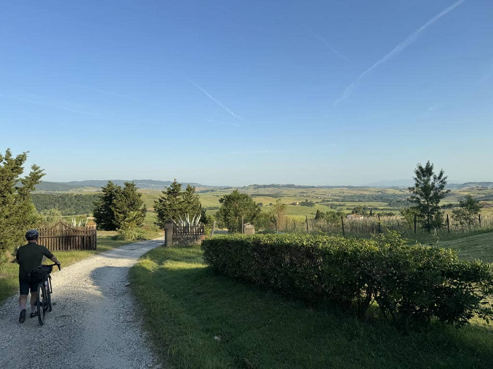

***26 May 2026 - 83 km / 1110 m ascent***

There are two expressions from Japanese Buddhism that represent principles I've been able to experience directly, more than ever before, in these days: ***Shiki-shin-funi (色心不二)***: body and mind appear as two distinct phenomena, but in reality form a single, indivisible entity, and ***Itai doshin (異体同心)***, different bodies, same mind — the union and total harmony among people who, while keeping their individuality, cooperate to reach an objective.

## The premises
Today is the last day. We have ahead of us 100 km with almost 1,500 m of elevation gain, it's impressively hot (the Garmin thermometer at some points of the day will read 37°) and obviously we're carrying with us a *certain* tiredness from the previous stages. On top of that we shouldn't be too late because once we arrive we have three hours of driving home ahead of us. Not bad as a setup.

Yesterday evening we talked at length about the options, and made some decisions. The first is easy: all three of us are pretty early risers, so it won't be hard for us to set off around 7, and this will give us a first big advantage over the day. The second is more debated: a significant change to the hard, very first part of the route to reach Montecatini — a less rugged loop, so as not to crash and burn right away, but ending up taking us substantially away from the original route. Here we are slightly in disagreement: I'd like us to stay faithful to the track so as not to lose its spirit, but I also realize I have a higher gear compared to the first days. Fabrizio, fitter and less worn out, is mostly worried about the timing; Vincenzo about the excessive elevation gain. In reality I share both concerns, so much so that we find ourselves agreeing on a different idea, namely trying a shortcut at Canneto to avoid about 15 km and a bit of elevation (in reality not more than 350 m, we'll discover later). This allows me to more easily get my travel companions on board with keeping the first part unchanged: we're all worried, it isn't a matter of "insisting" — it's really just a question of trust, in oneself and in others. ***Itai Doshin***.

## The start

As decided, at 7:15 we are on the pedals and off we go, and this will indeed help us a lot. Shortly afterwards, while our muscles are still cold, the climb up to Montecatini begins, and it's indeed a truly tough route: all uphill, very rough, and you're already sweating tremendously considering the hour. I feel a bit guilty and I say so openly to Vincenzo, who however, as always, tells me *"for me, once the group has decided, we go and that's it."* Different bodies, same mind, ***Itai Doshin***. In the end we'll be glad we didn't betray the track, but it really is hard.

Out of the hell of that grueling trail, we find ourselves on more restful gravel and in gentler scenery, and when we reach Montecatini, the route becomes much easier.

## The Shortcut
Arrived in the valley, it's time to cut, and instead of taking the trails to Querceto, we set off pedaling straight along the provincial road. There isn't much traffic and the road is beautiful, surrounded by woods. I struggle because the large chainring still won't engage, so I have to pedal on the flat in the 28-tooth gear, working very hard to cover less distance than I could — but never mind, on we pedal. Here too climbs are not lacking (the elevation has to be gained one way or another), and on the last stretch to Canneto we struggle and it's hot, but once we're up there we're happy.

It isn't even 11 yet and we're already halfway through the route, with about 50 km left that involve long descents we expect to be restful and fun. As if.

## The rocky trail
After Canneto we stop first for a small break in Monteverdi Marittimo, where at a grocery shop I get a piece of cheese to put some protein and solids into my body (a breakfast made entirely of carbs certainly wasn't enough for me), and after several more km, we decide to stop at Sassetta for a more substantial sandwich. We know we've done the bulk of the climbs, and we're ready for the famous "restful" descent. But once we set off, after a few bends we enter a wood, and a beautiful but extremely rocky trail begins, downhill, requiring a lot of technique, a lot of attention and a lot of effort to stay upright and get down without crashing. A nice little gift for the end of the route. And it's long, very long.

The splendid non-duality of body and mind (*Shiki-shin-funi*), whose balance I feel I have reached in these previous days, helps a lot in dosing my strength, keeping my focus and staying concentrated, without skimping on silly jokes to keep the mood high. And down we go, for almost 10 km, fortunately not all rocky, but still.

## The finish
Arrived at the bottom, you start to feel the sea air and the scent of the finish. There's not much left now — very little, in fact — and the triumphal tree-lined gravel avenues towards Campiglia are a reminder of the wonders we have seen in these very hard but splendid days.

Once we enter Campiglia, a few km from the finish we stop at a bar for a coffee. It's 3 p.m., maybe not even, we arrived in perfect time, we paced ourselves, we made a few sacrifices in great serenity, we are tired, but aware of having accomplished — for us — a great feat. It wasn't necessary, someone could say "but go rest instead of putting yourself through these brutal efforts," but the joy of managing to do something you have decided you want to do, and in the face of whose difficulties you have decided not to give up, supporting each other with extraordinary travel companions, discovering or rediscovering reserves of body-mind strength that, despite the 57 years and the poor fitness, are there, and are just waiting to be reawakened — that is priceless.

In the end, physical training for tackling challenges like this counts a lot, but not everything. There's another kind of training, a discipline of keeping your eyes on the ball, of facing difficulties and seeing important tasks through, finding happiness in the doing and in facing suffering with a smile, knowing that your priorities are not easy and immediate gratification, but care and love for yourself and for the people you love, who are the true center and center of gravity of your life. We made it, we are finishers. But from tomorrow we start again.

## Post scriptum: the little car

Stored in the top tube bag, Gabriele's little yellow car accompanied me along the entire route, and for every stage, as I had decided, I took a photo. Now it has come home with me and will be given back to Gabriele tomorrow. I thought about printing the photos along with the route map, and making a little poster, or a little book — we'll see.
The most important thing is having dedicated time and heart to this little initiative that accompanied me during the trip. Every so often, in the most tiring and difficult moments, I touched the little car in the bag, and a few tears came down, feeling that I was "reconnecting" with my heart.

There is nothing else so powerful, from which to draw and give strength.

