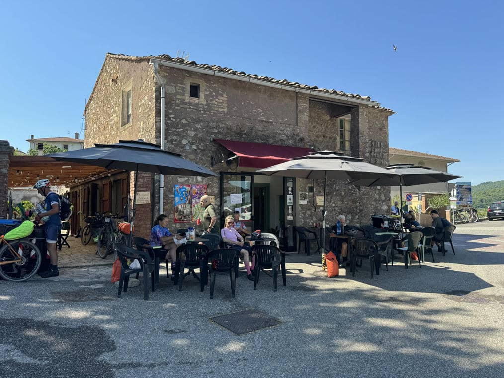
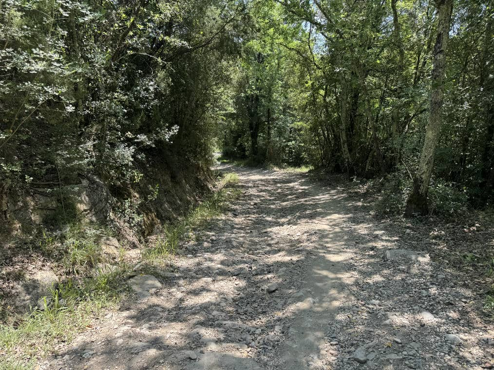
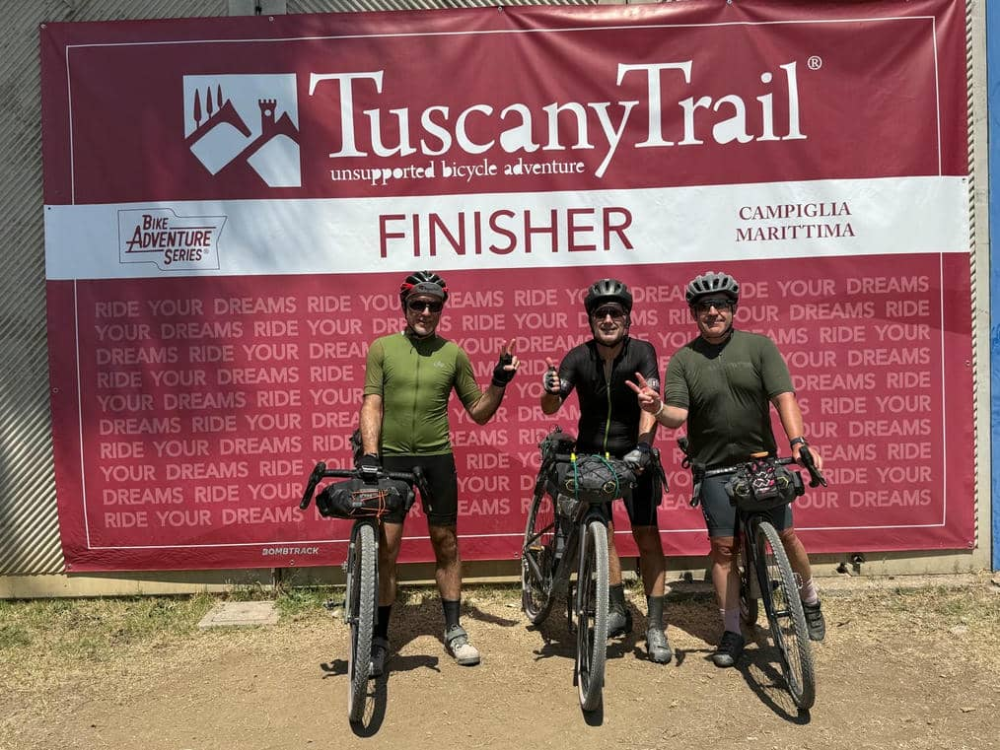
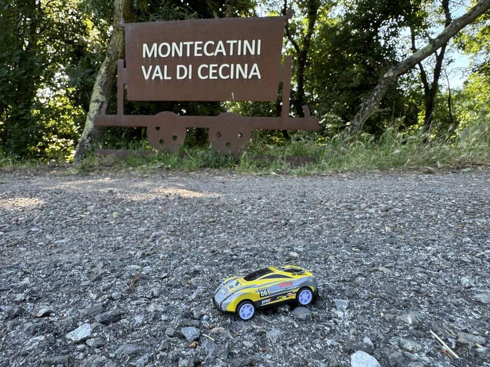

***26 Maggio 2026 - 83km 1110 DSL +***

Ci sono due espressioni del Buddismo giapponese, che rappresentano principi di cui ho potuto fare, mai come prima, esperienza diretta in questi giorni: ***Shiki-shin-funi (色心不二)***: corpo e mente appaiano come due fenomeni distinti, ma nella realtà formano un'entità unica e indivisibile, e ***Itai doshin (異体同心)***, diversi corpi stessa mente, l'unione e la totale armonia tra persone che, pur mantenendo la propria individualità, collaborano per raggiungere un obiettivo.

## Le premesse
Oggi è l'ultimo giorno, abbiamo davanti a noi 100km con quasi 1500 mt di dislivello, fa un caldo impressionante (il termometro del Garmin in alcuni punti della giornata mi segnerà 37°) e ovviamente ci portiamo dietro una *certa* stanchezza dalle tappe precedenti. Inoltre non dovremmo tardare troppo perché all'arrivo ci aspettano tre ore di viaggio in auto verso casa. Non male come premessa.

Ieri sera abbiamo parlato lungamente delle opzioni che abbiamo, e abbiamo preso alcune decisioni. La prima è facile: siamo tutti e tre piuttosto mattinieri, quindi non ci sarà difficile partire intono alle 7, e questo ci darà un primo grande vantaggio rispetto alla giornata. La seconda è più dibattuta: un importante cambiamento rispetto alla dura primissima parte del percorso per arrivare a Montecatini, un giro meno impervio, per non schiantare subito, ma finendo con l'allontanarci sostanzialmente dal percorso originale. Qui siamo in filo in disaccordo: io vorrei che rimanessimo fedeli alla traccia per non perderne lo spirito, ma mi rendo anche conto di avere una marcia in più rispetto ai primi giorni. Fabrizio, più allenato e meno affaticato, è soprattutto preoccupato per gli orari; Vincenzo del dislivello eccessivo. In realtà condivido entrambe le preoccupazioni, tant'è che ci ritroviamo d'accordo sul provare a fare un taglio all'altezza di Canneto per evitare una 15ina di km e un po' di dislivello (in realtà non più di 350mt, scopriremo dopo). Questo mi consente di motivare più facilmente i miei compagni di viaggio sul mantenere la prima parte inalterata: siamo tutti preoccupati, non si tratta di "insistere" è davvero solo una questione di fiducia, in se stessi e negli altri due. ***Itai Doshin***.

## La partenza

Come deciso, alle 7:15 siamo sui pedali e partiamo, e questo effettivamente ci aiuterà parecchio. Poco dopo, quindi ancora con i muscoli freddini, inizia la scalata verso Montecatini, e in effetti è un percorso veramente tosto: tutto in salita, molto sconnesso, e già si suda tremendamente considerando l'orario. Mi sento un po' in colpa e lo dico apertamente a Vincenzo, che però come sempre mi dice *"per me, una volta che il gruppo ha deciso, si va e basta"* Diversi corpi, stessa mente, ***Itai Doshin***. Alla fine saremo contenti di non aver tradito la traccia, però è veramente dura.

Usciti dall'inferno di quel faticoso sentiero, ci ritroviamo sulla più riposante ghiaia e in scenari più dolci, e arrivati a Montecatini, il percorso diventa nettamente più facile.

## Il Taglio
Arrivati a valle, è il momento di tagliare, e invece di prendere i sentieri per Querceto, ci mettiamo a pedalare dritti sulla provinciale. Non c'è molto traffico e la strada è bellissima, circondata da boschi. Io faccio fatica perché la corona grande continua a non ingaggiare, e quindi mi tocca pedalare in piano con la corona 28, facendo una gran fatica per fare meno metri di quelli che potrei, ma pazienza, si pedala. Anche qui le salite non mancano (in qualche modo l'elevazione va raggiunta comunque), e nell'ultimo tratto fino a Canneto si fatica e fa caldo, ma arrivati su siamo contenti. 

Non sono neanche le 11 e siamo già a metà percorso, mancano una 50ina di km che prevedono lunghe discese che ci aspettiamo siano riposanti e divertenti. E invece.

## Il sentiero roccioso
Dopo Canneto ci fermiamo a fare prima una piccola sosta a Monteverdi Marittimo, dove in un alimentari mi prendo un pezzo di formaggio per mettere in corpo un po' di proteine e di solidi (colazione tutta carboidrati non mi è certamnente bastata), e dopo diversi altri km, decidiamo di fermarci a Sassetta per un panino più strutturato. Sappiamo di aver fatto il grosso delle salite, e siamo pronti per la famosa "riposante" discesa. Ma ripartiti, dopo qualche curva entriamo in un bosco, e inizia un  sentiero bellissimo ma rocciosissimo, in discesa, che richiede molta tecnica, molta attenzione e molta fatica per restare in piedi e scendere senza schiantarsi. Un bel regalino di fine percorso. Ed è lunga, molto lunga. 

La splendida non dualità corpo-mente (*Shiki-shin-funi*) il cui equilibrio sento di aver raggiunto in questi giorni precedenti, aiuta molto a dosare le forze, mantenere l'attenzione e rimanere concentrati, senza lesinare in battute sceme per mantenere alta l'allegria. E si va giù, per quasi 10km, per fortuna non tutti rocciosi ma insomma.

## La fine
Arrivati in fondo, si inizia a sentire l'aria di mare e il profumo dell'arrivo. Manca poco, pochissimo ormai, e i trionfali viali ghiaiosi e alberati verso Campiglia sono un promemoria di ciò che di meraviglioso abbiamo visto in questi durissimi ma splendidi giorni.

Wntrati a Campiglia, a pochi km dall'arrivo ci fermiamo in un bar per un caffè. Sono le 15, forse nemmeno, siamo arrivati nei tempi perfetti, ci siamo dosati, abbiamo fatto qualche rinuncia in grande serenità, siamo stanchi, ma consapevoli di aver fatto - per noi - una grande impresa. Non era necessaria, qualcuno potrebbe dire "ma riposati invece di farti ste ammazzate", ma la gioia di riuscire a fare qualcosa che hai determinato di voler fare, e di fronte alle cui difficoltà hai deciso di non mollare, sostenendoti reciprocamente con straordinari compagni di viaggio, scoprendo o riscoprendo risorse di forza di corpo-mente che nonostante i 57 anni e lo scarso allenamento sono lì, e aspettano solo di essere risvegliate, non ha prezzo.

Alla fine, l'allenamento fisico per affrontare sfide come questa, conta tanto, ma non tutto. C'è un altro allenamento, una disciplina del tenere gli occhi sulla palla, dell'affrontare le difficoltà e del portare a termine compiti importanti, trovando la felicità nel fare e nell'affrontare le sofferenze con il sorriso, sapendo che le tue priorità non sono appagamento facile e immediato, ma la cura e l'amore per te stesso e per le persone che ami, e che sono il vero centro e baricentro della tua vita. Ce l'abbiamo fatta, siamo finisher. Ma da domani si riparte.

## Post scriptum: la macchinina

Custodita nella borsina da telaio superiore, la macchinina gialla di Gabriele mi ha accompagnato lungo tutto il percorso, e per ogni tappa, come avevo deciso, ho fatto una foto. Ora è tornata a casa con me e verrà ridata domani a Gabriele. Ho pensato di stampare le foto insieme alla mappa del percorso, e farne un piccolo poster, o un librino, ora vediamo.
La cosa più importante è aver dedicato tempo e cuore a questa piccola iniziativa che mi ha accompagnato durante il viaggio. Ogni tanto, nei momenti più faticosi e difficili, ho toccato la macchinina nella borsina, e mi è scesa qualche lacrima, sentendo di "riconnettere" il cuore. 

Non esiste altro di così potente, da cui trarre e donare forza.

